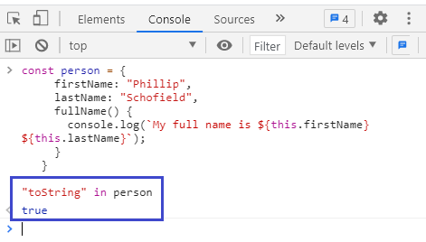
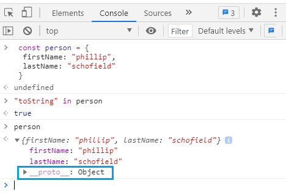
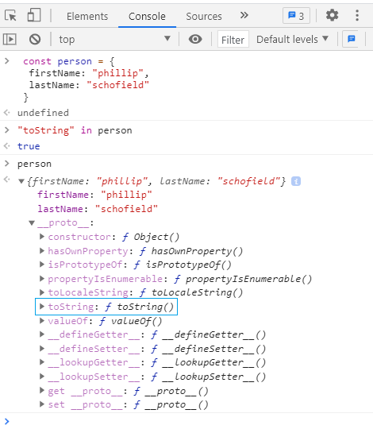
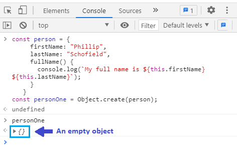
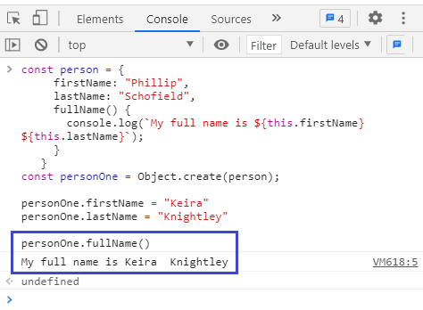
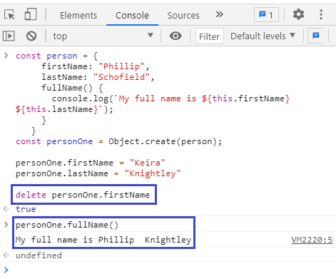
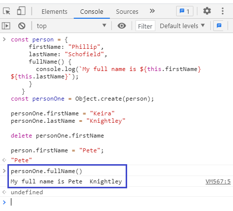

We know that in JavaScript, everything (_except the primitive data types_) is an object. An Object in an object. A function is an object. An array is an object. And so on.

Also in JavaScript, every object is linked to another object. That another object is called prototype. The linkage happens through an internal hidden property known as `__proto__` (_double underscore each side_), which gets assigned to the object during its creation by default. The prototype also gets assigned to the `__proto__` property by default.

More importantly, the created object inherits properties and methods from its prototype (_aka prototypal inheritance_). Also, every object in JavaScript has ~~Object.prototype~~ (_an object that comes built-in with JavaScript_) at the top of its prototype chain.

This all might sound gibberish to you. In order to make this a bit clearer, let’s look at some examples.

First off, we will create an object using the literal notation using curly braces. Note that you can also create an object using constructor notation using the ~~new~~ operator.

```js
const person = {
  firstName: "Phillip",
  lastName: "Schofield",
}
```

Nothing fancy here. We have a simple ~~person~~ object which has two properties - ~~firstName~~ & ~~lastName~~ - defined inside it.

We can check whether a property is present in a specified object using the ~~in~~ operator. The ~~in~~ operator returns ~~true~~ if the specified property is defined in the specified object or its prototype chain.

Therefore, the following code returns true because the ~~person~~ object does have a ~~firstName~~ property.

```js
"firstName" in person // true
```

Now, let’s consider another example.

What do you think the following code will return as its output?

```js
“toString” in person
```

At first glance, you might say that the output will be ~~false~~ because the ~~person~~ object does not have a ~~toString~~ property. But lo and behold, we get ~~true~~ as our output.



What the heck is happening here?

We have already said that an object inherits properties and methods from its prototype. And the object can find its prototype (_which is also an object_) through its internal `__proto__` property (_hidden_).



JavaScript does not find the ~~toString~~ property defined inside the ~~person~~ object. Therefore it moves up the prototype chain looking for the property and finds it defined inside the ~~person~~ object’s prototype, which in our case is ~~Object.prototype~~ - an object that sits at the top of the prototype chain (_that is its prototype is null_) and comes standard with JavaScript. This is the reason why the console logs in ~~true~~ as the output.



This was a simple example. We did not have any intermediate object that the ~~person~~ object inherited from. The ~~person~~ object inherited properties and methods directly from the ~~Object.prototype~~ object.

It is important to note that we can also assign our own prototype. Let’s do that by introducing another prototype object called ~~person~~ that other objects will inherit properties and methods from.

```js {numberLines}
const person = {
  firstName: "Phillip",
  lastName: "Schofield",
  fullName() {
    console.log(`My full name is ${this.firstName}  ${this.lastName}`)
  },
}
```

Now, let’s create a child of the ~~person~~ object using ~~Object.create()~~ function, which is built-in JavaScript and is used to create children from a prototype object.

```js
const personOne = Object.create(person)
```

Here we have created a child object called ~~personOne~~. Because children inherit the properties and methods from their prototype object, ~~personOne~~ has access to all the properties and methods from the ~~person~~ object. We can prove that by accessing the ~~firstName~~ property from the ~~personOne~~ object. As expected, we get ~~Phillip~~ as the output.

```js
personOne.firstName // Phillip
```

Let’s see what we get if we log ~~personOne~~ object to the console.



We get an empty object.

This is because we have not defined any properties and methods inside ~~personOne~~ object. However, ~~personOne~~ inherits properties and methods from its prototype object - the ~~person~~ object. As a result, ~~personOne.firstName~~ logs in ~~Phillip~~ to the console.

We can also override the inherited properties and methods and create ~~personOne~~ object’s own properties and methods. We can also create new properties and methods.

Let’s override the ~~firstName~~ & ~~lastName~~ properties using dot notation.

```js
personOne.firstName = "Keira"
personOne.lastName = "Knightley"
```

Now ~~personOne~~ is no longer an empty object. It has its own ~~firstName~~ & ~~lastName~~ properties. If we log ~~personOne.fullName()~~ to the console, we get ~~My full name is Keira Knightey~~.



Now let’s delete the ~~firstName~~ property from the ~~personOne~~ object, after which ~~personOne~~ object is left with only the ~~lastName~~ property.

What do you think will be the output of ~~personOne.fullName()~~ ?



We get ~~My full name is Phillip Knightley~~. Because, even though we had deleted the ~~firstName~~ property, ~~personOne~~ object inherited the ~~firstName~~ property from its prototype (_the ~~person~~ object_).

Another important concept to remember is that any changes made to the prototype object will reflect in the child object.

Let’s assign the ~~firstName~~ property inside the ~~person~~ object (_the prototype object_) a new value called ~~Pete~~. This change is propagated to the child (~~personOne~~) object .

Now if we log ~~personOne.fullName()~~ to the console, we get ~~My full name is Pete Knightley~~.



Hope you now have a basic understanding of prototypes and prototype-based inheritance in JavaScript.
