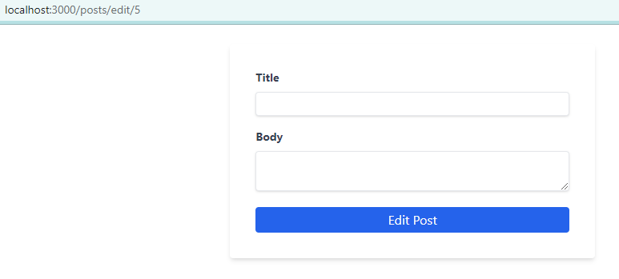

###### This blog post is part of a series. You must complete [part-1](https://hemanta.io/a-complete-guide-to-mutations-in-react-query-part-1-project-set-up/), [part-2](https://hemanta.io/a-complete-guide-to-mutations-in-react-query-part-2-fetching-data-using-the-usequery-hook/) & [part-3](https://hemanta.io/a-complete-guide-to-mutations-in-react-query-part-3-using-the-usemutation-hook-to-create-resources-on-the-server/) before continuing here.

In part-3, we learnt how to create new blog posts on the server using the ~~useMutation~~ hook. In this post, we will learn how to edit/update them.

Updating a blog post is similar to creating a blog post. Instead of sending a ~~POST~~ request, we send a ~~PUT~~ request.

First, let’s create an ~~Edit Post~~ button and display it next to each blog post on the ~~Posts~~ page. Edit the ~~Posts.js~~ file as shown below:

```js:title=src/components/Posts.js {numberLines, 23-32}
import React from "react";
import { Link } from "react-router-dom";
import { useGetPosts } from "./postHooks";

const Posts = () => {
  const { isLoading, isError, error, data: posts } = useGetPosts();

  return (
    <div className="w-1/2 m-auto mt-6">
      <Link to="/posts/create">
        <button className="bg-blue-500 text-gray-50 px-2 py-1 rounded hover:bg-blue-600">
          Create Post
        </button>
      </Link>

      <h1 className="text-2xl font-bold mb-2">Blog Posts</h1>
      {isLoading ? (
        <p>Loading...</p>
      ) : isError ? (
        <p>{error.message}</p>
      ) : (
        posts.map(({ id, title }) => (
          <div className="flex justify-even">
            <Link key={id} to={`/posts/${id}`}>
              <h1 className="mr-6">{title}</h1>
            </Link>
            <Link to={`/posts/edit/${id}`}>
              <button className="bg-green-500 text-gray-50 mb-4 px-1 py-0.5 rounded hover:bg-green-600">
                Edit Post
              </button>
            </Link>
          </div>
        ))
      )}
    </div>
  );
};

export default Posts;
```


Clicking on the ~~Edit Post~~ button will take us to the ~~`/posts/edit/${id}`~~ route, which will load the ~~Editpost~~ component.

In the ~~components~~ folder, create a file named ~~Editpost.js~~ with the following code snippets.

```js:title=src/components/Editpost.js {numberLines, 11-11, 25-25}
import React, { useState } from "react";
import { useParams } from "react-router-dom";
import { Formik, Field, Form, ErrorMessage } from "formik";
import * as Yup from "yup";
import { useEditPost } from "./postHooks";
import { useGetSinglePostById } from "./postHooks";

const EditPost = () => {
  const { id } = useParams();

  const { data: post } = useGetSinglePostById(id);

  const [error, setError] = useState(null);

  const { mutate, isLoading } = useEditPost(id, setError);

  return (
    <>
      {error && (
        <div className="w-1/3 flex justify-center items-center bg-red-400 rounded mt-4 px-2 py-2 m-auto">
          <p>{error}</p>
        </div>
      )}
      <Formik
        initialValues={{ title: post?.title, body: post?.body }}
        validationSchema={Yup.object({
          title: Yup.string().required("Required"),
          body: Yup.string().required("Required"),
        })}
        onSubmit={(values) => {
          mutate(values);
        }}
      >
        <Form className="w-1/3 flex flex-col bg-white shadow-md rounded mt-6 px-8 py-8 m-auto">
          <div className="flex flex-col mb-4">
            <label
              htmlFor="title"
              className="text-gray-700 text-sm font-bold mb-2"
            >
              Title
            </label>
            <Field
              name="title"
              type="text"
              className="shadow appearance-none border rounded py-1 px-2 text-gray-700 leading-tight focus:outline-none focus:shadow-outline"
              id="username"
            />
            <ErrorMessage name="title" />
          </div>

          <div className="flex flex-col mb-4">
            <label
              htmlFor="body"
              className="text-gray-700 text-sm font-bold mb-2"
            >
              Body
            </label>
            <Field
              name="body"
              as="textarea"
              type="text"
              className="shadow appearance-none border rounded mb-1 py-1 px-2 text-gray-700 leading-tight focus:outline-none focus:shadow-outline"
            />
            <ErrorMessage name="body" />
          </div>

          <button
            type="submit"
            className="bg-blue-600 text-gray-50 px-2 py-1 rounded hover:bg-blue-700"
          >
            {isLoading ? "Editing... Post" : "Edit Post"}
          </button>
        </Form>
      </Formik>
    </>
  );
};

export default EditPost;
```

On line 11, we are fetching the blog post which we want to edit. And on line 25, we are using the ~~title~~ and ~~body~~ of the post that we fetched to populate the form. On line 25, notice that we have used the optional chaining operator(~~?.~~) to ensure that the ~~post~~ object is not ~~null~~ or ~~undefined~~ before accessing its ~~title~~ & ~~body~~ properties.

###### Learn more about using optional chaining operator in React in my blog post [here](https://hemanta.io/how-to-use-the-javascript-optional-chaining-operator-in-react/).

Next, add the following highlighted code snippets in the ~~postHooks.js~~ file.

```js:title=src/components/postHooks.js {numberLines, 38-56}
import { useNavigate } from "react-router-dom";
import { useQuery, useMutation, useQueryClient } from "@tanstack/react-query";
import axios from "axios";

export const useGetPosts = () => {
  return useQuery(["posts"], async () => {
    const { data } = await axios.get(`http://localhost:5000/posts`);
    return data;
  });
};

export const useGetSinglePostById = (id) => {
  return useQuery(["posts", id], async () => {
    const { data } = await axios.get(`http://localhost:5000/posts/${id}`);
    return data;
  });
};

export const useCreatePost = (setError) => {
  const queryClient = useQueryClient();
  const navigate = useNavigate();
  return useMutation(
    (postData) => {
      return axios.post("http://localhost:5000/posts", postData);
    },
    {
      onSuccess: () => {
        queryClient.invalidateQueries(["posts"]);
        navigate("/");
      },

      onError: ({ message }) => {
        setError(message);
      },
    }
  );
};
export const useEditPost = (id, setError) => {
  const queryClient = useQueryClient();
  const navigate = useNavigate();
  return useMutation(
    (postData) => {
      return axios.put(`http://localhost:5000/posts/${id}`, postData);
    },
    {
      onSuccess: () => {
        queryClient.invalidateQueries(["posts"]);
        navigate("/");
      },

      onError: ({ message }) => {
        setError(message);
      },
    }
  );
};
```

Finally, add the following highlighted code snippets in the ~~App.js~~ file.

```js:title=src/App.js {numberLines, 6-6, 14-14}
import React from "react";
import { Routes, Route } from "react-router-dom";
import Posts from "./components/Posts";
import SinglePost from "./components/SinglePost";
import CreatePost from "./components/CreatePost";
import EditPost from "./components/Editpost";

const App = () => {
  return (
    <Routes>
      <Route path="/" element={<Posts />} />
      <Route path="/posts/:id" element={<SinglePost />} />
      <Route path="/posts/create" element={<CreatePost />} />
      <Route path="/posts/edit/:id" element={<EditPost />} />
    </Routes>
  );
};

export default App;
```

Now, let’s check our edit post functionality.

Go ahead, click on any one of the ~~Edit Post~~ buttons on the ~~Posts~~ page.



Oops! The edit post form is empty. Now, go back to the ~~Posts~~ page and click on the ~~Edit Post~~ button (_that you clicked before_) again.


We see the edit post form being populated with the post data fetched from the server. But the problem is the post edit form is not getting populated on the first render of the ~~\<Editpost />~~ component.

Why so?

The reason the post data form is empty on the first render is because **our data is _undefined_ on the first render cycle. We must fetch the data first.**

So, how do we solve our problem?

One of the ways is to split ~~\<Editpost />~~ into two components.

Inside the ~~components~~ folder, create a file named ~~EditPostForm.js~~ with the following code snippets.

```js:title=src/components/EditPostForm.js {numberLines}
import React, { useState } from "react";
import { useParams } from "react-router-dom";
import { Formik, Field, Form, ErrorMessage } from "formik";
import * as Yup from "yup";
import { useEditPost } from "./postHooks";

const EditPostForm = ({ formData: { title, body } }) => {
  const { id } = useParams();

  const [error, setError] = useState(null);

  const { mutate, isLoading } = useEditPost(id, setError);

  return (
    <>
      {error && (
        <div className="w-1/3 flex justify-center items-center bg-red-400 rounded mt-4 px-2 py-2 m-auto">
          <p>{error}</p>
        </div>
      )}
      <Formik
        initialValues={{ title, body }}
        validationSchema={Yup.object({
          title: Yup.string().required("Required"),
          body: Yup.string().required("Required"),
        })}
        onSubmit={(values) => {
          mutate(values);
        }}
      >
        <Form className="w-1/3 flex flex-col bg-white shadow-md rounded mt-6 px-8 py-8 m-auto">
          <div className="flex flex-col mb-4">
            <label
              htmlFor="title"
              className="text-gray-700 text-sm font-bold mb-2"
            >
              Title
            </label>
            <Field
              name="title"
              type="text"
              className="shadow appearance-none border rounded py-1 px-2 text-gray-700 leading-tight focus:outline-none focus:shadow-outline"
              id="username"
            />
            <ErrorMessage name="title" />
          </div>

          <div className="flex flex-col mb-4">
            <label
              htmlFor="body"
              className="text-gray-700 text-sm font-bold mb-2"
            >
              Body
            </label>
            <Field
              name="body"
              as="textarea"
              type="text"
              className="shadow appearance-none border rounded mb-1 py-1 px-2 text-gray-700 leading-tight focus:outline-none focus:shadow-outline"
            />
            <ErrorMessage name="body" />
          </div>

          <button
            type="submit"
            className="bg-blue-600 text-gray-50 px-2 py-1 rounded hover:bg-blue-700"
          >
            {isLoading ? "Editing... Post" : "Edit Post"}
          </button>
        </Form>
      </Formik>
    </>
  );
};

export default EditPostForm;
```

Now, copy and paste the following code snippets in the ~~EditPost.js~~ file.

```js:title=src/components/Editpost.js {numberLines, 9-9, 16-16}
import React from "react";
import { useParams } from "react-router-dom";
import { useGetSinglePostById } from "./postHooks";
import EditPostForm from "./EditPostForm";

const EditPost = () => {
  const { id } = useParams();

  const { data, isLoading } = useGetSinglePostById(id);

  return (
    <>
      {isLoading ? (
        <p className="text-center">Loading...</p>
      ) : (
        <EditPostForm formData={data} />
      )}
    </>
  );
};

export default EditPost;
```

In the ~~\<EditPost />~~ component, we fetch the post data and pass that data to the ~~\<EditPostForm />~~ component through the ~~formData~~ prop. This fixes our problem.

###### Learn more about React Query & Forms in TkDodo's blog post [here](https://tkdodo.eu/blog/react-query-and-forms).

Let’s edit a blog post. Click on the ~~Edit Post~~ button next to the ~~What is React Query?~~ blog post. Make the following changes and click on the ~~Edit Post~~ button.


We get redirected to the ~~Posts~~ page and we see the updated post.


Now you know how to update resources on the server using the ~~useMutation~~ hook.

In part-5, we will learn how to delete resources on the server.
