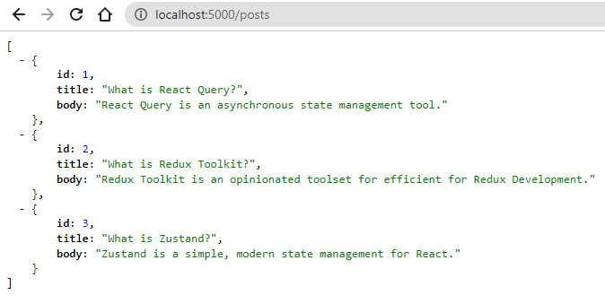

React Query is a **server-state** management library. The word **server state** refers to the data stored on a server.

In a typical React app, the client fulfills its data requirement by making HTTP requests to a server. Most often, the client carries out four basic operations: Create, Read, Update & Delete (CRUD).

To read data, React Query provides the ~~useQuery~~ hook.

###### Learn how to read data from a server using React Query in my blog post [here](https://hemanta.io/react-query-a-guide-to-fetching-data/).

To create, update & delete (in other words, mutate) data, React Query provides the ~~useMutation~~ hook. The word **mutation** means to make modifications, which is exactly what we do when we create, update or delete resources on the server, hence the name ~~useMutation~~.

In this multi-part blog post, we will focus exclusively on data mutation using the ~~useMutation~~ hook.

First, let’s set up our project.

Create a React project inside a folder named ~~react-query-mutation~~ using the following command:

```js {numberLines}
PS C:\Users\Delhivery\Desktop\react-query-mutation> npx create-react-app .
```

Next, install the following libraries:

- React Query
- Axios (HTTP client)
- Formik (Form library for React)
- Yup (Form validation)
- React Router (a routing library)

using the command:

```js {numberLines}
PS C:\Users\Delhivery\Desktop\react-query-mutation> npm i @tanstack/react-query react-router-dom axios formik yup
```

Now, let’s set up Tailwind CSS.

###### Learn more about setting up Tailwind CSS in a React project in my blog post [here](https://hemanta.io/setting-up-tailwind-css-in-a-react-application/)

Install Tailwind CSS and its peer dependencies using the following command:

```js {numberLines}
PS C:\Users\Delhivery\Desktop\react-query-mutation> npm install -D tailwindcss postcss autoprefixer
```

Next, run the following command to generate both ~~tailwind.config.js~~ and ~~postcss.config.js~~.

```js {numberLines}
PS C:\Users\Delhivery\Desktop\react-query-mutation> npx tailwindcss init -p
```

In the ~~tailwind.config.js~~ file, copy and paste the following code snippet:

```js:title=src/tailwind.config.js {numberLines}
module.exports = {
  content: ["./src/**/*.{js,jsx,ts,tsx}"],
  theme: {
    extend: {},
  },
  plugins: [],
}
```

Now, it’s time to include Tailwind CSS in our CSS. Open the ~~./src/index.css~~ file that Create React App generates for us by default and use the ~~@tailwind~~ directive to include Tailwind’s ~~base~~, ~~components~~, and ~~utilities~~ styles, replacing the original file contents:

```js:title=src/index.css {numberLines}
@tailwind base;
@tailwind components;
@tailwind utilities;
```

Tailwind will swap these directives out at build-time with all of the styles it generates based on your configured design system.

We are almost ready. The only thing pending is a backend.

For our demo project, we will use ~~json-server~~ to create a fake REST API. ~~json-server~~ is easy to set up and will help us get started quickly without us spinning up a full-fledged Node.js server and a MongoDB database.

Install ~~json-server~~ with the following command:

```js {numberLines}
PS C:\Users\Delhivery\Desktop\react-query-mutation> npm i json-server
```

Next, we will create a data source (some blog posts) in a JSON file. Create a ~~db.json~~ file in the ~~react-query-mutation~~ folder with the following data:

```json:title=mutations/db.json {numberLines}
{
    "posts": [
        {"id" : 1, "title": "What is React Query?", "body":"React Query is an asynchronous state management tool."},
        {"id" : 2, "title": "What is Redux Toolkit?", "body":"Redux Toolkit is an opinionated toolset for efficient for Redux Development."},
        {"id" : 3, "title": "What is Zustand?", "body":"Zustand is a simple, modern state management for React."}
    ]
}
```

Whenever we will make any POST, PUT or DELETE request to create, update or delete a blog post, the changes will be automatically saved to ~~db.json~~.

> **important**: Make sure to create the ~~db.json~~ file in the root project folder. In our case, this will be the ~~react-query-mutation~~ folder.

###### Learn more about the JSON data format in my blog post [here](https://hemanta.io/introduction-to-json/).

Thereafter, add the following highlighted code snippet in your ~~package.json~~ file.

```js:title=react-query-mutation/package.json {numberLines, 6-6}
  "scripts": {
    "start": "react-scripts start",
    "build": "react-scripts build",
    "test": "react-scripts test",
    "eject": "react-scripts eject",
    "server": "json-server --watch db.json --port 5000"
  }
```

The ~~--watch~~ flag means that ~~json-server~~ will watch for changes in the ~~db.json~~ file and will refresh automatically.

Let’s start the JSON server with the command ~~npm run server~~.

Now go to ~~localhost:5000/posts~~ and you should see a list of blog posts that are there in the ~~db.json~~ file.



In [part-2](https://hemanta.io/a-complete-guide-to-mutations-in-react-query-part-2-fetching-data-using-the-usequery-hook/), we will fetch the blog posts by making a GET request to the ~~localhost:5000/posts~~ end point using React Query and display them in a ~~Posts~~ page.
