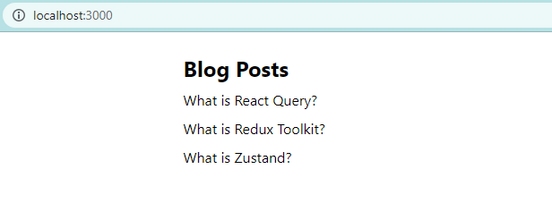
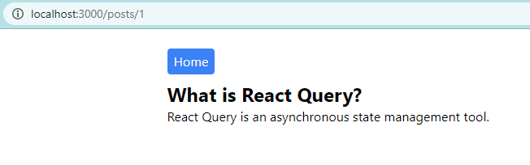

###### This blog post is part of a series. You must complete [part-1](https://hemanta.io/a-complete-guide-to-mutations-in-react-query-part-1-project-set-up/) before continuing here.

We have a list of blog posts available at the ~~http://localhost:5000/posts~~ endpoint. We will fetch those posts and display them in a ~~Posts~~ page using React Query’s ~~useQuery~~ hook.

Before we can use ~~useQuery~~, we will have to create a query client and provide that client to our ~~\<App />~~ component.

Add the following highlighted code snippets in the ~~index.js~~ file:

```js:title=src/index.js {numberLines, 5-5, 7-7, 12-12, 14-14}
import React from "react";
import ReactDOM from "react-dom/client";
import "./index.css";
import App from "./App";
import { QueryClient, QueryClientProvider } from "@tanstack/react-query";

const queryClient = new QueryClient();

const root = ReactDOM.createRoot(document.getElementById("root"));
root.render(
  <React.StrictMode>
    <QueryClientProvider client={queryClient}>
      <App />
    </QueryClientProvider>
  </React.StrictMode>
);
```

Next, inside the ~~src~~ folder, create a ~~components~~ folder & inside the ~~components~~ folder, create a file named ~~Posts.js~~.

Copy & paste the following code snippet in the ~~Posts.js~~ file.

```js:title=src/components/Posts.js {numberLines, 6-14}
import React from "react";
import { useQuery } from "@tanstack/react-query";
import axios from "axios";

const Posts = () => {
  const {
    isLoading,
    isError,
    error,
    data: posts,
  } = useQuery(["posts"], async () => {
    const { data } = await axios.get(`http://localhost:5000/posts`);
    return data;
  });

  return (
    <div className="w-1/2 m-auto mt-6">
      <h1 className="text-2xl font-bold mb-2">Blog Posts</h1>
      {isLoading ? (
        <p>Loading...</p>
      ) : isError ? (
        <p>{error.message}</p>
      ) : (
        posts.map(({ id, title }) => (
          <h1 key={id} className="mb-2">
            {title}
          </h1>
        ))
      )}
    </div>
  );
};

export default Posts;
```

The first argument to ~~useQuery~~ is a unique key (~~posts~~) for the query. Note that the query key is inside an array - ~~[posts]~~. This means that the query inside the ~~\<Posts />~~ component is tied to the ~~posts~~ key, which will be used for refetching, caching and sharing the query throughout the application.

The second argument to ~~useQuery~~ is a query function that returns a promise that resolves the data or throws an error. If the quey function throws an error, it is available as ~~error.message~~.

The query function is where we have made a HTTP ~~GET~~ request to the ~~http://localhost:5000/posts~~ API endpoint using axios (an HTTP client).

> **Note that React Query does not invoke the query function on every rerender.**

The query result returned by ~~useQuery~~ contains all the information about the query.

When we make an API call, we can view its progress as follows:

- **The request is in progress**. This is when we show a loader/spinner to the user.
- **The request succeeds**. We get the data we need.
- **The request fails**. We show the error message.

For most queries, it's usually sufficient to check for the ~~isLoading~~ state, then the ~~isError~~ state, then finally, assume that the data is available and render the successful state.

We have destructured ~~isLoading~~, ~~isError~~, ~~error~~ and ~~data~~ properties from the object returned by the ~~useQuery~~ hook. Note that we have renamed the ~~data~~ property to ~~posts~~.

Then, if ~~isLoading~~ is true, we show the text ~~Loading…~~; if ~~isError~~ is true, we show the error message, else, we map through the ~~posts~~ array and show the post titles.

Let’s render the ~~\<Posts />~~ component on the root (~~/~~) route.

Add the highlighted code snippets in the ~~index.js~~ file.

```js:title=src/index.js {numberLines, 5-5, 13-13, 17-17}
import React from "react";
import ReactDOM from "react-dom/client";
import "./index.css";
import App from "./App";
import { BrowserRouter as Router } from "react-router-dom";
import { QueryClient, QueryClientProvider } from "@tanstack/react-query";

const queryClient = new QueryClient();

const root = ReactDOM.createRoot(document.getElementById("root"));
root.render(
  <React.StrictMode>
    <Router>
      <QueryClientProvider client={queryClient}>
        <App />
      </QueryClientProvider>
    </Router>
  </React.StrictMode>
);
```

Then, copy and paste the following code snippet in the ~~App.js~~ file.

```js:title=src/App.js {numberLines}
import React from "react"
import { Routes, Route } from "react-router-dom"
import Posts from "./components/Posts"

const App = () => {
  return (
    <Routes>
      <Route path="/" element={<Posts />} />
    </Routes>
  )
}

export default App
```

Now, start the server with the command ~~npm start~~ and you should see the following result:



We have successfully fetched the blog posts from a fake REST API endpoint and displayed it in the ~~\<Posts />~~ component, in just a few lines of code. This is the beauty of React Query.

Everything is working as expected; however, there is one improvement we can make to our code. Notice that the ~~\<Posts />~~ component holds the UI logic as well as the data fetching logic. It’s always better to keep the UI & data fetching logic separate. So, we will encapsulate the data fetching logic in a custom hook.

In the ~~components~~ folder, make a file named ~~postHooks.js~~. Copy and paste the following code snippet in the ~~postHooks.js~~ file.

```js:title=src/components/postHooks.js {numberLines}
import { useQuery } from "@tanstack/react-query";
import axios from "axios";

export const useGetPosts = () => {
  return useQuery(["posts"], async () => {
    const { data } = await axios.get(`http://localhost:5000/posts`);
    return data;
  });
};
```

> Note that, as a convention, the name of custom hooks should start with the word ~~use~~, so that we can tell at a glance that the rules of hooks apply to them. Otherwise, custom hooks don’t have a specific signature. It’s up to the developer to decide what arguments they take and if they should return anything.

Next, let’s import and use the ~~useGetPosts~~ custom hook in the ~~Posts.js~~ file.

The updated ~~Posts.js~~ file is as shown below:

```js:title=src/components/Posts.js {numberLines, 2-2, 5-5}
import React from "react";
import { useGetPosts } from "./postHooks";

const Posts = () => {
  const { isLoading, isError, error, data: posts } = useGetPosts();

  return (
    <div className="w-1/2 m-auto mt-6">
      <h1 className="text-2xl font-bold mb-2">Blog Posts</h1>
      {isLoading ? (
        <p>Loading...</p>
      ) : isError ? (
        <p>{error.message}</p>
      ) : (
        posts.map(({ id, title }) => (
          <h1 key={id} className="mb-2">
            {title}
          </h1>
        ))
      )}
    </div>
  );
};

export default Posts;
```

The benefit of creating a custom hook is that we don’t have to repeat the data fetching logic in any component that requires to render the list of blog posts. All we need to do is to import and use the ~~useGetPosts()~~ hook.

Next, we will implement a functionality wherein when we click on the ~~title~~ of a blog post, we should be diected to a page that displays both the ~~title~~ and ~~body~~ of the post.

Update the ~~Posts.js~~ file by adding the following highlighted code snippets:

```js:title=src/components/Posts.js {numberLines, 2-2, 17-19}
import React from "react";
import { Link } from "react-router-dom";
import { useGetPosts } from "./postHooks";

const Posts = () => {
  const { isLoading, isError, error, data: posts } = useGetPosts();

  return (
    <div className="w-1/2 m-auto mt-6">
      <h1 className="text-2xl font-bold mb-2">Blog Posts</h1>
      {isLoading ? (
        <p>Loading...</p>
      ) : isError ? (
        <p>{error.message}</p>
      ) : (
        posts.map(({ id, title }) => (
          <Link key={id} to={`/posts/${id}`}>
            <h1>{title}</h1>
          </Link>
        ))
      )}
    </div>
  );
};

export default Posts;
```

Then, add the highlighted code snippet in the ~~App.js~~ file.

```js:title=src/App.js {numberLines, 4-4, 10-10}
import React from "react"
import { Routes, Route } from "react-router-dom"
import Posts from "./components/Posts"
import SinglePost from "./components/SinglePost"

const App = () => {
  return (
    <Routes>
      <Route path="/" element={<Posts />} />
      <Route path="/posts/:id" element={<SinglePost />} />
    </Routes>
  )
}

export default App
```

Next, inside the ~~components~~ folder, create a file named ~~SinglePost.js~~, and copy and paste the following code snippet in the file.

```js:title=src/components/SinglePost.js {numberLines}
import React from "react";
import { Link, useParams } from "react-router-dom";
import { useQuery } from "@tanstack/react-query";
import axios from "axios";

const SinglePost = () => {
  const { id } = useParams();

  const {
    data: post,
    error,
    isError,
    isLoading,
  } = useQuery(["posts", id], async () => {
    const { data } = await axios.get(`http://localhost:5000/posts/${id}`);
    return data;
  });
  return (
    <div className="w-1/2 m-auto mt-6">
      <Link to="/">
        <button className="bg-blue-500 text-gray-50 mb-2 px-2 py-1 rounded hover:bg-blue-600">
          Home
        </button>
      </Link>
      <div>
        {isLoading ? (
          <p>Loading..</p>
        ) : isError ? (
          <p>{error.message}</p>
        ) : (
          <article>
            <h1 className="text-2xl font-bold">{post.title}</h1>
            <p>{post.body}</p>
          </article>
        )}
      </div>
    </div>
  );
};

export default SinglePost;
```

Since query keys uniquely describe the data they are fetching, they should include any variables we use in your query function that change. In our case, ~~id~~ changes whenever we click on different blog posts. This is why we have included the ~~id~~ variable in our query key (~~["posts", id]~~).

**More importantly, whenever the query key changes, React Query will trigger a refetch.** You can think of the query key as the dependency array of the ~~useEffect~~ hook.

Now, whenever we click on the ~~title~~ of a blog post, the ~~\<SinglePost />~~ component renders and we see the details of the post.



Next, we should extract the data fetching logic inside the ~~\<SinglePost />~~ component to a custom hook, like the way we did for the ~~Posts~~ page. This way, all our data fetching logic will be managed in a centralized location: the ~~postHooks.js~~ file.

Add the highlighted code snippets in the ~~postHooks.js~~ file:

```js:title=src/components/postHooks.js {numberLines, 11-17}
import { useQuery } from "@tanstack/react-query"
import axios from "axios"

export const useGetPosts = () => {
  return useQuery(["posts"], async () => {
    const { data } = await axios.get(`http://localhost:5000/posts`)
    return data
  })
}

export const useGetSinglePostById = id => {
  return useQuery(["posts", id], async () => {
    const { data } = await axios.get(`http://localhost:5000/posts/${id}`)
    return data
  })
}
```

The updated ~~SinglePost.js~~ file looks like the following:

```js:title=src/components/SinglePost.js {numberLines, 3-3, 8-8}
import React from "react";
import { Link, useParams } from "react-router-dom";
import { useGetSinglePostById } from "./postHooks";

const SinglePost = () => {
  const { id } = useParams();

  const { data: post, error, isError, isLoading } = useGetSinglePostById(id);

  return (
    <div className="w-1/2 m-auto mt-6">
      <Link to="/">
        <button className="bg-blue-500 text-gray-50 mb-2 px-2 py-1 rounded hover:bg-blue-600">
          Home
        </button>
      </Link>
      <div>
        {isLoading ? (
          <p>Loading..</p>
        ) : isError ? (
          <p>{error.message}</p>
        ) : (
          <article>
            <h1 className="text-2xl font-bold">{post.title}</h1>
            <p>{post.body}</p>
          </article>
        )}
      </div>
    </div>
  );
};

export default SinglePost;
```

In part-3, we will turn our attention to data mutation using the ~~useMutation~~ hook.
