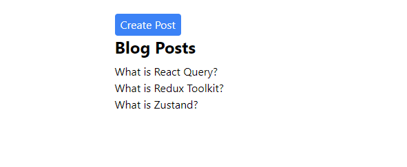
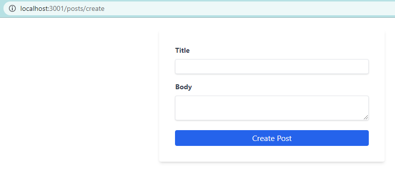
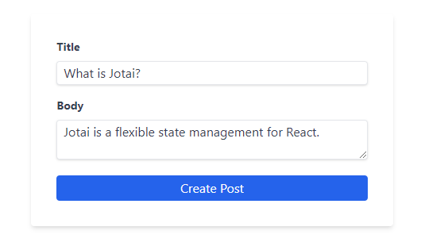
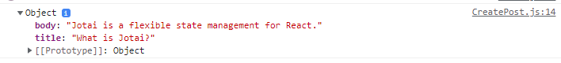
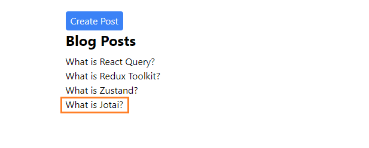
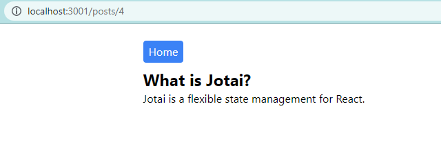
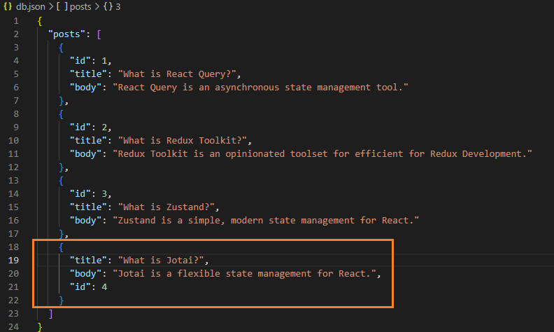
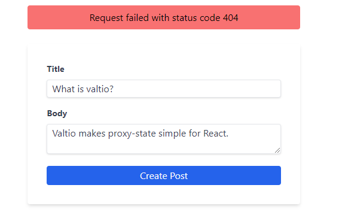

```toc

```

###### This blog post is part of a series. You must complete [part-1](https://hemanta.io/a-complete-guide-to-mutations-in-react-query-part-1-project-set-up/) & [part-2](https://hemanta.io/a-complete-guide-to-mutations-in-react-query-part-2-fetching-data-using-the-usequery-hook/) before continuing here.

In part-2, we fetched a list of blog posts from the ~~http://localhost:5000/posts~~ end point using the ~~useQuery~~ hook and displayed them on the ~~Posts~~ page.

In this post, we will learn how to create resources on the server using the ~~useMutation~~ hook. Let’s get started.

First, let's create a ~~Create Post~~ button on the ~~Posts~~ page. Clicking on the ~~Create Post~~ button will take us to the ~~/posts/create~~ route, which will load the ~~\<CreatePost />~~ component (_which we have not created yet_).

Add the highlighted code snippets in the ~~Posts.js~~ file.

```js:title=src/components/Posts.js {numberLines, 10-14}
import React from "react";
import { Link } from "react-router-dom";
import { useGetPosts } from "./postHooks";

const Posts = () => {
  const { isLoading, isError, error, data: posts } = useGetPosts();

  return (
    <div className="w-1/2 m-auto mt-6">
      <Link to="/posts/create">
        <button className="bg-blue-500 text-gray-50 px-2 py-1 rounded hover:bg-blue-600">
          Create Post
        </button>
      </Link>

      <h1 className="text-2xl font-bold mb-2">Blog Posts</h1>
      {isLoading ? (
        <p>Loading...</p>
      ) : isError ? (
        <p>{error.message}</p>
      ) : (
        posts.map(({ id, title }) => (
          <Link key={id} to={`/posts/${id}`}>
            <h1>{title}</h1>
          </Link>
        ))
      )}
    </div>
  );
};

export default Posts;
```



### Creating a React form using the Formik library

Next, inside the ~~components~~ folder, create a file named ~~CreatePost.js~~. Copy and paste the following code snippet in the ~~CreatePost.js~~ file.

```js:title=src/components/CreatePost.js {numberLines, 13-15}
import React from "react";
import { Formik, Field, Form, ErrorMessage } from "formik";
import * as Yup from "yup";

const CreatePost = () => {
  return (
    <Formik
      initialValues={{ title: "", body: "" }}
      validationSchema={Yup.object({
        title: Yup.string().required("Required"),
        body: Yup.string().required("Required"),
      })}
      onSubmit={(values) => {
        console.log(values);
      }}
    >
      <Form className="w-1/3 flex flex-col bg-white shadow-md rounded mt-6 px-8 py-8 m-auto">
        <div className="flex flex-col mb-4">
          <label
            htmlFor="title"
            className="text-gray-700 text-sm font-bold mb-2"
          >
            Title
          </label>
          <Field
            name="title"
            type="text"
            className="shadow appearance-none border rounded py-1 px-2 text-gray-700 leading-tight focus:outline-none focus:shadow-outline"
            id="username"
          />
          <ErrorMessage name="title" />
        </div>

        <div className="flex flex-col mb-4">
          <label
            htmlFor="body"
            className="text-gray-700 text-sm font-bold mb-2"
          >
            Body
          </label>
          <Field
            name="body"
            as="textarea"
            type="text"
            className="shadow appearance-none border rounded mb-1 py-1 px-2 text-gray-700 leading-tight focus:outline-none focus:shadow-outline"
          />
          <ErrorMessage name="body" />
        </div>

        <button
          type="submit"
          className="bg-blue-600 text-gray-50 px-2 py-1 rounded hover:bg-blue-700"
        >
          Create Post
        </button>
      </Form>
    </Formik>
  );
};

export default CreatePost;
```

Here, we have used the ~~Formik~~ library to create the form. Note that the ~~values~~ variable (on line 13) contains the form data. At present, we are just logging the form data to the console. Shortly, we will learn how to use the ~~useMutation~~ hook to ~~POST~~ the form data to the server.

Next, add the highlighted code snippets in the ~~App.js~~ file.

```js:title=src/App.js {numberLines, 5-5, 12-12}
import React from "react";
import { Routes, Route } from "react-router-dom";
import Posts from "./components/Posts";
import SinglePost from "./components/SinglePost";
import CreatePost from "./components/CreatePost";

const App = () => {
  return (
    <Routes>
      <Route path="/" element={<Posts />} />
      <Route path="/posts/:id" element={<SinglePost />} />
      <Route path="/posts/create" element={<CreatePost />} />
    </Routes>
  );
};

export default App;
```

Now, if we click on the ~~Create Post~~ button on the ~~Post~~ page, we see the following form.



If we fill the ~~title~~ and ~~body~~



and click on the ~~CreatePost~~ button, we will see the form data contained inside the ~~values~~ variable.



Now, add the highlighted code snippets in ~~CreatePost.js~~ file.

```js:title=src/components/CreatePost.js {numberLines, 2-2, 5-6, 9-23, 32-32}
import React from "react"
import { useNavigate } from "react-router-dom"
import { Formik, Field, Form, ErrorMessage } from "formik"
import * as Yup from "yup"
import { useMutation, useQueryClient } from "@tanstack/react-query"
import axios from "axios"

const CreatePost = () => {
  const queryClient = useQueryClient()
  const navigate = useNavigate()

  const mutation = useMutation(
    postData => {
      return axios.post("http://localhost:5000/posts", postData)
    },
    {
      onSuccess: () => {
        // invalidate & refetch
        queryClient.invalidateQueries(["posts"])
        navigate("/")
      },
    }
  )
  return (
    <Formik
      initialValues={{ title: "", body: "" }}
      validationSchema={Yup.object({
        title: Yup.string().required("Required"),
        body: Yup.string().required("Required"),
      })}
      onSubmit={values => {
        mutation.mutate(values)
      }}
    >
      <Form className="w-1/3 flex flex-col bg-white shadow-md rounded mt-6 px-8 py-8 m-auto">
        <div className="flex flex-col mb-4">
          <label
            htmlFor="title"
            className="text-gray-700 text-sm font-bold mb-2"
          >
            Title
          </label>
          <Field
            name="title"
            type="text"
            className="shadow appearance-none border rounded py-1 px-2 text-gray-700 leading-tight focus:outline-none focus:shadow-outline"
            id="username"
          />
          <ErrorMessage name="title" />
        </div>

        <div className="flex flex-col mb-4">
          <label
            htmlFor="body"
            className="text-gray-700 text-sm font-bold mb-2"
          >
            Body
          </label>
          <Field
            name="body"
            as="textarea"
            type="text"
            className="shadow appearance-none border rounded mb-1 py-1 px-2 text-gray-700 leading-tight focus:outline-none focus:shadow-outline"
          />
          <ErrorMessage name="body" />
        </div>

        <button
          type="submit"
          className="bg-blue-600 text-gray-50 px-2 py-1 rounded hover:bg-blue-700"
        >
          Create Post
        </button>
      </Form>
    </Formik>
  )
}

export default CreatePost
```

Let’s understand the code snippets that we have added.

### Understanding the anatomy of the useMutation hook

The first argument to the ~~useMutation~~ hook is a mutation function. In our code snippet above, the mutation function accepts the form data as the argument and uses the ~~axios~~ HTTP client to ~~POST~~ the form data to the ~~http://localhost:5000/post~~ end point.

Notice that we have used the ~~mutate()~~ function on line 32 to pass the form data to the mutation function.

**Invalidating & refetching the query with the posts query key**

After we successfully create a blog post, the list of blog posts on the ~~Posts~~ page becomes out of sync with the list of blog posts on the server. The server state contains the new post, but not the ~~Posts~~ page.

How can we then show the new post on the ~~Posts~~ page?

We can show the new post by invalidating and refetching any query with the ~~posts~~ query key. To do this, we can use the ~~useMutation~~’s ~~onSuccess~~ option and the ~~client~~’s ~~invalidateQueries~~ function.

Notice that, on line 20, after we successfully create a new blog post, we get navigated to the root ~~/~~ route, which loads the ~~\<Post />~~ component.

To see the blog post creation in action, fill the form with a ~~title~~ and a ~~body~~


and click on the ~~Create Post~~ button. We get directed to the ~~Posts~~ page and we see the new post.





Remember that we are using JSON Server as our backend. In part-1, I told you that when we create a resource on the server, the changes will be automatically saved in the ~~db.json~~ file.

Check the ~~db.json~~ file; you should see the new post added to the ~~posts~~ array.



Hurray! Now you know how to use the ~~useMutation~~ hook to create resources on the server.

We are not done yet.

### Error handling with the onError callback

What if our mutation (_creation of a blog post_) encounters an error?

Well, to handle errors, ~~useMutation~~ provides an ~~onError~~ callback.

Let’s simulate an error by POSTing the form data to a **wrong** API endpoint.

Add the highlighted code snippets in the ~~CreatePost.js~~ file. Also, make sure to remove the ~~s~~ from ~~/posts~~ inside the mutation function. Remember, the ~~http://localhost:5000/post~~ end point does not exist.

```js:title=src/components/CreatePost.js {numberLines, 1-1, 9-9, 24-26, 31-35}
import React, { useState } from "react";
import { useNavigate } from "react-router-dom";
import { Formik, Field, Form, ErrorMessage } from "formik";
import * as Yup from "yup";
import { useMutation, useQueryClient } from "@tanstack/react-query";
import axios from "axios";

const CreatePost = () => {
  const [error, setError] = useState(null);

  const queryClient = useQueryClient();
  const navigate = useNavigate();

  const mutation = useMutation(
    (postData) => {
      return axios.post("http://localhost:5000/post", postData);
    },
    {
      onSuccess: () => {
        // invalidate & refetch
        queryClient.invalidateQueries(["posts"]);
        navigate("/");
      },
      onError: ({ message }) => {
        setError(message);
      },
    }
  );
  return (
    <>
      {error && (
        <div className="w-1/3 flex justify-center items-center bg-red-400 rounded mt-4 px-2 py-2 m-auto">
          <p>{error}</p>
        </div>
      )}
      <Formik
        initialValues={{ title: "", body: "" }}
        validationSchema={Yup.object({
          title: Yup.string().required("Required"),
          body: Yup.string().required("Required"),
        })}
        onSubmit={(values) => {
          mutation.mutate(values);
        }}
      >
        <Form className="w-1/3 flex flex-col bg-white shadow-md rounded mt-6 px-8 py-8 m-auto">
          <div className="flex flex-col mb-4">
            <label
              htmlFor="title"
              className="text-gray-700 text-sm font-bold mb-2"
            >
              Title
            </label>
            <Field
              name="title"
              type="text"
              className="shadow appearance-none border rounded py-1 px-2 text-gray-700 leading-tight focus:outline-none focus:shadow-outline"
              id="username"
            />
            <ErrorMessage name="title" />
          </div>

          <div className="flex flex-col mb-4">
            <label
              htmlFor="body"
              className="text-gray-700 text-sm font-bold mb-2"
            >
              Body
            </label>
            <Field
              name="body"
              as="textarea"
              type="text"
              className="shadow appearance-none border rounded mb-1 py-1 px-2 text-gray-700 leading-tight focus:outline-none focus:shadow-outline"
            />
            <ErrorMessage name="body" />
          </div>

          <button
            type="submit"
            className="bg-blue-600 text-gray-50 px-2 py-1 rounded hover:bg-blue-700"
          >
            Create Post
          </button>
        </Form>
      </Formik>
    </>
  );
};

export default CreatePost;
```

Fill the form with a ~~title~~ and a ~~body~~ and click on the ~~Create Post~~ button. You will see an error:



### Using the isLoading boolean

There is one more improvement we can make to the user experience. When we click on the ~~Create Post~~ button, we make a network request to the server. When the network request is in progress (In other words, while the mutation is currently running), let’s change the button text from ~~Create Post~~ to ~~Creating… Post~~. You can also choose to show a spinner next to the text.

Make the highlighted changes in the ~~Create Post.js~~ file.

```js:title=src/components/CreatePost.js {numberLines, 14-14, 83-83}
import React, { useState } from "react";
import { useNavigate } from "react-router-dom";
import { Formik, Field, Form, ErrorMessage } from "formik";
import * as Yup from "yup";
import { useMutation, useQueryClient } from "@tanstack/react-query";
import axios from "axios";

const CreatePost = () => {
  const [error, setError] = useState(null);

  const queryClient = useQueryClient();
  const navigate = useNavigate();

  const { mutate, isLoading } = useMutation(
    (postData) => {
      return axios.post("http://localhost:5000/posts", postData);
    },
    {
      onSuccess: () => {
        // invalidate & refetch
        queryClient.invalidateQueries(["posts"]);
        navigate("/");
      },
      onError: ({ message }) => {
        setError(message);
      },
    }
  );
  return (
    <>
      {error && (
        <div className="w-1/3 flex justify-center items-center bg-red-400 rounded mt-4 px-2 py-2 m-auto">
          <p>{error}</p>
        </div>
      )}
      <Formik
        initialValues={{ title: "", body: "" }}
        validationSchema={Yup.object({
          title: Yup.string().required("Required"),
          body: Yup.string().required("Required"),
        })}
        onSubmit={(values) => {
          mutate(values);
        }}
      >
        <Form className="w-1/3 flex flex-col bg-white shadow-md rounded mt-6 px-8 py-8 m-auto">
          <div className="flex flex-col mb-4">
            <label
              htmlFor="title"
              className="text-gray-700 text-sm font-bold mb-2"
            >
              Title
            </label>
            <Field
              name="title"
              type="text"
              className="shadow appearance-none border rounded py-1 px-2 text-gray-700 leading-tight focus:outline-none focus:shadow-outline"
              id="username"
            />
            <ErrorMessage name="title" />
          </div>

          <div className="flex flex-col mb-4">
            <label
              htmlFor="body"
              className="text-gray-700 text-sm font-bold mb-2"
            >
              Body
            </label>
            <Field
              name="body"
              as="textarea"
              type="text"
              className="shadow appearance-none border rounded mb-1 py-1 px-2 text-gray-700 leading-tight focus:outline-none focus:shadow-outline"
            />
            <ErrorMessage name="body" />
          </div>

          <button
            type="submit"
            className="bg-blue-600 text-gray-50 px-2 py-1 rounded hover:bg-blue-700"
          >
            {isLoading ? "Creating... Post" : "Create Post"}
          </button>
        </Form>
      </Formik>
    </>
  );
};

export default CreatePost;
```

We use the ~~isLoading~~ boolean to determine what text to show inside the form submit button.

Now, fill the form with a ~~title~~ and a ~~body~~ and hit the ~~Create Post~~ button. You should see the text ~~Creating... Post~~ before the mutation succeeds.

### Creating a custom hook

Finally, let's extract the mutation logic to a custom hook named ~~useCreatePost()~~ inside the ~~postHooks.js~~ file.

```js:title=src/components/postHooks.js {numberLines, 1-2, 20-38}
import { useNavigate } from "react-router-dom";
import { useQuery, useMutation, useQueryClient } from "@tanstack/react-query";
import axios from "axios";

export const useGetPosts = () => {
  return useQuery(["posts"], async () => {
    const { data } = await axios.get(`http://localhost:5000/posts`);
    return data;
  });
};

export const useGetSinglePostById = (id) => {
  console.log(id);
  return useQuery(["posts", id], async () => {
    const { data } = await axios.get(`http://localhost:5000/posts/${id}`);
    return data;
  });
};

export const useCreatePost = (setError) => {
  const queryClient = useQueryClient();
  const navigate = useNavigate();
  return useMutation(
    (postData) => {
      return axios.post("http://localhost:5000/posts", postData);
    },
    {
      onSuccess: () => {
        queryClient.invalidateQueries(["posts"]);
        navigate("/");
      },

      onError: ({ message }) => {
        setError(message);
      },
    }
  );
};
```

Next, make the highlighted changes in the ~~CreatePost.js~~ file.

```js:title=src/components/CreatePost.js {numberLines, 4-4, 9-9}
import React, { useState } from "react";
import { Formik, Field, Form, ErrorMessage } from "formik";
import * as Yup from "yup";
import { useCreatePost } from "./postHooks";

const CreatePost = () => {
  const [error, setError] = useState(null);

  const { mutate, isLoading } = useCreatePost(setError);

  return (
    <>
      {error && (
        <div className="w-1/3 flex justify-center items-center bg-red-400 rounded mt-4 px-2 py-2 m-auto">
          <p>{error}</p>
        </div>
      )}
      <Formik
        initialValues={{ title: "", body: "" }}
        validationSchema={Yup.object({
          title: Yup.string().required("Required"),
          body: Yup.string().required("Required"),
        })}
        onSubmit={(values) => {
          mutate(values);
        }}
      >
        <Form className="w-1/3 flex flex-col bg-white shadow-md rounded mt-6 px-8 py-8 m-auto">
          <div className="flex flex-col mb-4">
            <label
              htmlFor="title"
              className="text-gray-700 text-sm font-bold mb-2"
            >
              Title
            </label>
            <Field
              name="title"
              type="text"
              className="shadow appearance-none border rounded py-1 px-2 text-gray-700 leading-tight focus:outline-none focus:shadow-outline"
              id="username"
            />
            <ErrorMessage name="title" />
          </div>

          <div className="flex flex-col mb-4">
            <label
              htmlFor="body"
              className="text-gray-700 text-sm font-bold mb-2"
            >
              Body
            </label>
            <Field
              name="body"
              as="textarea"
              type="text"
              className="shadow appearance-none border rounded mb-1 py-1 px-2 text-gray-700 leading-tight focus:outline-none focus:shadow-outline"
            />
            <ErrorMessage name="body" />
          </div>

          <button
            type="submit"
            className="bg-blue-600 text-gray-50 px-2 py-1 rounded hover:bg-blue-700"
          >
            {isLoading ? "Creating... Post" : "Create Post"}
          </button>
        </Form>
      </Formik>
    </>
  );
};

export default CreatePost;
```

Part-3 of the series is complete. In part-4, we will learn how to update a blog post using the ~~useMutation~~ hook.
