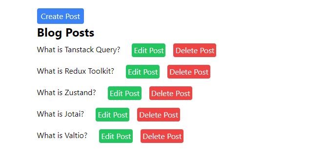

###### This blog post is part of a series. You must complete [part-1](https://hemanta.io/a-complete-guide-to-mutations-in-react-query-part-1-project-set-up/) & [part-2](https://hemanta.io/a-complete-guide-to-mutations-in-react-query-part-2-fetching-data-using-the-usequery-hook/), [part-3]() & [part-4]() before continuing here.

In part-4, we learnt how to update resources on the server using React Query’s ~~useMutation~~ hook.

In this part, we will learn how to delete resources on the server.

Add the ~~useDeletePost()~~ custom hook in the ~~postHooks.js~~ file.

```js:title=src/postHooks.js {numberLines, 58-76}
import { useNavigate } from "react-router-dom";
import { useQuery, useMutation, useQueryClient } from "@tanstack/react-query";
import axios from "axios";

export const useGetPosts = () => {
  return useQuery(["posts"], async () => {
    const { data } = await axios.get(`http://localhost:5000/posts`);
    return data;
  });
};

export const useGetSinglePostById = (id) => {
  return useQuery(["posts", id], async () => {
    const { data } = await axios.get(`http://localhost:5000/posts/${id}`);
    return data;
  });
};

export const useCreatePost = (setError) => {
  const queryClient = useQueryClient();
  const navigate = useNavigate();
  return useMutation(
    (postData) => {
      return axios.post("http://localhost:5000/posts", postData);
    },
    {
      onSuccess: () => {
        queryClient.invalidateQueries(["posts"]);
        navigate("/");
      },

      onError: ({ message }) => {
        setError(message);
      },
    }
  );
};
export const useEditPost = (id, setError) => {
  const queryClient = useQueryClient();
  const navigate = useNavigate();
  return useMutation(
    (postData) => {
      return axios.put(`http://localhost:5000/posts/${id}`, postData);
    },
    {
      onSuccess: () => {
        queryClient.invalidateQueries(["posts"]);
        navigate("/");
      },

      onError: ({ message }) => {
        setError(message);
      },
    }
  );
};

export const useDeletePost = (setDeletionError) => {
  const queryClient = useQueryClient();
  const navigate = useNavigate();
  return useMutation(
    (id) => {
      return axios.delete(`http://localhost:5000/posts/${id}`);
    },
    {
      onSuccess: () => {
        queryClient.invalidateQueries(["posts"]);
        navigate("/");
      },

      onError: ({ message }) => {
        setDeletionError(message);
      },
    }
  );
};
```

Recall that **the variable that we pass to the ~~mutate()~~ function gets passed to the mutation function(_the first argument of the useMutation hook_)**. On line 62, notice that the mutation function receives the ~~id~~ variable, which we will pass to the ~~mutate()~~ function in the ~~Posts.js~~ file.

Copy and paste the following code snippets in the ~~Posts.js~~ file.

```js:title=src/components/Posts.js {numberLines, 14-14, 49-49}
import React, { useState } from "react";
import { Link } from "react-router-dom";
import { useGetPosts } from "./postHooks";
import { useDeletePost } from "./postHooks";

const Posts = () => {
  const [deletionError, setDeletionError] = useState(null);

  const { isLoading, isError, error, data: posts } = useGetPosts();

  const { mutate, isLoading: isDeleting } = useDeletePost(setDeletionError);

  const handleDeleteClick = (id) => {
    mutate(id);
  };

  return (
    <div className="w-1/2 m-auto mt-6">
      {deletionError && (
        <div className="w-1/3 flex justify-center items-center bg-red-400 rounded mt-4 px-2 py-2 m-auto">
          <p>{deletionError}</p>
        </div>
      )}

      <Link to="/posts/create">
        <button className="bg-blue-500 text-gray-50 px-2 py-1 rounded hover:bg-blue-600">
          Create Post
        </button>
      </Link>

      <h1 className="text-2xl font-bold mb-2">Blog Posts</h1>
      {isLoading ? (
        <p>Loading...</p>
      ) : isError ? (
        <p>{error.message}</p>
      ) : (
        posts.map(({ id, title }) => (
          <div key={id} className="flex justify-even">
            <Link to={`/posts/${id}`}>
              <h1 className="mr-6">{title}</h1>
            </Link>
            <Link to={`/posts/edit/${id}`}>
              <button className="bg-green-500 text-gray-50 mb-4 mr-4 px-1 py-0.5 rounded hover:bg-green-600">
                Edit Post
              </button>
            </Link>
            <button
              className="bg-red-500 text-gray-50 mb-4 px-1 py-0.5 rounded hover:bg-red-600"
              onClick={() => handleDeleteClick(id)}
            >
              {isDeleting ? "Deleting... Post" : "Delete Post"}
            </button>
          </div>
        ))
      )}
    </div>
  );
};

export default Posts;
```

On line 14, notice that we are passing the ~~id~~ variable to the ~~mutate()~~ function.



Our delete post functionality is ready. Go ahead, delete some blog posts.

This post marks the end of the series on using React Query's ~~useQuery~~ & ~~useMutation~~ hooks to perform CRUD operations. You now know enough to effectively use React Query and manage server state
like a boss.
