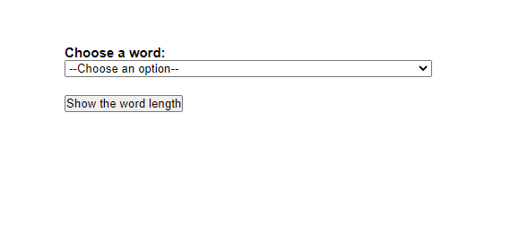
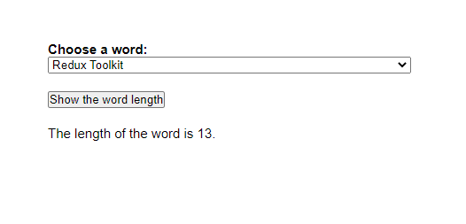
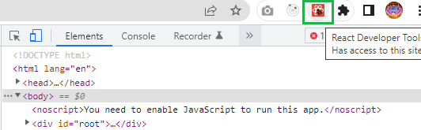
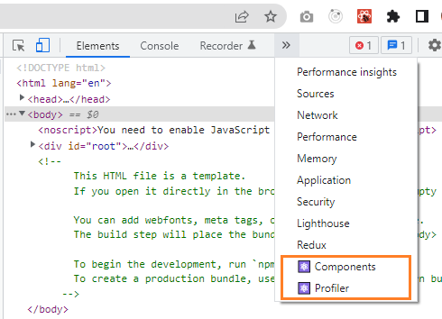
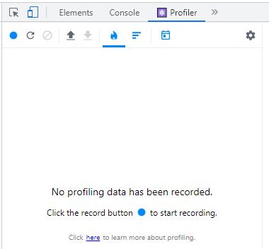
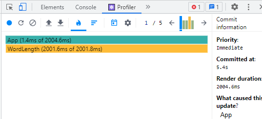
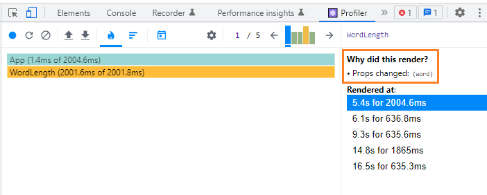
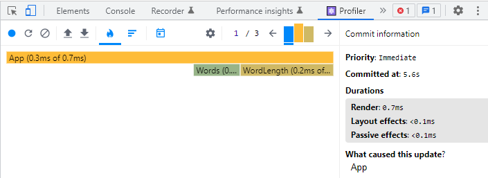

```toc

```

In this post, we will learn how to optimize React apps using memoization with the ~~useMemo()~~ hook in three steps:

- First, We will build an example app.

- Then, we will measure its performance using React Profiler, which will help us find out which components render and how often.

- And finally, we will optimize our app (_make it faster_) using the ~~useMemo()~~ hook.

### Building the example app

Start a React project. Inside the ~~src~~ folder, create a ~~components~~ folder. Then inside the ~~components~~ folder, create two components: ~~Words.js~~ & ~~WordLength.js~~.

Copy and paste the following code snippets in their respective files.

```js:title=src/components/Words.js {numberLines}
import React from "react";

const Words = ({ handleSelectWord }) => {
  return (
    <div className="words">
      <label for="word-select">Choose a word:</label>
      <select name="words" id="word-select" onChange={handleSelectWord}>
        <option value="">--Choose an option--</option>
        <option value="React">React</option>
        <option value="Redux Toolkit">Redux Toolkit</option>
        <option value="TypeScript">TypeScript</option>
        <option value="React Query">React Query</option>
      </select>
    </div>
  );
};

export default Words;
```

```js:title=src/components/WordLength.js {numberLines}
import React from "react";

const WordLength = ({ show, word }) => {
  const wordCount = (word) => {
    let i = 0;
    while (i < 1000000000) {
      i++;
    }
    return word.length;
  };

  let length = wordCount(word);

  return <>{show ? <p>The length of the word is {length}.</p> : ""}</>;
};

export default WordLength;
```

Copy and paste the following code snippet in ~~App.js~~.

```js:title=src/components/WordLength.js {numberLines}
import React, { useState } from "react";
import Words from "./components/Words";
import WordLength from "./components/WordLength";

const App = () => {
  const [show, setShow] = useState(false);
  const [word, setWord] = useState("");

  const handleSelectWord = (e) => {
    setWord(e.target.value);
  };
  return (
    <main>
      <Words handleSelectWord={handleSelectWord} />
      <button onClick={() => setShow(!show)}>Show the word length</button>
      <WordLength show={show} word={word} />
    </main>
  );
};

export default App;
```

Finally, copy and paste the following style rules in ~~index.css~~.

```js:title=src/components/index.js {numberLines}
* {
  padding: 0;
  margin:0;
  box-sizing: border-box;
}

html {
  font-size: 62.5%;
  font-family: sans-serif;
}

button {
  cursor: pointer;
  margin-bottom: 2rem;
}

main {
  width: 30%;
  max-width: 30%;
  margin: auto;
  margin-top: 6rem;
}

label {
  font-size: 1.5rem;
  font-weight: bold;
}

.words {
  display: flex;
  flex-direction: column;
  margin-bottom: 2rem;
}

p {
  font-size: 1.5rem;
}
```

Our app is ready and looks like the following:



Our app allows users to find the length of a word, which they can select from a dropdown. After selecting a word, when the user clicks on the ~~Show word length~~ button, our app displays a paragraph element that tells the user the length of the word they have selected from the dropdown. When the user clicks on the button again, our app turns off the display of the paragraph element.



Go ahead, select a word from the dropdown. Then click on the ~~Show word length~~ button. You will notice that the sentence is not displayed on the screen instantly. There is some amount of delay. Click on the button again and there is again some amount of delay in turning off the display of the paragraph element.

Clearly, the interaction within our app is slow, causing bad user experience. There are definitely some performance improvements that we can make to our app.

Before we figure out a way to improve the performance of our app, we must find out the component that is causing the performance bottleneck. To do this, we will use a tool called React Profiler.

If you have never used React Profiler before, it is a tool we can use to identify performance issues in React apps. To use React profiler, ensure that you have ~~React Developer Tools~~ installed as a browser extension. You can install it on Chrome from the link [here](https://chrome.google.com/webstore/detail/react-developer-tools/fmkadmapgofadopljbjfkapdkoienihi?hl=en).

I have React Developer Tools installed as a chrome DevTools extension.



After you install **React Dev Tools**, you will get two new tabs in your Chrome DevTools: ~~Components~~ & ~~Profiler~~.



Click on the ~~Profiler~~ tab and you will see the following:



### Identifying performance bottleneck

Notice that there is a round blue button. We can use this button to record all the commits made during a session.

**Understanding the Commit Phase**

React applies changes in 2 phases. React maintains a copy of the DOM (called Virtual DOM) so that when React sees that a change has occurred, it finds out what DOM elements need to be changed by comparing the state of the Virtual DOM before and after the change.

Once React has the before & after states of the DOM, it compares them to find what changes it needs to apply to the real DOM.

Once React knows which elements need to change using its Virtual DOM, it makes changes to the browser’s DOM to display the new state of the app. This second phase is called the **commit phase** and the commit phase is how React Profiler organizes its data.

Now that we understand how React makes changes to the DOM, let’s record a session using the **Profiler**. Click on the blue record button. (After you click on the blue record button, its color turns to red.) Now, select a word from the dropdown and click on the ~~Show the word length~~ button to show the length of the word. Click on the button again to turn off the display of the paragraph.

Next, click on the record button again to stop the recording of the session. Once we stop the session, the profiler will show us information about how React worked during our session.

The first graph we see is the **flame graph**, which are the long blue & yellow horizontal bars.



Flame graphs show us the hierarchy of components that were called during our session and help us figure out where performance issues may be occurring.

The first horizontal bar is blue and says **App**. The label on each bar corresponds to the component name. The ~~App~~ is the top level component in our app and is the first thing that renders. We can see that ~~App~~ took 1.4ms to render.

Below that, there is the ~~WordLength~~ component, which took 2001.6ms to render. In the Profiler, the longer something takes to render, the more yellow the bar will be. The shorter something takes to render, the bluer the bar will be.

> Note that the width of bars in the flame graph are also meaningful. The wider each bar, the longer it took to render.

So, clearly it’s the ~~WordLength~~ component that is causing performance bottlenecks in our app.

Click on the ~~WordLength~~ bar in the flame graph in the React Profiler. We can see that the ~~WordLength~~ component rendered because the ~~word~~ prop changed.



This gives us a clue as to what we should inspect in our app, so let’s jump into the code.

```js:title=src/App.js {numberLines, 16-16}
import React, { useState } from "react";
import Words from "./components/Words";
import WordLength from "./components/WordLength";

const App = () => {
  const [show, setShow] = useState(false);
  const [word, setWord] = useState("");

  const handleSelectWord = (e) => {
    setWord(e.target.value);
  };
  return (
    <main>
      <Words handleSelectWord={handleSelectWord} />
      <button onClick={() => setShow(!show)}>Show the word length</button>
      <WordLength show={show} word={word} />
    </main>
  );
};

export default App;
```

Notice that the ~~WordLength~~ component accepts two props: ~~show~~ & ~~word~~.

When we clicked on the ~~Show word length~~ button, our app sent the ~~show~~ prop into the ~~WordLength~~ component. The ~~WordLength~~ component then used the ~~show~~ prop to toggle a paragraph element that tells us the length of the word we chose from the dropdown. And when we chose a word from the dropdown, our app sent the ~~word~~ prop into the ~~WordLength~~ component.

It is important to understand that when we click on the ~~Show word length~~ button, the value of the ~~show~~ prop changes (from ~~false~~ to ~~true~~ or from ~~true~~ to ~~false~~) and whenever the value of the ~~show~~ prop changes, React rerenders the ~~WordLength~~ component. And everytime the ~~WordLength~~ component rerenders, it reruns the ~~wordCount~~ function, which does a long-running and time-consuming calculation (thanks to the ~~while~~ loop).

I want you to pay close attention to the ~~wordCount()~~ function as highlighted below. Why is there a ~~while~~ loop inside the function? Well, we don’t really need it. It’s only purpose is to introduce some amount of delay in the execution of the ~~wordCount()~~ function, so that I can explain you the concept of the ~~useMemo()~~ hook.

```js:title=src/components/WordLength.js {numberLines, 4-10}
import React from "react";

const WordLength = ({ show, word }) => {
  const wordCount = (word) => {
    let i = 0;
    while (i < 1000000000) {
      i++;
    }
    return word.length;
  };

  let length = wordCount(word);

  return <>{show ? <p>The length of the word is {length}.</p> : ""}</>;
};

export default WordLength;
```

We know that when React loads a component, it not only renders the JSX code but also evaluates all of the code and functions inside the component. So, the question we need to answer is: do we really need the ~~wordCount()~~ function to be re-executed on every rerender of the ~~WordLength~~ component?

The answer is NO. We need the ~~wordCount()~~ function to be re-executed ONLY when the ~~word~~ prop changes, which the function accepts as an argument.

Now we have identified the culprit, which is slowing our app down. It’s the re-execution of the ~~wordCount()~~ function (which does a long-running calculation) on every rerender of the ~~WordLength~~ component.

To fix this particular issue, we have to find a way to instruct React to only call the ~~wordCount()~~ function when new data is needed (in other words, when the ~~word~~ prop changes) and have it return a cached result when the data is the same. This is where we can leverage the ~~useMemo()~~ React hook, which can help us optimize expensive function calls.

### using the useMemo() hook

~~useMemo()~~ utilizes an optimization technique called **memoization**. This technique caches the result of a function call and only calls the function again when its dependencies change.

React’s ~~useMemo()~~ hook takes a function as its first argument and a list of props as its second argument. If the list of props changes, then it will run the function. Importantly, if the props don’t change, then the ~~useMemo()~~ hook will return the last calculated value without recalculating the result. This is called memoization, hence the name ~~useMemo()~~.

Let’s implement the ~~useMemo()~~ hook by changing the following line of code (inside the ~~WordLength~~ component)

```js {numberLines}
let length = wordCount(word)
```

into this code:

```js {numberLines}
let length = useMemo(() => wordCount(word), [word])
```

Now, the ~~wordCount()~~ function will be recomputed if the ~~word~~ dependency changes.

> There are some notable behaviors of ~~useMemo()~~. The function passed to ~~useMemo()~~ will be called when the component mounts, so it will always be called at least once. The dependency list works just like ~~useEffect()~~’s dependency list: if the list is empty, then it will only run on the first rendering of the component. In most cases, the dependency list should be the same as the arguments passed to the expensive function executed within the ~~useMemo()~~ callback.

Also, make sure to import ~~useMemo~~ from React.

Now, our updated code for the ~~WordLength~~ component looks like the following:

```js:title=src/components/WordLength.js {numberLines, 1-1, 12-12}
import React, { useMemo } from "react";

const WordLength = ({ show, word }) => {
  const wordCount = (word) => {
    let i = 0;
    while (i < 1000000000) {
      i++;
    }
    return word.length;
  };

  let length = useMemo(() => wordCount(word), [word]);

  return <>{show ? <p>The length of the word is {length}.</p> : ""}</>;
};

export default WordLength;
```

After making the change, let’s record another session using the React Profiler and see what happens.



Now the ~~WordLength~~ component takes just 0.2 ms to render instead of 2001.6 ms to render. There is big performance improvement and our app now feels a lot more responsive.

I hope you now have a clear understanding of the ~~useMemo()~~ hook and can use it confidently in order to optimize your React apps.
