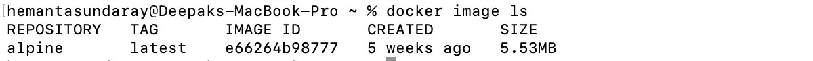

```toc

```

A Docker image is a unit of packaging that contains everything required for an application to run. This includes: application code, application dependencies, and OS constructs.

You can think of a Docker image as a template or as a class.

### Pulling Images

The process of getting images onto a Docker host is called pulling.

> Note: A cleanly installed Docker host has no images in its local repository. We can use the command ~~docker image ls~~ to check if the Docker host has any images in its local repository.

The format for pulling a Docker image is as shown below:

```sh
docker image pull <repository>:<tag>
```

We have to provide the repository name and tag separated by a colon (~~:~~). **Note that by default, images will be pulled from repositories on Docker Hub**. And if you don’t specify an image tag after the repository name, Docker will assume you are referring to the image tagged as ~~latest~~.

> Note: ~~latest~~ is an arbitrary tag and is not guaranteed to point to the newest image in a repository.

The following command will pull the image tagged as ~~latest~~ from the ~~alpine~~ repository on Docker hub.

```sh
docker image pull alpine:latest
```


```sh
docker image ls
```



As we can see the image we just pulled is now present in the Docker host’s local repository.

### Image Layers

Images are made up of multiple layers that are stacked on top of each other and represented as a single object. Inside of the image is a cut-down operating system (OS) and all of the files and dependencies required to run an application.

There are a few ways to see and inspect the layers that make up an image.

```sh
docker image pull redis:latest
```


In the output above, each line that ends with "Pull Complete” represents a layer in the image that was pulled.

### Image Layer Inspection

Another way to see the layers of an image is to inspect the image with the ~~docker inspect image~~ command. The following example inspects the same ~~redis:latest~~ image.

```sh
docker image inspect redis:latest
```

### Deleting Images

We can delete an image with the ~~docker image rm~~ command. ~~rm~~ is short for remove.

Below, we delete the ~~redis:latest~~ image by its ID.

```sh
docker image rm 2e50d70ba706
```


Deleting an image will remove the image and all of its layers from your Docker host. This means it will no longer show up in ~~docker image ls~~ commands and all directories on Docker host containing the layer data will be deleted.

We can list multiple images on the same command by separating them with whitespace like the following:

```sh
$ docker image rm 2e50d70ba706 e66264b98777
```

> **Note**: Once you have started a container from an image, the two constructs become dependent on each other and you can’t delete the image until the last container using it has been stopped and destroyed. Attempting to delete an image without stopping and destroying all containers using it will result in an error.
