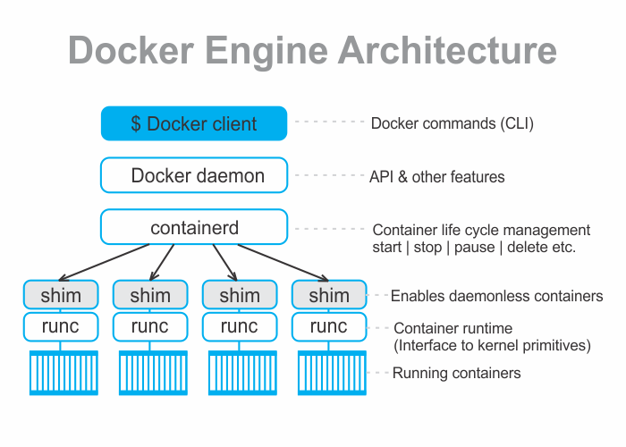

```toc

```

Docker Engine acts as a client-server application.

The following figure shows a high-level view of the Docker engine architecture with brief descriptions:



### Docker daemon (dockerd)

The daemon is called ~~dockerd~~. Some of the major functionalities of the _daemon_ includes: image management, image builds, the REST API, authentication, security, core networking & orchestration.

### containerd

_containerd_ is the container life cycle (start | pause | stop | delete etc.) manager. In addition, it manages things like image pulls, volumes and networks.

_containerd_ can’t actually create containers. It uses _runc_ to do that. It converts the required Docker image into an OCI bundle and tells _runc_ to use this to create a new container.

### runc

~~runc~~ is a standalone container runtime tool, whose purpose is to create containers. The layer that _runc_ operates at is called the “OCI LAYER”.

_runc_ interfaces with the OS kernel to pull together all the constructs necessary to create a container (namespaces, cgroups, etc.). The container process is started as a child process of _runc_, and as soon as it starts, _runc_ exits.

### shim

The _shim_ makes it possible to decouple running containers from the daemon for things like _daemon_ upgrades.

_containerd_ creates a new instance of _runc_ for every container it creates. However, once each container is created the parent _runc_ process exits. This means that we can run hundreds of containers without having to run hundreds of _runc_ instances.

Once a container’s parent _runc_ process exits, the associated _containerd-shim_ process becomes the container’s parent. Some of the responsibilities the _shim_ performs as a container’s parent include:

- Keeping any ~~STDIN~~ & ~~STDOUT~~ streams open, so that when the daemon is restarted, the container doesn’t terminate due to pipes being closed etc.
- Reports the container’s exit status back to the daemon.

###### Understand the process of creating a new Docker container in my blog post [here](https://hemanta.io/understand-the-process-of-creating-a-new-docker-container/).
