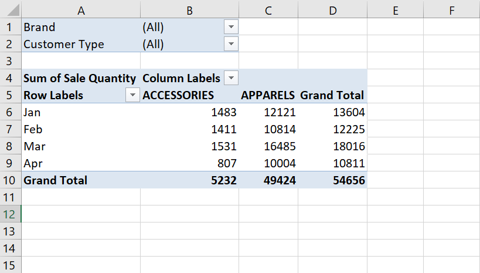

We can add fields to the data area of a pivot table using the ~~AddFields~~ method.

In the code block below, notice that we have two page fields: ~~Customer Type~~ & ~~Brand~~. Whenever we have two or more fields in the ~~AddFields~~ method, we wrap these fields in an array function.

```vb {numberLines}
Sub Common_Pivot()

On Error Resume Next

ActiveSheet.PivotTables(1).AddFields _
    RowFields:="Month", _
    ColumnFields:="Division", _
    PageFields:=Array("Customer Type", "Brand")

ActiveSheet.PivotTables(1).PivotFields("Sale Quantity").Orientation = xlDataField

End Sub
```

> Note that you should never use the ~~DataFields~~ argument in the ~~AddFields~~ method. Instead change the property of the field to ~~xlDataField~~.

Executing the Sub procedure above gives us the following result:


