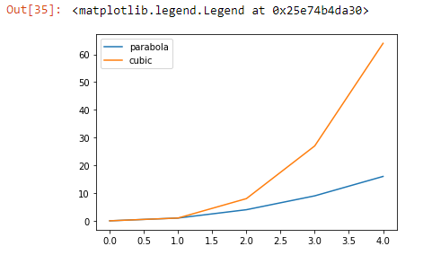
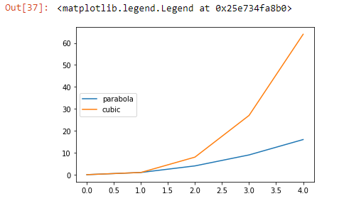

When we have multiple lines on a single graph we can label them by using the command ~~plt.legend()~~.

The ~~legend~~ method takes a list with the labels to display. So, for example, we can call:

```py {numberLines, 4}
plt.plot([0, 1, 2, 3, 4], [0, 1, 4, 9, 16])
plt.plot([0, 1, 2, 3, 4], [0, 1, 8, 27, 64])

plt.legend(['parabola', 'cubic'])
```

This would display a legend on our graph, labeling each line:



~~plt.legend()~~ can also take a keyword argument ~~loc~~, which will position the legend on the figure.

These are the position values ~~loc~~ accepts:

0-best,
1-upper right,
2-upper left,
3-lower left,
4-lower right,
5-right,
6-center left,
7-center right,
8-lower center,
9-upper center,
10-center

> **Note:** If you decide not to set a value for ~~loc~~, it will default to choosing the _best_ location.
> For, example, we can call ~~plt.legend()~~ and set ~~loc~~ to 6:

```py {numberLines}
plt.legend(['parabola', 'cubic'], loc=6)
plt.show()
```

which would move the legend to the left side of the graph:



Sometimes, it’s easier to label each line as we create it.

If we want, we can use the keyword ~~label~~ inside of ~~plt.plot()~~. If we choose to do this, we don’t pass any labels into ~~plt.legend()~~. For example:

```py {numberLines}
plt.plot([0, 1, 2, 3, 4], [0, 1, 4, 9, 16],
         label="parabola")
plt.plot([0, 1, 2, 3, 4], [0, 1, 8, 27, 64],
         label="cubic")
plt.legend() # Still need this command!
```

This would display a legend that looks just like what we had before:


