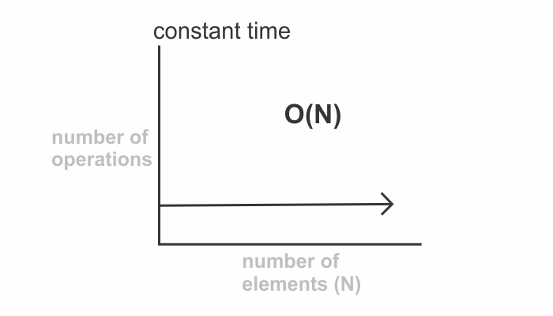

###### Understand the concept of runtime complexity in my blog post [here](https://hemanta.io/data-structures-and-algorithms-what-is-time-complexity/)

O(1), also known as constant time, describes an algorithm which will execute in the same amount of time regardless of the amount of data.

Below, we define a function that takes no arguments and returns the words ~~Hello World~~. It doesn’t depend on any input and is therefore a constant-time algorithm with O(1).

```js {numberLines}
function greeting() {
  return `Hello World!`
}
```


