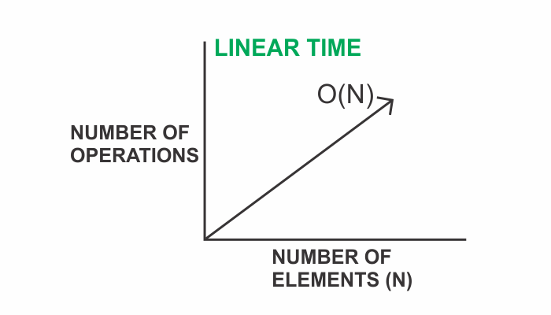

###### Understand the concept of runtime complexity in my blog post [here](https://hemanta.io/data-structures-and-algorithms-what-is-time-complexity/)



O(N) describes an algorithm whose performance grows linearly and proportionally to the size of the input.

A for-loop has O(N) runtime.

In the code example below, the for-loop runs once for each fruit in the array. If n is the length of the ~~fruitsArray~~ then this function has O(N) or linear time performance.

```js {numberLines}
const fruits = fruitsArray => {
  for (let i = 0; i < fruitsArray.length; i++) {
    console.log(fruitsArray[i])
  }
}
```

> Mapping over an array, filtering an array, cloning an array with the spread operator and running a task for each item in an array all have O(N) runtime, assuming they don't contain another loop. As the number of data points in the array grows, so does the runtime.

###### Understand the concept of constant time in my blog post [here](https://hemanta.io/algorithmic-complexity-constatnt-time/).
