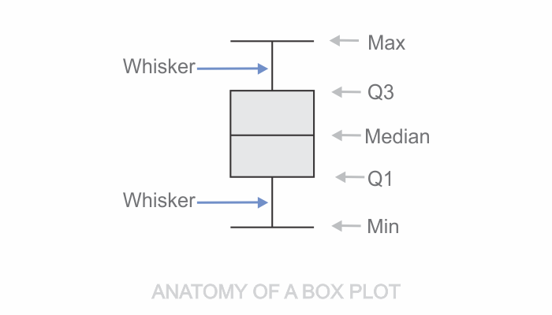

```toc

```



A box plot (aka box & whisker plot) is a chart that gives a standard visualization of the _five-number summary_ statistic for a dataset, namely Minimum, First Quartile (Q1), Median, Third Quartile (Q3) and Maximum.

### Anatomy of a Box Plot

**Quartiles:** The lower horizontal edge of the box specifies the 1st quartile (Q1), while the upper horizontal edge specifies the 3rd quartile (Q3). Each section of the boxplot (the minimum to Q1, Q1 to the median, the median to Q3, and Q3 to the maximum) contains 25% of the data no matter what. In essence the box contains 50% of the data.

The horizontal line inside the box specifies the median value.

**Whiskers:** The vertical line extending upwards and downwards from the box are called whiskers.

**Fences:** The distance of 1.5 times the height of the box in either direction are called the upper and lower fences.

**Outliers:** Individual data points that fall beyond the genes are referred to as outliers.

A box plot is a great tool for finding out the shape, center and variability of a dataset.

### Assessing the Shape of a Distribution

A box plot can show whether a data set is symmetric (roughly the same on each side when cut down the middle) or skewed (lopsided).

A symmetric data set shows the median roughly in the middle of the box. Skewed data show a lopsided box plot, where the median cuts the box into two unequal pieces. If the longer part of the box is to the right (or above) the median, the data is said to be **skewed right**. If the longer part is to the left (or below) the median, the data is **skewed left**.

> **Note:** If one side of the box is longer than the other, it does not mean that side contains more data. In fact, you can't tell the sample size by looking at a boxplot; it's based on percentages, not counts. If one of the sections is longer than another, it indicates a wider range in the values of data in that section (meaning the data are more spread out). A smaller section of the box plot indicates the data are more condensed (closer together).

### Picking out the Center Using the Median

The median is the line that cuts through the box in the box plot. You don’t see the mean on a box plot because boxplots are completely based on percentiles. If the data are skewed, the median is the most appropriate measure of the center.

### Measuring Variability

Variability in a dataset that is described by the five-number summary is measured by the interquartile range (IQR). The IQR is equal to ~~Q3-Q1~~, the difference between the 75th percentile and the 25th percentile - the distance covering the middle 50% of the data.

> **Note:** Note that IQR ignores the data below the 25th percentile or above the 75th, which may contain outliers that could inflate the measure of variability of the entire dataset. So, if the data is skewed, the IQR is a more appropriate measure of variability than the standard deviation.
