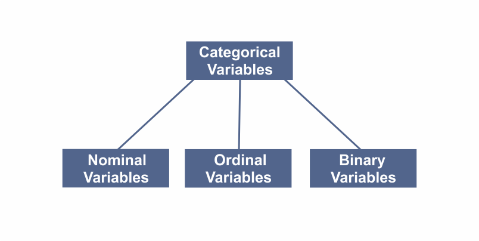
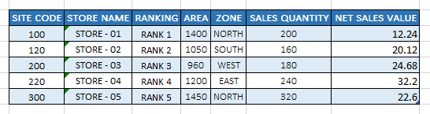

```toc

```



Categorical variables come in 3 types:

- **Nominal variables**, which describe something,
- **Ordinal variables**, which have an inherent ranking, and
- **Binary variables**, which have only possible variations.

Let’s look at each one separately:

### Nominal Variables

Nominal variables are usually words (i.e., red, yellow, blue or hot, cold), but they can also be numbers (i.e., zip codes or user id’s).

### Ordinal variables

**When our categories have an inherent order, we need an ordinal variable**.

Ordinal variables are usually described by numbers like 1st, 2nd, 3rd. Ranking in a competition, grades in school, and the scales in survey responses are some of the example of ordinal variables.

Ordinal variables can be a little tricky because even though they are numbers, it doesn’t make sense to do math on them. For example, let’s say an Olympian won a Gold medal (1st place) and a Bronze medal (3rd place). We wouldn’t say that they averaged Silver medals (2nd place).

### Binary variables

When there are only two logically possible variations, we need a binary variable. Binary variables are things like on/off, yes/no, and TRUE/FALSE. If there is any possibility of a third option, it is not a binary variable.

Let’s take a look at the following dataset:



There are some obvious nominal categorical variables: ~~STORE NAME~~ & the ~~ZONE~~ are all nominal categorical variables. We know this because they are written in descriptive words or letters.

A little less obvious is the ~~SITE CODE~~ field. It’s a number, but it’s not a count or a measurement. Rather, ~~SITE CODE~~ is a nominal categorical variable since it is describing each store in the same way that the ~~STORE NAME~~ is.

We also have an ordinal categorical variable: ~~RANKING~~, which has an inherent order.
