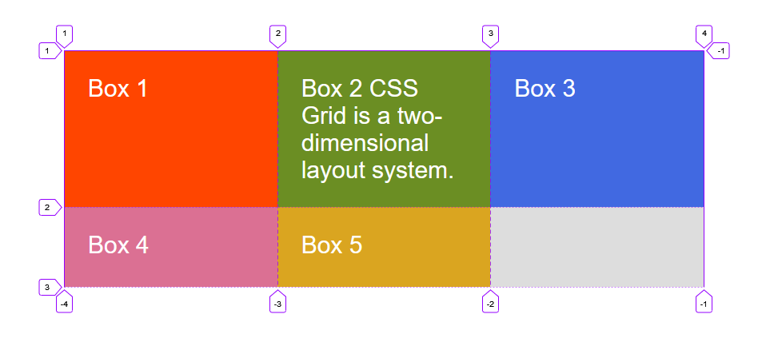

```toc

```

In this post, we are going to explore the basic concepts of CSS Grid.

```html:title=index.html {numberLines}
<div class="container">
    <div class="box box-1">Box 1</div>
    <div class="box box-2">Box 2</div>
    <div class="box box-3">Box 3</div>
    <div class="box box-4">Box 4</div>
    <div class="box box-5">Box 5</div>
</div>
```

```css:title=style.css {numberLines}
* {
  padding: 0;
  margin: 0;
  box-sizing: border-box;
}

html {
  font-size: 10px;
  font-family: sans-serif;
}

.container {
  width: 80rem;
  background-color: #ddd;
  margin: 40rem auto;
}

.box {
  padding: 3rem;
  font-size: 3rem;
  color: #fff;
}

.box-1 {
  background-color: orangered;
}

.box-2 {
  background-color: olivedrab;
}

.box-3 {
  background-color: royalblue;
}

.box-4 {
  background-color: palevioletred;
}

.box-5 {
  background-color: goldenrod;
}
```


### The Grid container

We can create a grid container by declaring ~~display:grid~~ on an element. As soon as we do this, all direct children of that element become grid items.

Let’s make ~~.container~~ a grid container.

```css:title=style.css {numberLines, 5-5}
.container {
  width: 80rem;
  background-color: #ddd;
  margin: 40rem auto;
  display: grid;
}
```


All the direct children are now grid items. However, in the pic. above, we don’t see any difference to how these items are displayed before turning them into a grid. This is because grid has created a single column grid for the items.

### Defining Grid tracks

We define tracks (rows and columns) on our grid with the ~~grid-template-columns~~ and ~~grid-template-rows~~ properties.

#### The fr unit

Tracks can be defined using any length unit.

The ~~fr~~ unit represents a fraction of the available space in the grid container.

Let’s create three equal width tracks that grow and shrink according to the available space.

```css:title=style.css {numberLines, 6-6}
.container {
  width: 80rem;
  background-color: #ddd;
  margin: 40rem auto;
  display: grid;
  grid-template-columns: 1fr 1fr 1fr;
}
```


#### repeat() notation

We can use the ~~repeat()~~ notation to repeat all or a section of the track listing.

The following grid definition

```css:title=style.css {numberLines, 3-3}
.container {
  display: grid;
  grid-template-columns: 1fr 1fr 1fr;
}
```

can also be written as:

```css:title=style.css {numberLines, 3-3}
.container {
  display: grid;
  grid-template-columns: repeat(3, 1fr);
}
```

Repeat notation can also be used for a part of the track listing. In the following example, we have created a grid with an initial 50rem track, then a repeating section of 2 1fr tracks.

```css {numberLines, 3-3}
.container {
  display: grid;
  grid-template-columns: 50rem repeat(2, 1fr);
```

#### Creating unequal sizes

Below, we have created a track definition with a 2fr track, then two 1fr tracks.

The available space is split into four. Two parts are given to the first track and one part each to the next two tracks.

```css:title=style.css {numberLines, 6-6}
.container {
  width: 80rem;
  background-color: #ddd;
  margin: 40rem auto;
  display: grid;
  grid-template-columns: 2fr 1fr 1fr;
}
```


#### Mixing flexible & absolute sizes

In the code example below, we mix absolutely sized tracks with ~~fr~~ units. The first track is 50rem, so the fixed width is taken away from the available space. The remaining space is divided into three and assigned in proportion to the two flexible tracks.

```css:title=style.css {numberLines, 6-6}
.container {
  width: 80rem;
  background-color: #ddd;
  margin: 40rem auto;
  display: grid;
  grid-template-columns: 50rem 2fr 1fr;
}
```


### The implicit & explicit grid

When creating our example grid, we specifically defined our column tracks with the ~~grid-template-columns~~ property, but the grid also created rows on its own. These rows are part of the implicit grid.

> If we place something outside of the defined grid - _or due to the amount of content, more grid tracks are needed_ - then the grid creates rows and columns in the implicit grid. The size of these tracks will be based on the content that is inside them.

We can define sizes for tracks created in the implicit grid with the ~~grid-auto-rows~~ and ~~grid-auto-columns~~ properties.

In the example below, we use ~~grid-auto-rows~~ to ensure that tracks created in the implicit grid are 10rem tall.

```css:title=style.css {numberLines, 7-7}
.container {
  width: 80rem;
  background-color: #ddd;
  margin: 40rem auto;
  display: grid;
  grid-template-columns: repeat(3, 1fr);
  grid-auto-rows: 10rem;
}
```


### Track sizing & minmax()

When setting up an explicit grid or defining the size for automatically created rows or columns we may want to give tracks a minimum size, but also ensure they expand to fit any content that is added.

We can achieve this with the ~~minmax()~~ function.

In the example below, we have used ~~minmax()~~ in the value of ~~grid-auto-rows~~. This means automatically created rows will be a minimum 10rem tall and a maximum of _auto_, which means that the size will look at the content size and will stretch to give space for the tallest item in a cell, in this row.

```html:title=index.html {numberLines}
<div class="container">
    <div class="box box-1">Box 1</div>
    <div class="box box-2">Box 2 CSS Grid is a two-dimensional layout system.</div>
    <div class="box box-3">Box 3</div>
    <div class="box box-4">Box 4</div>
    <div class="box box-5">Box 5</div>
</div>
```

```css:title=style.css {numberLines, 7-7}
.container {
  width: 80rem;
  background-color: #ddd;
  margin: 40rem auto;
  display: grid;
  grid-template-columns: repeat(3, 1fr);
  grid-auto-rows: minmax(10rem, auto);
}
```



### Positioning items against Grid lines

When we define a grid, the Grid gives us numbered lines to use when positioning items.

In our Grid below, we have 4 column lines (3 column, 2 row grid).

```html:title=index.html {numberLines}
<div class="container">
    <div class="box box-1">Box 1</div>
    <div class="box box-2">Box 2</div>
    <div class="box box-3">Box 3</div>
    <div class="box box-4">Box 4</div>
    <div class="box box-5">Box 5</div>
</div>
```

```css:title=style.css {numberLines, 7-7}
.container {
  width: 80rem;
  background-color: #ddd;
  margin: 40rem auto;
  display: grid;
  grid-template-columns: repeat(3, 1fr);
  grid-auto-rows: minmax(10rem, auto);
}
```


In the following example, we have used ~~grid-row~~ & ~~grid-column~~ properties for placing items on the grid.

- The value before the forward slash character (/) is the start line and the value after, the end line.

- We can omit the end value if the area only spans 1 track.

```css:title=style.css {numberLines, 18-19, 23-24}
.container {
  width: 80rem;
  background-color: #ddd;
  margin: 40rem auto;
  display: grid;
  grid-template-columns: repeat(3, 1fr);
  grid-auto-rows: minmax(10rem, auto);
}

.box {
  padding: 3rem;
  font-size: 3rem;
  color: #fff;
}

.box-1 {
  background-color: orangered;
  grid-column: 1 / 4;
  grid-row: 1 / 3;
}
.box-2 {
  background-color: olivedrab;
  grid-column: 1;
  grid-row: 3 / 5;
}
```


### Grid gutter

Gutters or alleys between grids can be created using the ~~column-gap~~ & ~~row-gap~~ properties, or the shorthand ~~gap~~.

In the example below, we have created a 2rem gap between columns and a 1rem gap between rows.

```css:title=style.css {numberLines, 8-9}
.container {
  width: 80rem;
  background-color: #ddd;
  margin: 40rem auto;
  display: grid;
  grid-template-columns: repeat(3, 1fr);
  grid-auto-rows: minmax(10rem, auto);
  column-gap: 2rem;
  row-gap: 1rem;
}
```


### Layering items with z-index

We can use the ~~z-index~~ property to control the order in which overlapping items stack.

```css:title=style.css {numberLines}
.container {
  width: 80rem;
  background-color: #ddd;
  margin: 40rem auto;
  display: grid;
  grid-template-columns: repeat(3, 1fr);
  grid-auto-rows: minmax(10rem, auto);
}

.box {
  padding: 3rem;
  font-size: 3rem;
  color: #fff;
}

.box-1 {
  background-color: orangered;
  grid-column: 1 / -1;
  grid-row: 1 / 4;
}
.box-2 {
  background-color: olivedrab;
  grid-column: 1;
  grid-row: 3 / 5;
}
```


We can see above that Box 2 overlaps Box 1. Box 2 displays on top as it comes later in the source order.

We can cause Box 1 to display on top by giving it a higher z-index than Box 2.

```css:title=style.css {numberLines, 5-5, 11-11}
.box-1 {
  background-color: orangered;
  grid-column: 1 / -1;
  grid-row: 1 / 4;
  z-index: 2;
}
.box-2 {
  background-color: olivedrab;
  grid-column: 1;
  grid-row: 3 / 5;
  z-index: 1;
}
```


