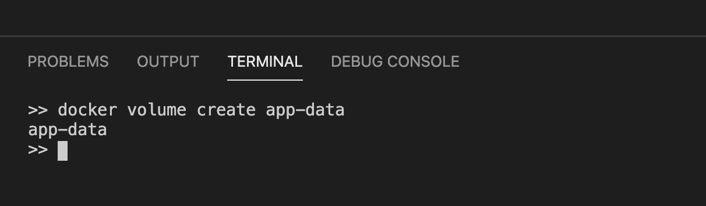
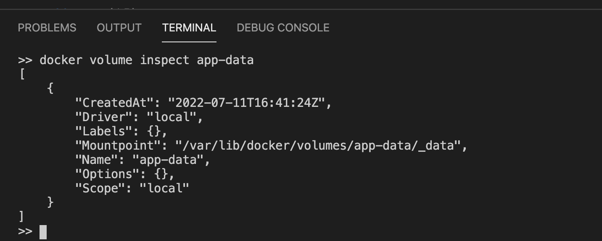
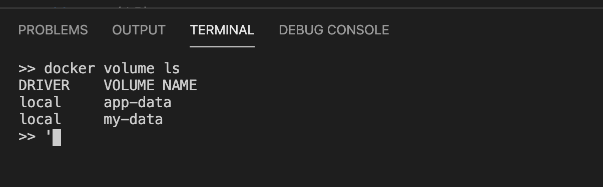
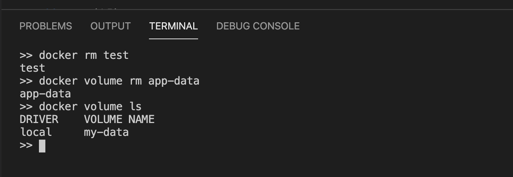

```toc

```

###### I highly recommend that you understand what a container layer is in Docker before starting with Docker volumes. Check out my blog post on container layers [here](http://localhost:8000/understanding-the-container-layer-in-docker/).

Volumes are the preferred mechanism for persisting data generated by and used by Docker containers. Using volumes, containers can store files on the filesystem of the host machine. The files persist even after containers stop.

When we create a volume, it is stored within a directory inside the Docker host. When we mount a volume into a container, this directory is what is mounted into the container. A given volume can be mounted into multiple containers simultaneously.

When no running container is using a volume, the volume is still available to Docker and is not removed automatically. The volume’s contents exist outside the lifecycle of a given container. Volumes are removed when we explicitly remove them.

### Creating Volumes

To create a new volume, we can use the ~~docker volume create~~ command.

Below, we have specified a name (~~app-data~~) for our volume. So Docker will create a named volume that containers can consume and store data in. Because the ~~app-data~~ volume does not exist in our system yet, Docker will create the volume for us.

```sh
docker volume create app-data
```



> Note that if we don’t provide a name, Docker will generate a random name for the volume - anonymous volume.

In the code sample above, the volume ~~app-data~~ will be created using the default volume driver.

The default volume driver is the so-called local driver which stores the data locally in the host filesystem.

The easiest way to find out where the data is stored on the host is by using the ~~docker volume inspect~~ command on the volume we just created. The actual location can differ from system to system and so, this is the safest way to find the target folder:

```sh {numberLines}
docker volume inspect app-data
```



> Note: If you are using Docker Desktop for Mac to create a volume on your laptop and then do a ~~docker volume inspect~~ on the volume you just created, the Mountpoint is shown as ~~/var/lib/docker/volumes/app-data/\_data~~. But you will discover that there is no such folder on your Mac. The reason is that the path is in relation to the hidden VM that Docker for Mac uses to run containers. At this time, containers cannot run natively on OS X.

### Starting a container with a volume

Once we have created a named volume, we can mount it into a container. For this, we can use the ~~-v~~ parameter in the ~~docker run~~ command:

```sh {numberLines}
$ docker run --name test -it \
    -v my-data:/app alpine /bin/sh
```

The preceding command mounts the ~~my-data~~ volume to the ~~/app~~ folder inside the container.

### List Volumes

We can list volumes using the ~~docker volume ls~~ command.

```sh {numberLines}
docker volume ls
```



### Removing volumes

Volumes can be removed using the ~~docker volume rm~~ command. It is important to remember that removing a volume destroys the containing data irreversibly and thus is to be considered a dangerous command.

```sh {numberLines}
$ docker volume rm my-data
```


