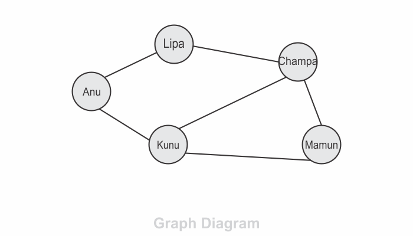
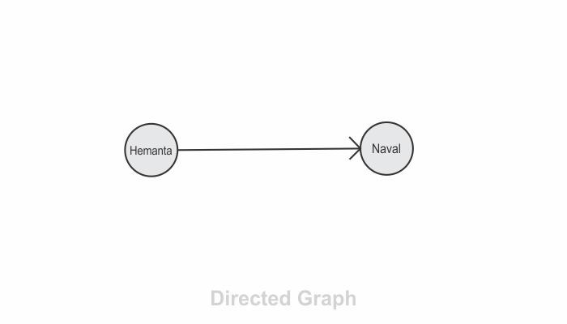
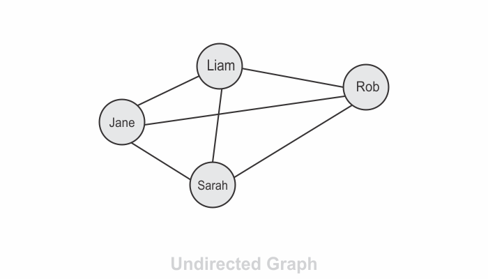

```toc

```

A graph is a data structure that specializes in relationships as it easily conveys how data is connected. Graphs are particularly suited to handle the needs of applications with a lot of data points.

The following is a visualization of a social network displayed as a graph.



The graph above is made up of five circles that represent data points. In graph terminology, these are called **nodes** or **vertices**. The lines or connections between these nodes are called **edges**, of which there are six.

### Directed Graph

In a directed graph, there is a one-way relationship between the nodes. For example, Twitter is a directed graph. You can follow someone but the person you follow might not follow you back.

In the graph diagram below, I follow naval on Twitter but naval doesn’t follow me back. (the relationship is not mutual)

Note that the edges in a directed graph, instead of lines, are arrows. There is a flow or direction between the nodes in a directed graph.



### Undirected Graph

In an undirected graph, there is a two-way connection between nodes via an edge. You can move in any direction.

Facebook, for example, is an undirected graph. Whenever you connect to someone on Facebook, they are connected to you.


