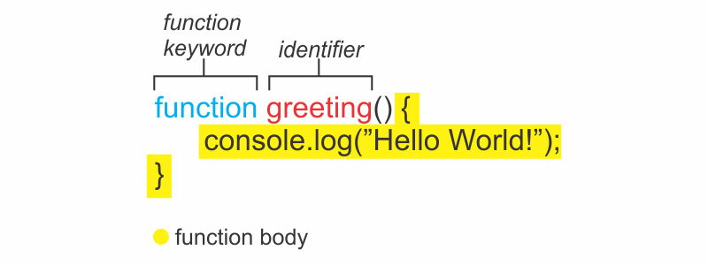
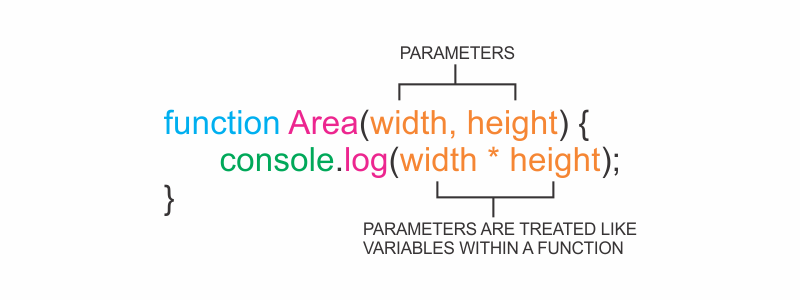
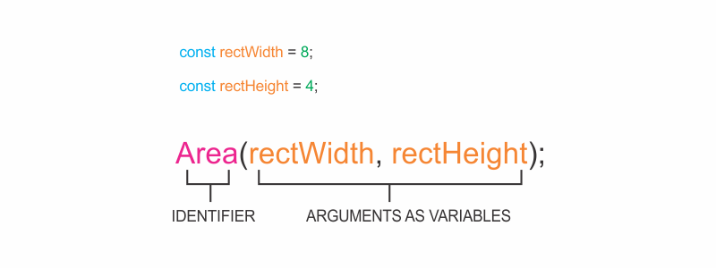

```toc

```

A function is a reusable block of code that groups together a sequence of statements to perform a specific task.

### Function Declarations

In JavaScript, one of the ways to create a function is by using a _function declaration_, which binds a function to a name, or an identifier.

The anatomy of a function declaration is as follows:



A function declaration consists of:

- The ~~function~~ keyword
- The name of the function, or its identifier, followed by parentheses.
- A function body, or the block of statements required to perform a specific task, enclosed in the function’s curly brackets, ~~{ }~~.

A function declaration is a function that is bound to an identifier or a name.

### Calling a Function

A function declaration does not ask the code inside the function body to run, it just declares the existence of the function. The code inside the function body runs or executes, only when the function is _called_.

To call a function in your code, you type the function name followed by the parentheses.


This function call executes the function body, or all of the statements between the curly braces in the function declaration.

Note that we can call the same function as many times as needed.

### Parameters & Arguments

Functions can also take inputs and use the inputs to perform a task. We can allow functions to accept inputs by specifying its parameters, which are placeholders for information that will be passed to the function when it is called.

We can specify parameters in our functions as shown in the diagram below:



In the diagram above, ~~Area()~~ computes the area of a rectangle based on two inputs: ~~width~~ & ~~height~~. The parameters are specified between the parentheses as ~~width~~ & ~~height~~, and inside the function body, they act just like regular variables. ~~width~~ & ~~height~~ act as placeholders for values that will be multiplied together.

When calling a function that has parameters, we specify the values in the parentheses that follow the function name. The values that are passed to the function when it is called are called _arguments_. Arguments can be passed to the function as values or variables.


In the function call above, ~~8~~ is passed as the width and ~~4~~ is passed as ~~height~~. Notice that the order in which arguments are passed and assigned follows the order that the parameters are declared.



The variables ~~rectWidth~~ & ~~rectHeight~~ are initialized with the values for the width and height of a rectangle before being used in the function call.

By using parameters, ~~Area()~~ can be reused to compute the area of any rectangle.

### Default Parameters

One of the features added in ES6 is the ability to use _default parameters_. Default parameters allow parameters to have a predetermined value in case there is no argument passed into the function or if the argument is ~~undefined~~ when called.

Take a look at the code snippet below:

```js {numberLines}
function greeting(name = "Stranger") {
  console.log(`Hello ${name}`)
}

greeting("Hemanta") // Output: Hello Hemanta

greeting() // Output: Hello Stranger
```

In the example above, we used the ~~=~~ operator to assign the parameter ~~name~~ a default value of ~~Stranger~~. This is useful to have in case we ever want to include a non-personalized default greeting.

When the code calls ~~greeting(‘Hemanta’)~~, the value of the argument is passed in and, ~~Hemanta~~, will override the default parameter of ~~Stranger~~ to log ~~Hello Hemanta~~ to the console.
When there is not an argument passed into ~~greeting()~~, the default value of ~~Stranger~~ is used, and ~~Hello Stranger~~ is logged to the console.

By using a default parameter, we account for situations when an argument isn’t passed into a function that is expecting an argument.
