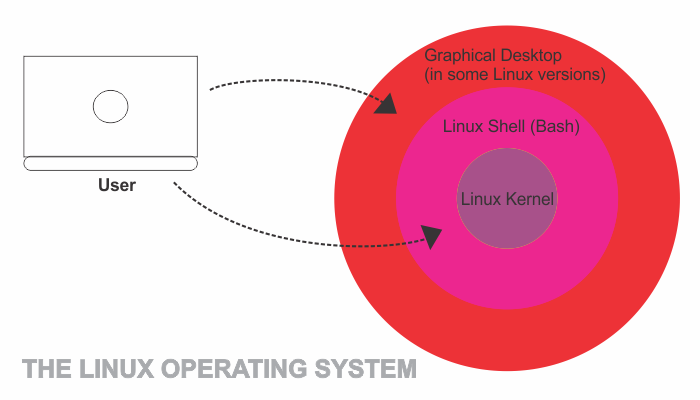

```toc

```

Linux refers to the family of operating systems based on the Linux kernel and each operating system is packaged as a **distribution** or **distro**, of Linux.

Linus Torvalds released the Linux operating system under GPL license in 1992.

> The Free Software Foundation first published the GNU Public License (GPL) in 1989. The GPL is a copyleft (as opposed to copyright) license, which means that any derivative software must be distributed under the same or equivalent license terms.

Linux runs on over 95% of web servers and 85% of smartphones (Android is built on top of the Linux Kernel).

The reason Linux is such a flexible operating system is that almost all of its features can be accessed using a text terminal, without a graphical desktop environment. This gives us faster access to a computer or server’s resources.

Today, Linux refers to the many versions of operating systems built on top of the base code. This means that anyone can create their own version of a Linux operating system.

### The Linux Operating System



#### What is an operating system?

An operating system is a system program that provides an interface between the user and the hardware. When a computer boots up, the operating system is the first program that loads and manages all of the other application programs on a computer.

#### What is a kernel?

The _kernel_ is the most important part of the operating system. It performs a variety of tasks:
Process management
Managing hardware services
Task scheduling

The kernel controls all the major functions of the hardware, whether its a phone, laptop or server. When we talk about what Linus Torvalds first published in 1991, it was the kernel.

#### What is a Shell?

The _shell_ is the interface between the user and the kernel. At its barest, it is a command line interpreter where a user can enter commands which are interpreted by the computer to perform a certain task.

#### What is bash?

In Linux, the shell language is called bash.

Inside operating systems with desktop environments such as Windows & Mac OS, users may never interact with the shell, but in Linux the shell plays a huge role. We can even install programs to use only within the shell. Some versions of Linux (like Ubuntu) have graphical desktop environments too. To navigate in a Linux environment and get the most out of it though, we have to be familiar with the **Bash command language**, which is what the Linux shell interprets.

### Linux Distribution

A Linux distribution is made from a software collection including the Linux kernel, GNU tools, and default software.

There are a large number of Linux distributions. Here is a short list of some of the most popular distributions:

- **Debian:** It is one of the oldest distributions of Linux, first developed in 1993. It is a stable Linux operating system, and software updates are frequent but small.
- **Ubuntu:** It is the most popular distribution of Linux and is based on Debian Linux. It’s widely used and supported and looks most like other operating systems like OSX and Windows in terms of usability.
- **Linux Mint:** It is a distribution that is based off of Ubuntu and comes with less pre-installed software than Ubuntu.
- **Red Hat Enterprise Linux:** Also known as _RHEL_, it is a distribution of Linux developed by Red Hat. It has strict rules around its trademark which prevent free distribution, but it is mostly used in enterprise environments on servers.
- **Fedora:** It is an open-source community-driven distribution of Linux that is backed by Red Hat. Think of it as the Ubuntu equivalent of Red Hat.
- **Arch:** It is the rolling release distribution of Linux that is 100% developed by its community. It has a steeper learning curve than other distributions but it is a great lightweight distribution of Linux.

This is just a small selection of distributions out there. There are forks and derivations of these distributions as well.
