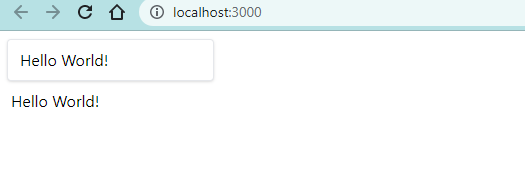
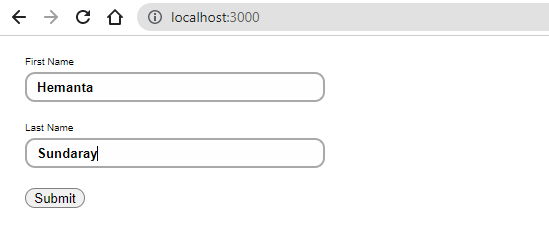
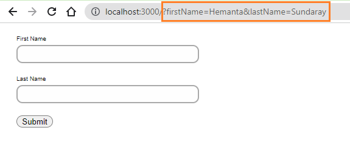

```toc

```

### Controlled Components

In a typical non-React environment, a user types some data into a form’s input fields. The server remains clueless until the user hits a “Submit” button, which sends all of the form’s data over to the server simultaneously.

In React, this is not the best way of doing things.

In React, we want to update the server any time a user enters or deletes any character. The best way to do this is by listening for a “change” event on the ~~\<input />~~.

```jsx {numberLines, 5-5, 7-9, 16-17}
import React from "react"
import { useState } from "react"

const App = () => {
  const [userInput, setUserInput] = useState("")

  function handleUserInput({ target }) {
    setUserInput(target.value)
  }

  return (
    <>
      <input
        className="shadow border rounded py-2 px-3 m-2"
        type="text"
        onChange={handleUserInput}
        value={userInput}
      />
      <p className="ml-3">{userInput}</p>
    </>
  )
}

export default App
```



In the example above, we have given ~~\<input />~~ an ~~onChange~~ attribute.

When a user types or deletes in the ~~\<input />~~, it triggers a _change_ event, which calls the ~~handleUserInput()~~ event handler.

~~handleUserInput()~~ sets ~~userInput~~ equal to whatever text is currently in the input field.

Then we control the ~~\<input />~~'s text by setting its ~~value~~ attribute. **In React, when we give an ~~\<input />~~ a ~~value~~ attribute, the ~~\<input />~~ becomes a controlled component**. It stops keeping track of its own text.

This way, we get an idiomatically correct React form.

### Default Form Behavior

When we submit a form by pressing Enter or clicking on a submit button, the ~~submit~~ event fires and **by default** the browser initiates form submission to the server and submits the form data to the same URL - which results in a page reload.

```js {numberLines, 6-8, 19-19}
import React, { useState } from "react"

const Login = () => {
  const [formValue, setFormValue] = useState({ firstName: "", lastName: "" })

  const handleSubmit = () => {
    console.log(formValue)
  }

  const handleChange = ({ target }) => {
    const { name, value } = target
    setFormValue({
      ...formValue,
      [name]: value,
    })
  }

  return (
    <form onSubmit={handleSubmit}>
      <label htmlFor="firstName">First Name</label>
      <input
        id="firstName"
        name="firstName"
        value={formValue.firstName}
        onChange={handleChange}
      />
      <label htmlFor="lastName">Last Name</label>
      <input
        id="lastName"
        name="lastName"
        value={formValue.lastName}
        onChange={handleChange}
      />
      <button type="submit">Submit</button>
    </form>
  )
}

export default Login
```

If I fill in the form and click on the ~~Submit~~ button,



we will see the default form submission behavior in action.



We can prevent this default behavior by using the ~~preventDefault~~ method on the ~~submit~~ event.

```js {numberLines, 7-7}
import React, { useState } from "react"

const Login = () => {
  const [formValue, setFormValue] = useState({ firstName: "", lastName: "" })

  const handleSubmit = e => {
    e.preventDefault()
    console.log(formValue)
  }

  const handleChange = ({ target }) => {
    const { name, value } = target
    setFormValue({
      ...formValue,
      [name]: value,
    })
  }

  return (
    <form onSubmit={handleSubmit}>
      <label htmlFor="firstName">First Name</label>
      <input
        id="firstName"
        name="firstName"
        value={formValue.firstName}
        onChange={handleChange}
      />
      <label htmlFor="lastName">Last Name</label>
      <input
        id="lastName"
        name="lastName"
        value={formValue.lastName}
        onChange={handleChange}
      />
      <button type="submit">Submit</button>
    </form>
  )
}

export default Login
```

Now, if I fill the form and hit the Enter button, we will not see a page refresh.

What you do with the form data is entirely up to you. Though, most of the time, we send this form data to a backend API using a HTTP Client (~~axios~~ for example) or the Fetch API (built into browsers) and save the user information in a database.

### React Form Libraries

In the real world, you will most likely use a library to build forms for your React apps. Libraries make it easier to handle form state, form validation and error messages.

The following are some of the libraries that I see being used often:

- [React Hook Form](https://react-hook-form.com/)
- [React Final Form](https://final-form.org/react)
- [Formik](https://formik.org/)

If you want to build forms with Formik, I have written a blog post (as part of a series). Check out [here](https://hemanta.io/implement-jwt-based-user-authentication-in-a-mern-stack-app-part-5/).
