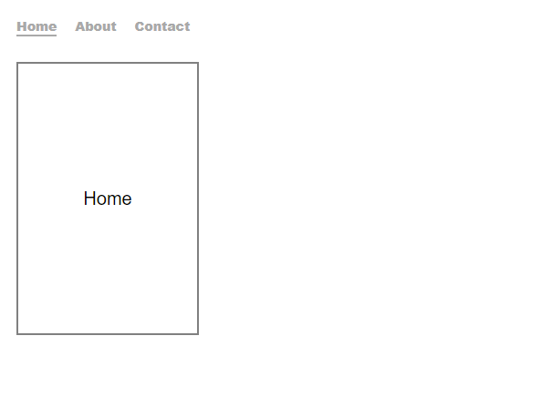

```toc

```

> Note that I have tested the following example with react-router-dom@5.3.0 & framer-motion@4.1.17

The application looks like the following:



Copy and paste the following code snippets in a React project.

```jsx:title=src/index.js {numberLines}
import React from "react";
import ReactDOM from "react-dom";
import "./index.css";
import App from "./App";
import { BrowserRouter as Router } from "react-router-dom";

ReactDOM.render(
  <Router>
    <App />
  </Router>,
  document.getElementById("root")
);
```

```css:title=src/index.css {numberLines}
* {
  margin: 0;
  padding: 0;
  box-sizing: border-box;
}

html {
  font-family: sans-serif;
  font-size: 62.5%;
}

nav {
  width: 40rem;
  margin: 2rem;
  margin-bottom: 3rem;
}

nav ul {
  width: 100%;
  display: flex;
  justify-content: flex-start;
  list-style: none;
}

nav li {
  font-size: 1.4rem;
  margin-right: 2rem;
}

nav a {
  font-weight: 900;
  text-decoration: none;
}

nav a:link,
a:visited {
  color: darkgray;
}

nav a:hover {
  color: black;
}

.selected {
  border-bottom: 0.2rem solid darkgray;
}

main {
  margin: 2rem;
  font-size: 2rem;
}

.home {
  width: 20rem;
  height: 30rem;
  border: 0.2rem solid gray;
  display: grid;
  place-items: center;
}

.about {
  width: 20rem;
  height: 30rem;
  border: 0.2rem solid gray;
  display: grid;
  place-items: center;
}

.contact {
  width: 20rem;
  height: 30rem;
  border: 0.2rem solid gray;
  display: grid;
  place-items: center;
}
```

```jsx:title=src/App.js {numberLines, 6-7, 10-10, 16-17}
import React from "react";
import About from "./components/About";
import Contact from "./components/Contact";
import Home from "./components/Home";
import Header from "./components/Header";
import { Switch, Route, useLocation } from "react-router-dom";
import { AnimatePresence } from "framer-motion";

const App = () => {
  const location = useLocation();

  return (
    <>
      <Header />
      <main>
        <AnimatePresence exitBeforeEnter initial={false}>
          <Switch location={location} key={location.key}>
            <Route path="/about" exact>
              <About />
            </Route>
            <Route path="/contact" exact>
              <Contact />
            </Route>
            <Route path="/" exact>
              <Home />
            </Route>
          </Switch>
        </AnimatePresence>
      </main>
    </>
  );
};
export default App;
```

###### Learn about the ~~useLocation()~~ hook in my blog post [here](https://hemanta.io/react-router-uselocation/).

### AnimatePresence

~~AnimatePresence~~ is used to animate components when they are removed from the React tree. It’s required to enable exit animations because React lacks a lifecycle method that

- Notifies components when they are going to be unmounted and
- Allows them to defer that unmounting until after an initial operation is complete (for instance an animation)

### exit prop

We wrap the ~~Switch~~ component (_responsible for rendering the \<Route /> that matches the current browser URL_) with ~~AnimatePresence~~. This enables us to use the ~~exit~~ prop, which defines a state for the component to animate to before it’s unmounted from the DOM.

### exitBeforeEnter

When ~~exitBeforeEnter~~ is set to ~~true~~, ~~AnimatePresence~~ will only render one component at a time. The exiting component will finish its exit animation before the entering component is rendered.

### initial={false}

We have set ~~initial={false}~~ on ~~AnimatePresence~~. This will disable any initial animations on children that are present when the component is first rendered. Only components that enter after the initial render will animate in.

### key prop

Note that we have added a ~~key~~ prop to the ~~Switch~~ component. This is because child ~~motion~~ components must each have a unique ~~key~~ prop, so ~~AnimatePresence~~ can track their presence in the tree.

```jsx:title=src/components/Home.js {numberLines, 13-13, 23-23}
import React from "react";
import { motion } from "framer-motion";

const homeVariants = {
  initial: {
    x: "1rem",
    opacity: 0,
  },
  animate: {
    x: 0,
    opacity: 1,
  },
  exit: { x: "-1rem", opacity: 0 },
};

const Home = () => {
  return (
    <motion.div
      className="home"
      variants={homeVariants}
      initial="initial"
      animate="animate"
      exit="exit"
    >
      Home
    </motion.div>
  );
};
export default Home;
```

```jsx:title=src/components/About.js {numberLines, 13-13, 23-23}
import React from "react";
import { motion } from "framer-motion";

const aboutVariants = {
  initial: {
    x: "1rem",
    opacity: 0,
  },
  animate: {
    x: 0,
    opacity: 1,
  },
  exit: { x: "-1rem", opacity: 0 },
};

const About = () => {
  return (
    <motion.div
      className="about"
      variants={aboutVariants}
      initial="initial"
      animate="animate"
      exit="exit"
    >
      About
    </motion.div>
  );
};
export default About;
```

```jsx:title=src/components/Contact.js {numberLines, 13-13, 23-23}
import React from "react";
import { motion } from "framer-motion";

const contactVariants = {
  initial: {
    x: "1rem",
    opacity: 0,
  },
  animate: {
    x: 0,
    opacity: 1,
  },
  exit: { x: "-1rem", opacity: 0 },
};

const Contact = () => {
  return (
    <motion.div
      className="contact"
      variants={contactVariants}
      initial="initial"
      animate="animate"
      exit="exit"
    >
      Contact
    </motion.div>
  );
};
export default Contact;
```

```jsx:title=src/components/Header.js {numberLines}
import React from "react";
import { NavLink } from "react-router-dom";
const Header = () => {
  return (
    <nav>
      <ul>
        <li>
          <NavLink to="/" exact activeClassName="selected">
            Home
          </NavLink>
        </li>
        <li>
          <NavLink to="/about" activeClassName="selected">
            About
          </NavLink>
        </li>
        <li>
          <NavLink to="/contact" activeClassName="selected">
            Contact
          </NavLink>
        </li>
      </ul>
    </nav>
  );
};
export default Header;
```

Start the development server using ~~npm start~~. Click on the navigation links and you should see the route animation in action.
