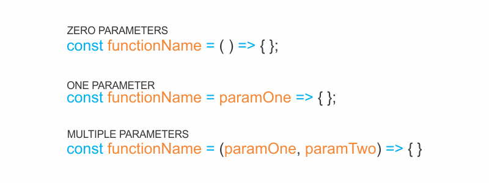
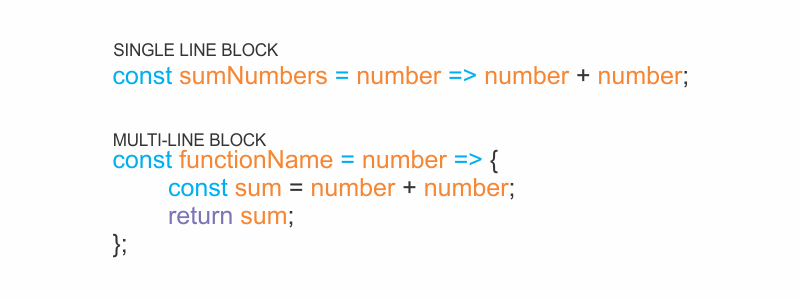

ES6 introduced arrow function syntax, a shorter way to write functions by using the special "fat arrow" ~~() =>~~ notation.

Arrow functions remove the need to type out the keyword ~~function~~ every time you need to create a function. Instead, you first include the parameters inside the ~~()~~ and then add an arrow ~~=>~~ that points to the function body surrounded in ~~{ }~~ like this:

```js {numberLines}
const rectangleArea = (width, height) => {
  const area = width * height
  return area
}

console.log(rectangleArea(6, 2))
// 12
```

### Concise body arrow functions

JavaScript provides several ways to refactor arrow function syntax. The most condensed form of the function is known as _concise body_. Below, we’ll explore a few of these techniques:

- Functions that take only a single parameter don’t need that parameter to be enclosed in parentheses. However, if a function takes zero or multiple parameters, parentheses are required.



- A function body composed of a single-line block does not need curly braces. Without the curly braces, whatever that line evaluates will be automatically returned. The contents of the block should immediately follow the arrow ~~=>~~ and the ~~return~~ keyword can be removed. This is referred to as _implicit return_.



So, if we have a function:

```js {numberLines}
const squareNum = num => {
  return num * num
}
```

We can refactor the function to:

```js {numberLines}
const squareNum = num => num * num
```

Notice the following changes:

- The parentheses around ~~num~~ have been removed, since it has a single parameter.
- The curly braces ~~{ }~~ have been removed since the function consists of a single-line block.
- The ~~return~~ keyword has been removed since the function consists of a single-line block.
