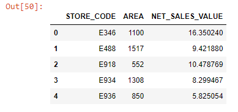
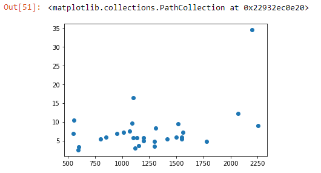
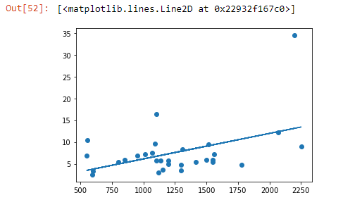

```toc

```

First, we will import a dataset in an Excel file as a pandas dataframe:

```py {numberLines}
import pandas as pd
import numpy as np
import matplotlib.pyplot as plt
from scipy.stats import pearsonr
```

```py {numberLines}
sales = pd.read_excel("retail_sales.xlsx")

sales.head()
```



The dataset captures the revenue of 30 different stores of a particular brand for the month of October. The dataset has three different fields, out of which two are quantitative variables: ~~AREA~~ (in square feet) & ~~NET_SALES_VALUE~~ (in lakhs).

Let’s say we want to find out whether there is a relationship that exists between ~~AREA~~ & ~~NET_SALES_VALUE~~.

When associations exist between variables, it means that information about the value of one variable gives us information about the value of the other variable.

### Scatter Plot

One of the best ways to quickly visualize the relationship between quantitative variables is to plot them against each other in a scatter plot. This makes it easy to look for patterns or trends in the data.

Let’s start by plotting the area of the stores against their revenue to see if we can spot any patterns.

```py {numberLines}
plt.scatter(sales.AREA, sales.NET_SALES_VALUE)
```



It seems like the higher the area of a store, the higher the revenue. To get more clarity, let’s draw a trendline.

```py {numberLines}
plt.scatter(sales.AREA, sales.NET_SALES_VALUE)
z = np.polyfit(sales.AREA, sales.NET_SALES_VALUE, 1)
p = np.poly1d(z)

plt.plot(sales.AREA, p(sales.AREA))
```



Clearly there is an upward trend. Therefore, we can conclude that there is a positive linear relationship between ~~AREA~~ & ~~NET_SALES_VALUE~~.

Next, we will learn how to measure the strength of a linear relationship using correlation.

### Correlation

Pearson correlation measures the strength of a linear relationship. It ranges from ~~-1~~ to ~~+1~~.

- Highly associated variables with a positive linear relationship will have a correlation close to ~~1~~.
- Highly associated variables with a negative linear relationship will have a correlationship close to ~~-1~~.
- Variables that don’t have a linear relationship will have a correlation close to ~~0~~.

We can use the ~~pearsonr()~~ function from ~~scipy.stats~~ to calculate the correlation:

```py {numberLines}
corr_area_nsv, p = pearsonr(sales.AREA, sales.NET_SALES_VALUE)

print(corr_area_nsv)

# 0.44654927278556344
```

The correlation is 0.44.

> Note: Generally a correlation greater than about ~~.3~~ indicates a linear association. A correlation greater than ~~.6~~ suggests a strong linear association.
