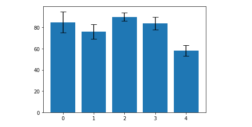
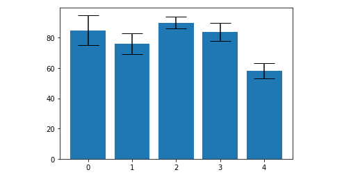

When we represent data as bars of different heights, sometimes, we need to visually communicate some sort of uncertainty in the heights of those bars.

Here are some examples:

- The average number of students in a 3rd grade classroom is 30, but some classes have as few as 18 and others have as many as 35 students.
- We measured that the weight of a certain fruit was 35g, but we know that our scale isn’t very precise, so the true weight of the fruit might be as much as 40g or as little as 30g.

To display error visually in a bar chart, we often use error bars to show where each bar _could be_, taking errors into account.

```py {numberLines}
import pandas as pd
import matplotlib. pyplot as plt
```

```py {numberLines}
subjects = ["Physics", "Chemistry", "Mathematics", "Botany", "Zoology"]

marks = [85, 76, 90, 84, 58]

error = [10, 7, 4, 6, 5]

plt.bar(range(len(subjects)), marks, yerr=error, capsize=6)
```



Each of the black lines is called an _error bar_. The taller the bar is, the more uncertain we are about the height of the blue bar. The horizontal lines at the top and bottom are called _caps_. They make it easier to read the error bars.

To make the caps wide and easy to read, we can increase the cap size.

```py {numberLines}
plt.bar(range(len(subjects)), marks, yerr=error, capsize=15)
```


