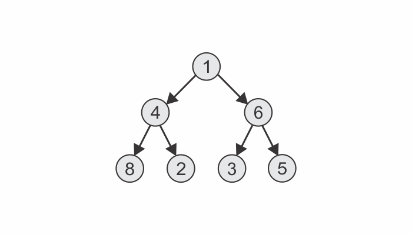

```toc

```

###### Learn to implement a tree data structure using JavaScript in my blog post [here](https://hemanta.io/implementing-a-tree-data-structure-in-javascript/).

### Direction

Implement a method named ~~traverseBF~~ on the ~~Tree~~ class. The ~~traverseBF~~ method should accept a function that gets called with each node in the tree.

With breadth-first traversal, we start iterating at each level of the tree:


### The algorithm

We will implement the ~~traverseBF~~ method using the following algorithm:

Consider the following tree data structure:



First, we will create an empty array and push the root node into it.


Then we will iterate through the array based on the condition that the array has some elements in it. Next, we will remove the first element from the array, then retrieve all of its children and push them into the array.


Thereafter, we will pass the element (_removed from the array in the previos step_) to the function received as an argument to the ~~traverseBF~~ method. Then, we will remove the first element from the array and the process continues.


### Implementation using JavaScript

```js {numberLines, 21-33}
class Node {
  constructor(data) {
    this.data = data
    this.children = []
  }

  add(data) {
    this.children.push(new Node(data))
  }

  remove(data) {
    this.children = this.children.filter(node => node.data !== data)
  }
}

class Tree {
  constructor() {
    this.root = null
  }

  traverseBF(fn) {
    // create an empty array and push the root node into it
    const arr = [this.root]
    // while there are some elements in the array
    while (arr.length > 0) {
      // remove the first element from the array using the shift() method
      const node = arr.shift()
      // then, push the children of the node (removed from the array in the previous step) into the array
      arr.push(...node.children)
      // pass the removed node as an argument to the function passed as an argument to the traverseBF method.
      fn(node)
    }
  }
}
```
