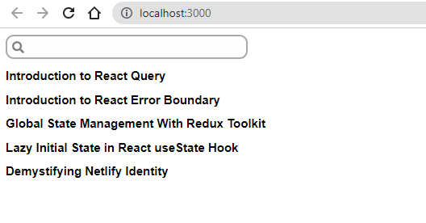
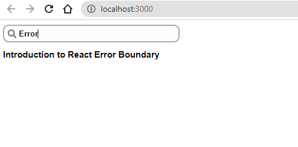

The search box that you see below is the exact search box (_in terms of functionality_) that I have in my blog.

You should be able to build the following search box on your own using the code snippets below. The logic is pretty simple.





> Note that the search icon that you see in the search box is from the ~~react-icons~~ library. Install the library using ~~npm install react-icons~~. You can find out more about the library [here](https://react-icons.github.io/react-icons/).

```js:title=src/components/SinglePost.js {numberLines}
import React from "react";

const SinglePost = ({ title }) => {
  return (
    <li>
      <h2>{title}</h2>
    </li>
  );
};

export default SinglePost;

```

```js:title=src/components/Posts.js {numberLines}
import React from "react";
import SinglePost from "./SinglePost";

const Posts = ({ posts, searchResult, searchQuery }) => {
  return (
    <ul>
      {!searchQuery
        ? posts.map(({ id, title }) => <SinglePost key={id} title={title} />)
        : searchResult.map(({ id, title }) => (
            <SinglePost key={id} title={title} />
          ))}
    </ul>
  );
};

export default Posts;
```

```js:title=src/components/Searchbar.js {numberLines}
import React from "react";
import { FaSearch } from "react-icons/fa";

const Searchbar = ({ value, onChange }) => {
  return (
    <div className="searchBarContainer">
      <div className="searchIcon">
        <FaSearch style={{ fontSize: 15, color: "gray" }} />
      </div>
      <input value={value} onChange={onChange} />
    </div>
  );
};

export default Searchbar;
```

```js:title=src/App.js {numberLines}
import React, { useState } from "react";
import Searchbar from "./components/Searchbar";
import Posts from "./components/Posts";

const posts = [
  { id: 1, title: "Introduction to React Query" },
  { id: 2, title: "Introduction to React Error Boundary" },
  { id: 3, title: "Global State Management With Redux Toolkit" },
  { id: 4, title: "Lazy Initial State in React useState Hook" },
  { id: 5, title: "Demystifying Netlify Identity" },
];

const App = () => {
  const [searchQuery, setSearchQuery] = useState("");

  const handleChange = (e) => {
    setSearchQuery(e.target.value);
  };

  const searchResult = () => {
    let filteredPosts;
    if (searchQuery) {
      filteredPosts = posts.filter((post) =>
        post.title.toLowerCase().includes(searchQuery.toLowerCase())
      );
    }
    return filteredPosts;
  };

  return (
    <>
      <Searchbar value={searchQuery} onChange={handleChange} />
      <Posts
        posts={posts}
        searchResult={searchResult()}
        searchQuery={searchQuery}
      />
    </>
  );
};

export default App;
```

If you are not able to understand any part of the code snippets above, let me know in the comments below.
