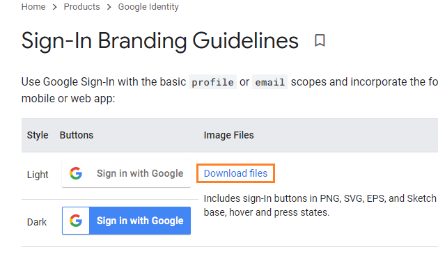
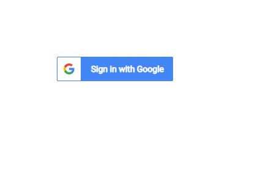

1. First, go to the Google sign-in branding guidelines page at the link [here](https://developers.google.com/identity/branding-guidelines).

2. Click on ~~Download files~~.



You should see a folder in your ~~Downloads~~ folder as shown below:


3. Double click on the folder. Go to **google_signin_buttons** > **web** > **vector**.

4. Inside the ~~vector~~ folder, rename ~~btn_google_dar_normal_ios~~ to ~~login~~.


5. Copy ~~login.svg~~ and paste it inside the ~~public~~ folder of your React project.

6. Click on ~~login.svg~~ inside your React project and replace the code with the following code:

```svg:title=public/login.svg {numberLines}
<svg width="46px" height="46px" viewBox="0 0 46 46" version="1.1" xmlns="http://www.w3.org/2000/svg" xmlns:xlink="http://www.w3.org/1999/xlink" xmlns:sketch="http://www.bohemiancoding.com/sketch/ns">
    <title>btn_google_dark_normal_ios</title>
    <desc>Created with Sketch.</desc>
    <defs>
        <filter x="-50%" y="-50%" width="200%" height="200%" filterUnits="objectBoundingBox" id="filter-1">
            <feOffset dx="0" dy="1" in="SourceAlpha" result="shadowOffsetOuter1"></feOffset>
            <feGaussianBlur stdDeviation="0.5" in="shadowOffsetOuter1" result="shadowBlurOuter1"></feGaussianBlur>
            <feColorMatrix values="0 0 0 0 0   0 0 0 0 0   0 0 0 0 0  0 0 0 0.168 0" in="shadowBlurOuter1" type="matrix" result="shadowMatrixOuter1"></feColorMatrix>
            <feOffset dx="0" dy="0" in="SourceAlpha" result="shadowOffsetOuter2"></feOffset>
            <feGaussianBlur stdDeviation="0.5" in="shadowOffsetOuter2" result="shadowBlurOuter2"></feGaussianBlur>
            <feColorMatrix values="0 0 0 0 0   0 0 0 0 0   0 0 0 0 0  0 0 0 0.084 0" in="shadowBlurOuter2" type="matrix" result="shadowMatrixOuter2"></feColorMatrix>
            <feMerge>
                <feMergeNode in="shadowMatrixOuter1"></feMergeNode>
                <feMergeNode in="shadowMatrixOuter2"></feMergeNode>
                <feMergeNode in="SourceGraphic"></feMergeNode>
            </feMerge>
        </filter>
        <rect id="path-2" x="0" y="0" width="40" height="40" rx="2"></rect>
        <rect id="path-3" x="5" y="5" width="38" height="38" rx="1"></rect>
    </defs>
    <g id="Google-Button" stroke="none" stroke-width="1" fill="none" fill-rule="evenodd" sketch:type="MSPage">
        <g id="9-PATCH" sketch:type="MSArtboardGroup" transform="translate(-608.000000, -219.000000)"></g>
        <g id="btn_google_dark_normal" sketch:type="MSArtboardGroup" transform="translate(-1.000000, -1.000000)">
            <g id="button" sketch:type="MSLayerGroup" transform="translate(4.000000, 4.000000)" filter="url(#filter-1)">
            </g>
            <g id="button-bg-copy">
                <use fill="#FFFFFF" fill-rule="evenodd" sketch:type="MSShapeGroup" xlink:href="#path-3"></use>
                <use fill="none" xlink:href="#path-3"></use>
                <use fill="none" xlink:href="#path-3"></use>
                <use fill="none" xlink:href="#path-3"></use>
            </g>
            <g id="logo_googleg_48dp" sketch:type="MSLayerGroup" transform="translate(15.000000, 15.000000)">
                <path d="M17.64,9.20454545 C17.64,8.56636364 17.5827273,7.95272727 17.4763636,7.36363636 L9,7.36363636 L9,10.845 L13.8436364,10.845 C13.635,11.97 13.0009091,12.9231818 12.0477273,13.5613636 L12.0477273,15.8195455 L14.9563636,15.8195455 C16.6581818,14.2527273 17.64,11.9454545 17.64,9.20454545 L17.64,9.20454545 Z" id="Shape" fill="#4285F4" sketch:type="MSShapeGroup"></path>
                <path d="M9,18 C11.43,18 13.4672727,17.1940909 14.9563636,15.8195455 L12.0477273,13.5613636 C11.2418182,14.1013636 10.2109091,14.4204545 9,14.4204545 C6.65590909,14.4204545 4.67181818,12.8372727 3.96409091,10.71 L0.957272727,10.71 L0.957272727,13.0418182 C2.43818182,15.9831818 5.48181818,18 9,18 L9,18 Z" id="Shape" fill="#34A853" sketch:type="MSShapeGroup"></path>
                <path d="M3.96409091,10.71 C3.78409091,10.17 3.68181818,9.59318182 3.68181818,9 C3.68181818,8.40681818 3.78409091,7.83 3.96409091,7.29 L3.96409091,4.95818182 L0.957272727,4.95818182 C0.347727273,6.17318182 0,7.54772727 0,9 C0,10.4522727 0.347727273,11.8268182 0.957272727,13.0418182 L3.96409091,10.71 L3.96409091,10.71 Z" id="Shape" fill="#FBBC05" sketch:type="MSShapeGroup"></path>
                <path d="M9,3.57954545 C10.3213636,3.57954545 11.5077273,4.03363636 12.4404545,4.92545455 L15.0218182,2.34409091 C13.4631818,0.891818182 11.4259091,0 9,0 C5.48181818,0 2.43818182,2.01681818 0.957272727,4.95818182 L3.96409091,7.29 C4.67181818,5.16272727 6.65590909,3.57954545 9,3.57954545 L9,3.57954545 Z" id="Shape" fill="#EA4335" sketch:type="MSShapeGroup"></path>
                <path d="M0,0 L18,0 L18,18 L0,18 L0,0 Z" id="Shape" sketch:type="MSShapeGroup"></path>
            </g>
            <g id="handles_square" sketch:type="MSLayerGroup"></g>
        </g>
    </g>
</svg>
```

Now, update the ~~App.js~~ file as shown below:

```jsx:title=src/App.js {numberLines}
import React from "react"

const App = () => {
  return (
    <div className="customBtn">
      
      <div className="buttonText">Sign in with Google</div>
    </div>
  )
}

export default App
```

Next, add the following CSS rules in the ~~index.css~~ file.

```css:title=src/index.css {numberLines}
* {
  padding: 0;
  margin: 0;
  box-sizing: border-box;
}

html {
  font-size: 10px;
}

.customBtn {
  margin: 10rem;
  width: 19rem;
  height: 4rem;
  background-color: #4285f4;
  border-radius: 0.2rem;
  display: flex;
  justify-content: space-between;
  align-items: center;
}

.google {
  margin-left: -0.3rem;
}

.buttonText {
  font-size: 1.4rem;
  font-weight: bold;
  font-family: "Roboto", sans-serif;
  color: white;
  margin-right: 1.5rem;
}
```

And finally, add the highlighted code snippet in the ~~index.html~~ file.

```html:title=public/index.html {numberLines, 6-10}
<!DOCTYPE html>
<html lang="en">
  <head>
    <meta charset="utf-8" />
    <link rel="icon" href="%PUBLIC_URL%/favicon.ico" />
    <link
      href="https://fonts.googleapis.com/css?family=Roboto"
      rel="stylesheet"
      type="text/css"
    />
    <meta name="viewport" content="width=device-width, initial-scale=1" />
    <meta name="theme-color" content="#000000" />
    <meta
      name="description"
      content="Web site created using create-react-app"
    />
    <link rel="apple-touch-icon" href="%PUBLIC_URL%/logo192.png" />
    <link rel="manifest" href="%PUBLIC_URL%/manifest.json" />
    <title>React App</title>
  </head>
  <body>
    <noscript>You need to enable JavaScript to run this app.</noscript>
    <div id="root"></div>
  </body>
</html>
```

Start the development server using ~~npm start~~ and you should see the following result:



###### You can read more about the Google sign-in branding guidelines at the link [here](https://developers.google.com/identity/branding-guidelines).
