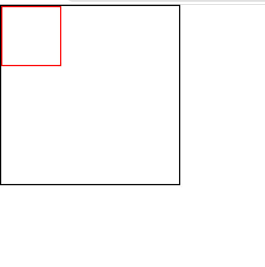
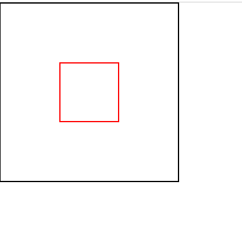

```toc

```

The result of the following two code snippets

```html:title=index.html {numberLines}
<!DOCTYPE html>
<html lang="en">
<head>
    <meta charset="UTF-8">
    <meta http-equiv="X-UA-Compatible" content="IE=edge">
    <meta name="viewport" content="width=device-width, initial-scale=1.0">
    <title>Document</title>
    <link rel="stylesheet" href="style.css">
</head>
<body>
    <div class="box-container">
        <div class="box"></div>
    </div>
</body>
</html>
```

```css:title=style.css {numberLines}
* {
  padding: 0;
  margin: 0;
  box-sizing: border-box;
}

html {
  font-size: 62.5%;
  font-family: sans-serif;
}

.box-container {
  width: 30rem;
  height: 30rem;
  border: 0.2rem solid black;
}

.box {
  width: 10rem;
  height: 10rem;
  padding: 0 2rem;
  border: 0.2rem solid red;
}
```

is the following:



### Technique-1

```css:title=style.css {numberLines, 16-16, 26-31}
* {
  padding: 0;
  margin: 0;
  box-sizing: border-box;
}

html {
  font-size: 62.5%;
  font-family: sans-serif;
}

.box-container {
  width: 30rem;
  height: 30rem;
  border: 0.2rem solid black;
  position: relative;
}

.box {
  width: 10rem;
  height: 10rem;
  padding: 0 2rem;
  border: 0.2rem solid red;
}

.box {
  position: absolute;
  top: 50%;
  left: 50%;
  transform: translate(-50%, -50%);
}
```

### Technique-2

```css:title=style.css {numberLines, 16-17}
* {
  padding: 0;
  margin: 0;
  box-sizing: border-box;
}

html {
  font-size: 62.5%;
  font-family: sans-serif;
}

.box-container {
  width: 30rem;
  height: 30rem;
  border: 0.2rem solid black;
  display: grid;
  place-items: center;
}

.box {
  width: 10rem;
  height: 10rem;
  padding: 0 2rem;
  border: 0.2rem solid red;
}
```

Both the techniques above result in the following:


