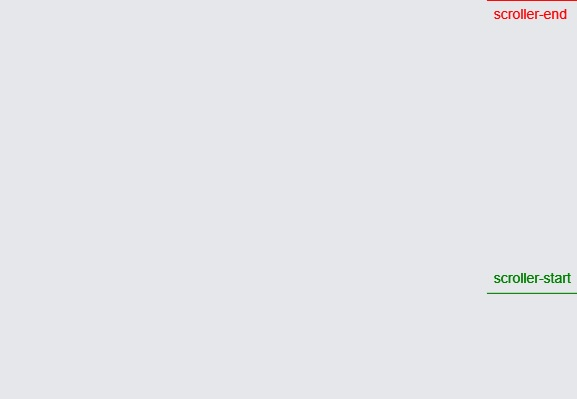
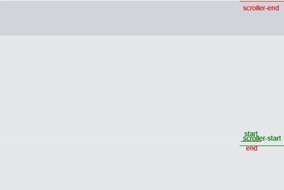

```jsx {numberLines}
import React, { useEffect, useRef } from "react"
import { gsap } from "gsap"
import { ScrollTrigger } from "gsap/ScrollTrigger"

gsap.registerPlugin(ScrollTrigger)

const App = () => {
  const blockOneRef = useRef()
  const blockTwoRef = useRef()

  useEffect(() => {
    gsap.to(blockOneRef.current, {
      backgroundColor: "#d1d5db",
      ease: "linear",
      scrollTrigger: {
        trigger: blockTwoRef.current,
        markers: true,
        start: "bottom 50%",
        toggleActions: "restart pause reverse reset",
      },
    })
  }, [])
  return (
    <>
      <div
        ref={blockOneRef}
        className="fixed top-0 left-0 bg-gray-200 w-full h-20"
      ></div>
      <div ref={blockTwoRef} className="bg-gray-200 w-full h-screen"></div>
      <div className="bg-gray-200 w-full h-screen"></div>
    </>
  )
}

export default App
```

###### Read ScrollTrigger notes in my blog post [here](https://hemanta.io/gsap-scrolltrigger-notes/).
