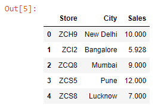

Let’s read 3 Excel files into 3 DataFrames:

```py {numberLines}
import pandas as pd

salesJan = pd.read_excel("salesJan.xlsx")

salesFeb = pd.read_excel("salesFeb.xlsx")

salesMarch = pd.read_excel("salesMarch.xlsx")
```

Let’s preview these DataFrames:

```py {numberLines}
salesJan
```

**Output:**


```py {numberLines}
salesFeb
```

**Output:**



```py {numberLines}
salesMarch
```

**Output:**


Notice that all three DataFrames have the same three columns (~~Store~~, ~~City~~, ~~Sales~~), and the columns are in the same order.

We can combine the 3 DataFrames using the ~~concat()~~ method by passing them inside a Python List.

```py {numberLines}
pd.concat([salesJan, salesFeb, salesMarch])
```

**Output:**


As highlighted above, we can see that we have combined the indexes as well. We can ignore these indexes and instead create a brand new one by passing ~~ignore_index = True~~ to the ~~concat()~~ method.

```py {numberLines}
salesQ4 = pd.concat([salesJan, salesFeb, salesMarch], ignore_index = True)

salesQ4
```

**Output:**


We have successfully combined the DataFrames; however, we have got a problem.

The problem is: in the combined ~~salesQ4~~ DataFrame, we can’t identify which sales figures belong to which DataFrame.

We can solve this problem by passing a List to the ~~keys~~ parameter. The List items will correspond to their respective DataFrames. (_We can name the List items anything we want_).

```py {numberLines}
salesQ4 = pd.concat([salesJan, salesFeb, salesMarch], keys=["January", "February", "March"])

salesQ4
```

**Output:**


The result is a multi-index DataFrame.

Now consider a scenario where the columns in the DataFrames are not in the same order.

I will reorder the columns in the ~~salesJan~~ & ~~salesFeb~~ Excel files. The order in the ~~salesMarch~~ file remains the same.

Let’s read the Excel files into DataFrames:

```py {numberLines}
import pandas as pd

salesJanMod = pd.read_excel("salesJanMod.xlsx")

salesFebMod = pd.read_excel("salesFebMod.xlsx")

salesMarch = pd.read_excel("salesMarch.xlsx")
```

Let’s preview these DataFrames:

```py {numberLines}
salesJanMod
```

**Output:**


```py {numberLines}
salesFebMod
```

**Output:**


```py {numberLines}
salesMarchTwo
```

**Output:**


Let’s combine these DataFrames:

```py {numberLines}
pd.concat([salesMarch, salesFebMod, salesJanMod,], keys=["Mar", "Feb", "Jan"]).fillna(value="N/A")
```

**Output:**


Even though the columns were in different order, Pandas did manage to combine the 3 DataFrames without any problem.

We can combine the DataFrames horizontally as well by passing ~~axis = “Columns”~~ to the ~~concat()~~ method.

```py {numberLines}
pd.concat([salesJanMod, salesFebMod, salesMarch], keys=["Jan", "Feb", "March"], axis="columns")
```

**Output:**


In our case, combining the DataFrames horizontally does not make sense. However, there might be scenarios when you would want to do that.
