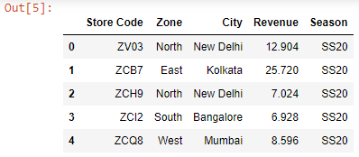

First, let’s read two Excel worksheets into two different Dataframes:

```py {numberLines}
import pandas as pd

df1 = pd.read_excel('budget.xlsx')

df2 = pd.read_excel('budget.xlsx', sheet_name="Sheet2")

df1.head()
```

**Output:**


```py {numberLines}
df2.head()
```

**Output:**



Next, we will combine both the Dataframes by alternating the rows:

```py {numberLines}
df3 = pd.concat([df1, df2]).sort_index()

df3.head()
```

**Output**

