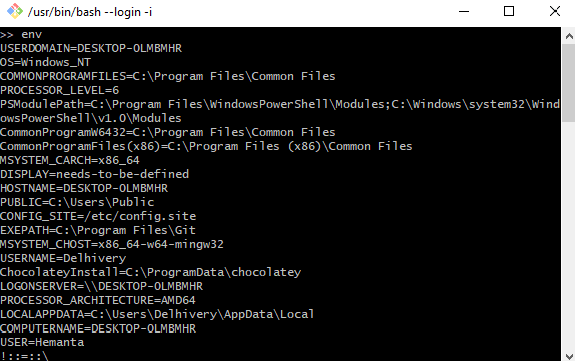

Environment variables are variables that can be used across commands and programs and hold information about the environment.

What happens when you store this in **~/.bash_profile**?

```sh {numberLines}
export USER="Hemanta"
```

- The line ~~USER="Hemanta"~~ sets the environment variable ~~USER~~ to a name "Hemanta". Usually the ~~USER~~ variable is set to the name of the computer’s owner.

- The line ~~export~~ makes the variable to be available to all child sessions initiated from the session you are in. This is a way to make the variable persist across programs.

- At the command line, the command ~~echo $USER~~ returns the value of the variable. Note that ~~$~~ is always used when returning a variable’s value. Here, the command ~~echo $USER~~ returns the name set for the variable.

We can return a list of the environment variables for the current user by typing the ~~env~~ command.

```sh {numberLines}
env
```


