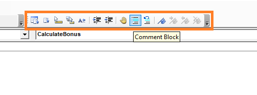
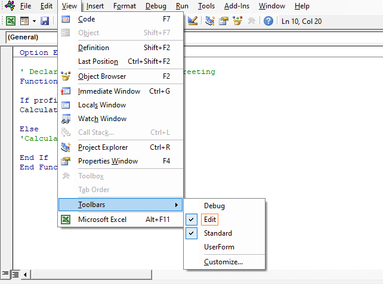

In VBA, we can create a comment using an apostrophe (~~'~~) followed by the comment.

```vb {numberLines}
' Declares a Sub procedure named Greeting
Sub Greeting()

' Declares a string variable named name
Dim name As String

' Assigns the return value of the InputBox function to name
name = InputBox(Prompt:="What is your name?")

' Calls the MsgBox function
MsgBox "Welcome " & name

' Ends the Sub procedure
End Sub
```

We can also comment and uncomment code blocks using the ~~Comment Block~~ and ~~Uncomment Block~~ buttons on the _Edit_ toolbar.

```vb {numberLines}
Function CalculateBonus(profit)

If profit >= 0.1 Then
CalculateBonus = 50000

Else
CalculateBonus = 0

End If

End Function
```

Let’s say we want to comment out the statements on lines 6 & 7. We can easily do this by placing an apostrophe at the start of each of those lines. An easier way to achieve this would be to use a feature in VBA called ~~Comment Block~~.



The ~~Comment Block~~ button is available on the _Edit_ toolbar, which is highlighted in orange. The ~~Comment Block~~ button is next to the _hand_ symbol.

If you can’t see the _Edit_ toolbar in the Visual Basic Editor, then you can activate it by going to ~~View > Toolbars > Edit~~.



All we need to do is select the lines we want to comment out and then click on the ~~Comment Block~~ button. Conversely, we can uncomment the lines by selecting them and clicking on the ~~Uncomment Block~~ button. (_The ~~Uncomment Block~~ button is the button next to the ~~Comment Block~~ button._)
