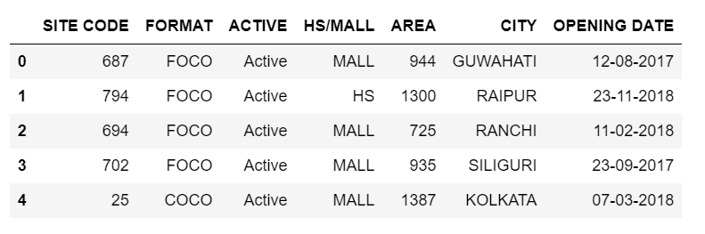
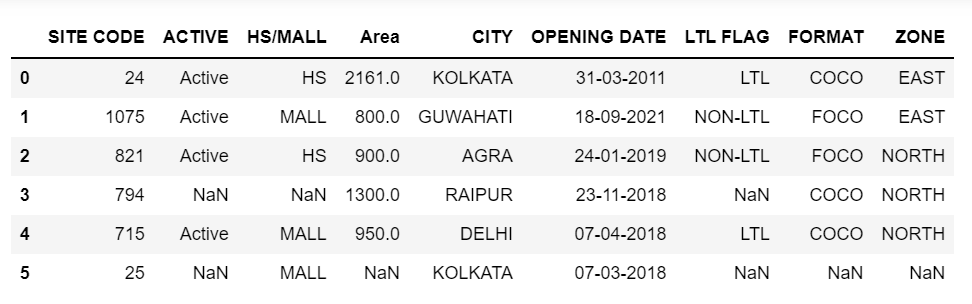
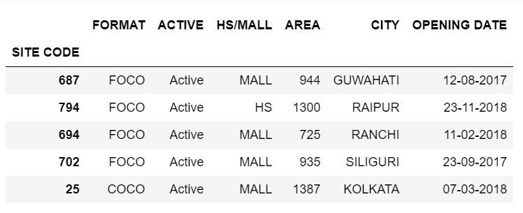
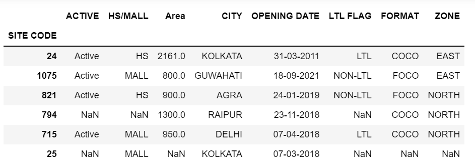
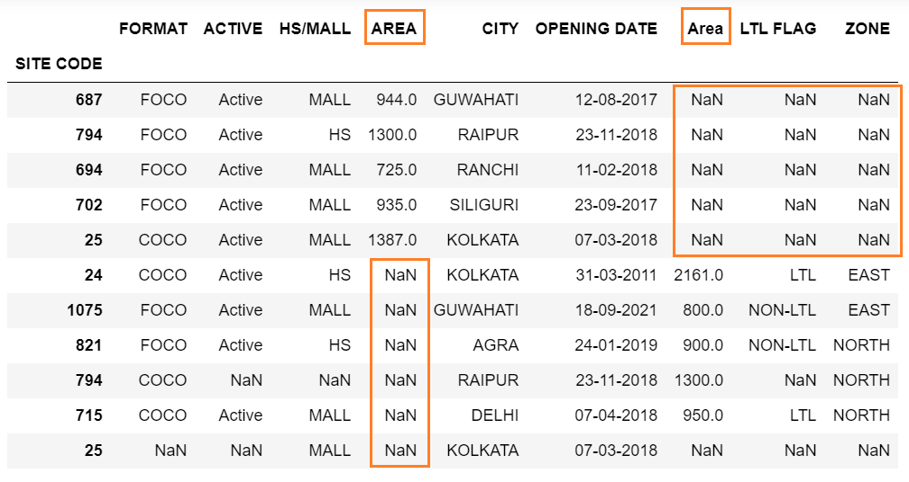
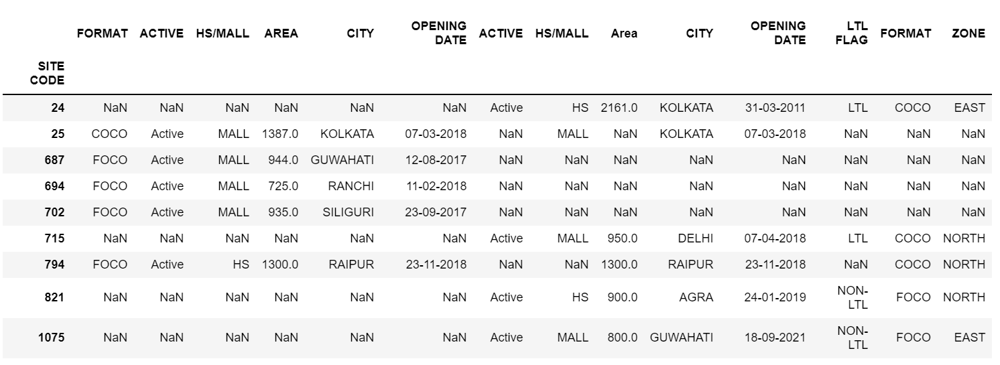
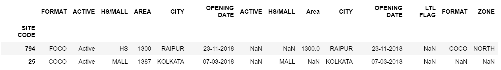

We can concatenate two or more DataFrames (or Series) together, both vertically and horizontally using the ~~concat~~ function.

Let’s read two different Excel worksheets into two different DataFrames:

```py {numberLines}
Import pandas as pd

Import matplotlib.pyplot as plt

%matplotlib notebook

data1 = pd.read_excel("dataOne.xlsx")

data2 = pd.read_excel("dataTwo.xlsx")
```

```py {numberLines}
data1
```



```py {numberLines}
data2
```



Next, we will make the ~~SITE CODE~~ column serve as the index of both of our DataFrames, using the ~~set_index()~~ method.

```py {numberLines}
data1.set_index(keys="SITE CODE", inplace=True)

data1
```



```py {numberLines}
data2.set_index(keys="SITE CODE", inplace=True)

data2
```



Let’s place both the DataFrames into a single list, and then call the ~~concat~~ function to concatenate them together:

```py {numberLines}
pd.concat([data1, data2])
```

The first argument is the only argument required for the ~~concat~~ function and it must be a sequence of pandas objects, typically a list or dictionary of DataFrames or Series.



By default, the ~~concat~~ function concatenates DataFrames vertically, one on top of the other.

When we concatenate vertically, the DataFrames align by their column names. Notice that all the column names that were the same in both the DataFramess lined up precisely under the same column name.

It is also possible to concatenate horizontally by changing the ~~axis~~ parameter to ~~columns~~ or ~~1~~:

```py {numberLines}
pd.concat([data1, data2], axis='columns')
```



```py {numberLines}

```

The ~~concat~~ function, by default, uses an outer join, keeping all rows from each DataFrame in the list. However, it gives us options to only keep rows that have the same index values in both DataFrames. This is referred to as an inner join. We set the ~~join~~ parameter to ~~inner~~ to change the behavior:

```py {numberLines}
pd.concat([data1, data2], join='inner', axis='columns')
```


