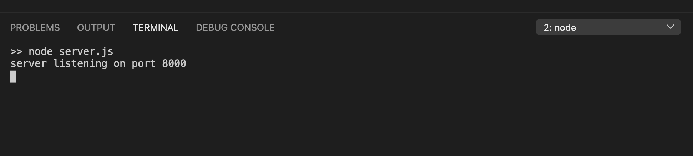
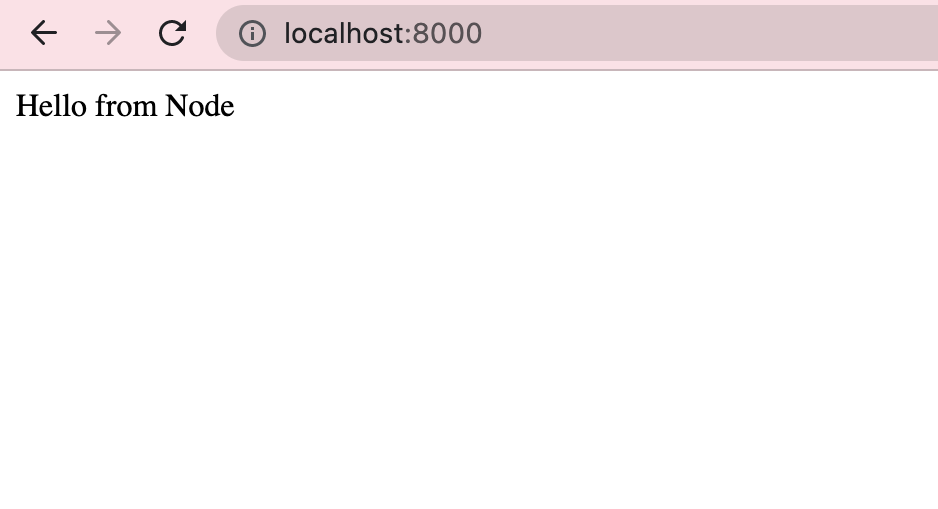
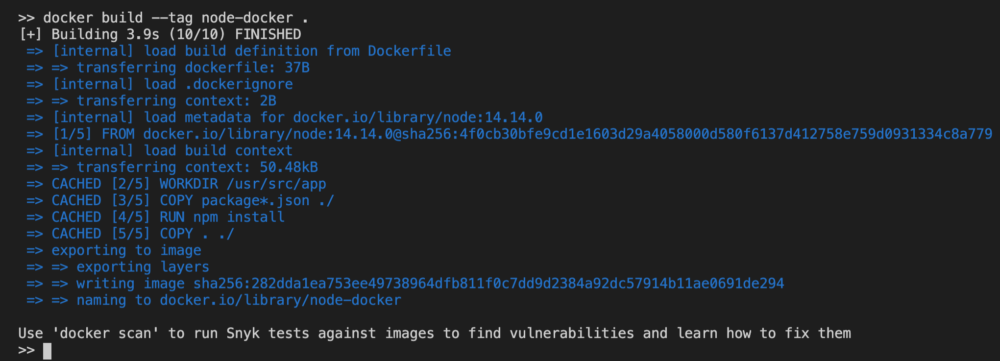
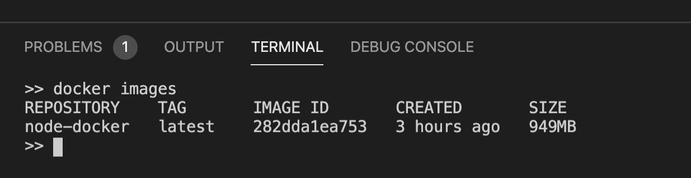

```toc

```

###### To follow this guide, you should have Docker desktop installed on your computer. Learn how to install Docker Desktop on Mac in my blog post [here](https://hemanta.io/install-docker-desktop-on-mac/).

In this 2-part guide, we will learn how to package a Node.js web application into a container image and run the image as a container.

In part-1, we will:

- Build a simple Node.js web application: Using Express.js, we will create a web server that will listen for requests coming into port 8000 and will respond with the text “Hello from Node” in response to a ~~GET~~ request to the root (~~/~~) route.
- Create a Dockerfile (_This is the most important part to understand_) & finally
- Create the Docker image

So, let’s get started.

### Building the Sample Application

Create a directory in your local machine named ~~node-docker~~ and open it in your preferred code editor (I use Visual Studio Code).

Run the command ~~npm init~~ to create a ~~package.json~~ file.

Next, install the ~~express~~ framework using the command ~~npm install express~~.

Now, create a file named ~~server.js~~ inside the ~~node-docker~~ directory. Copy and paste the following code inside the ~~server.js~~ file.

```js {numberLines}
const express = require("express")

const app = express()

app.get("/", (req, res) => {
  res.send("Hello from Node")
})

const PORT = 8000

app.listen(PORT, () => {
  console.log(`server listening on port ${PORT}`)
})
```

### Running the sample application

Let’s start our application and make sure it’s working properly. While being inside the ~~node-docker~~ directory, run the command ~~node server.js~~.

You should see the following output in the terminal.



Open ~~localhost:8000~~ and you will see the text “Hello from Node” on the web page.



You can also query the ~~localhost:8000~~ API endpoint using the ~~curl~~ command as shown below:

```sh {numberLines}
curl localhost:8000
```


We get the desired response: “Hello from Node”.

Our web server is working properly.

### Create a Dockerfile

A Dockerfile is a text document that contains the instructions to assemble a Docker image. When we will tell Docker to build our image by executing the ~~docker build~~ command later, Docker will read these instructions, execute them, and create a Docker image as a result.

> Note: A Docker image consists of read-only layers each of which represents a Dockerfile instruction.

Let’s walk through the process of creating a Dockerfile for our application. In the ~~node-docker~~ directory, create a file named ~~Dockerfile~~ and open this file in your code editor. Next, copy and paste the following code sample in the ~~Dockerfile~~.

```sh {numberLines}
FROM node:14.14.0
ENV NODE_ENV=production
WORKDIR /app
COPY package*.json .
RUN npm install --production
COPY . .
CMD ["node", "server.js"]
```

Let’s understand what the code sample inside our Dockerfile means:

- **FROM:** Defines the base image. All the instructions that follow are run in a container launched from this base image. We are using a ~~node~~ image because our application is a Node.js application. Note that this image comes with ~~Node.js~~ & ~~NPM~~ already installed.
- **ENV:** Sets environment variables. Setting ~~NODE_ENV~~ to ~~production~~ improves performance.
- **WORKDIR:** This is the directory that will hold our application code inside the image. This instructs docker to use this path as the default location for all subsequent commands.
- **COPY:** Copies files and directories into the container image. The ~~COPY~~ command takes two parameters: ~~src~~ & ~~dest~~. The first parameter (~~src~~) tells Docker what file(s) you would like to copy into the image. The second parameter (~~dest~~) tells Docker where you want the file(s) to be copied to. In our case, we are copying both the ~~package.json~~ & the ~~package-lock.json~~ files. A wildcard is used to ensure both ~~package.json~~ & ~~package-lock.json~~ are copied where available (npm@5+). Please note that if you are using ~~npm~~ version 4 or earlier a ~~package-lock.json~~ file will _not_ be generated.
- **RUN:** Once we have our files inside our image, we can use the ~~RUN~~ command to run the command ~~npm install~~. This works exactly the same as if we were running ~~npm install~~ locally on our machine, but this time the Node modules will be installed into the ~~node_modules~~ directory inside our image.
- **COPY:** Here, we are copying the files from our current directory to the ~~app~~ directory inside the image.
- **CMD:** Sets the default command (~~node server.js~~) to run when the container is launched.

### Create a .dockerignore file

Create a ~~.dockerignore~~ file in the same directory as your ~~Dockerfile~~ with following content:

```sh {numberLines}
node_modules
```

This will prevent our local modules from being copied onto our Docker image and possibly overwriting modules installed within our image.

The ~~.gitignore~~ file supports exclusion patterns similar to the ~~.gitignore~~ files.

Before the Docker CLI sends the context to the Docker daemon, it looks for a file named ~~.gitignore~~ in the root directory of the context. If this file exists, the CLI modifies the context to exclude files and directories that match patterns in it. This helps to avoid sending unnecessary large or sensitive files and directories to the daemon and potentially adding them to images using ~~ADD~~ or ~~COPY~~.

> **BUILD CONTEXT:** When you issue a ~~Docker build~~ command, the current working directory is called the _build context_. By default, the Dockerfile is assumed to be located here.

### Building the Image

Now we have everything that we need to build a Docker image. To do this, we use the ~~docker build~~ command.

The build command optionally takes a ~~--tag~~ flag. The tag is used to set the name of the image and an optional tag in the format ~~name:tag~~. We’ll leave off the optional “tag” for now to help simplify things. If you do not pass a tag, Docker will use ~~latest~~ as its default tag.

Let’s build our first Docker image:

```sh {numberLines}
docker build –tag node-docker .
```



We have successfully built our first Docker image.

### View Local Images

To see a list of images we have on our local machine, we can run the ~~images~~ command.

```sh {numberLines}
docker images
```



We see the image we just built ~~node-docker:latest~~ with the ~~latest~~ tag.

In part-2, we will learn how to run this image as a container.

Go to [part-2](https://hemanta.io/containerize-dockerize-a-nodejs-web-application-part-2-running-the-image-as-a-container/)
