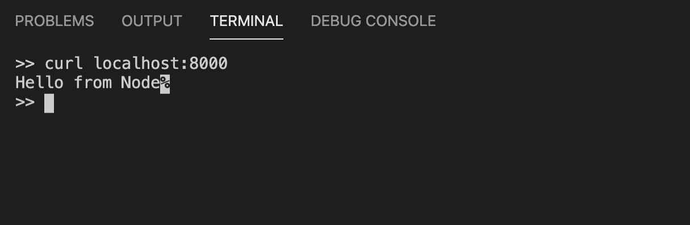
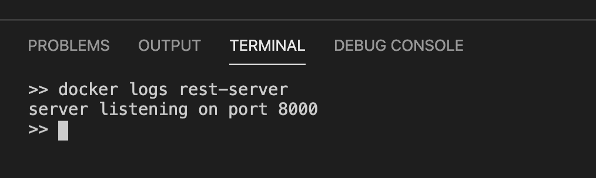

```toc

```

###### This is part-2 of a 2-part guide on how to package a Node.js web application as a container image and run the image as a container. You must finish [part-1](https://hemanta.io/containerize-dockerize-a-nodejs-web-application-part-1-building-the-image/) before continuing here.

In part-1, we successfully packaged our Node.js web application into a Docker image: ~~node-docker~~.

Now, we will run this image inside of a container using the ~~docker run~~ command.

> A container is a normal operating system process except that this process is isolated and has its own file system, its own networking, and its own isolated process tree separated from the host.

The ~~docker run~~ command has the following usage format:

```sh
docker run [OPTIONS] IMAGE [COMMAND] [ARG…]
```

Execute the following command in your terminal:

```sh
docker run -d -p 8000:8000 –name rest-server node-docker
```

- ~~-d~~: To run the container in the background (in detached mode).
- ~~p~~: To publish a port for our container. The format of the ~~--publish~~ (~~-p~~ for short) command is ~~[host port] : [container port]~~. In the command above, we are exposing port 8000 inside the container to port 8000 on the host.
- ~~name~~: To name your container for easy identification.


We can see that Docker started our container in the background and printed the container ID on the terminal.

We can make sure that the container is working properly using the following ~~curl~~ command:

```sh
curl localhost:8000
```



Alternatively, we can point our browser to ~~localhost:8000~~ and see the desired output:


### Fetch the logs of a container

Remember that when we start our web server, it logs the text
"server listening on port". Now that our application is running inside a container, the log it produces will also be inside the container. We can fetch these logs using the ~~docker logs~~ command.

```sh {numberLines}
docker logs rest-server
```



### List Containers

To see the list of running containers on our machine, we can use the ~~docker ps~~ command.


### Stop Containers

We can stop a running container using the following command:

```sh
docker stop rest-server
```

Note that the ~~docker ps~~ command by default only shows running containers. We have stopped our ~~rest-server~~ container. To see the list of all containers including the ones that are stopped, we pass the ~~-a~~ flag to the ~~docker ps~~ command, as shown below:

```sh
docker ps -a
```


### Restart Containers

Let’s restart the container we just stopped.

```sh
docker restart rest-server
```


### Remove containers

To remove a container, we simply run the ~~docker run~~ command, passing the container name. We can also pass multiple container names in one command.

```sh
docker rm rest-server
```


### Listing all running processes inside a container

We can see all running processes inside a container using the ~~docker top~~ command:

```sh
docker top rest-server
```


