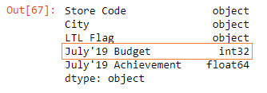

Below, we have read the ~~budget.xlsx~~ file to a DataFrame.

```py {numberLines}
budget = pd.read_excel("budget.xlsx")

budget
```

**Output:**


Both ~~July’19 Budget~~ & ~~July’19 Achievement~~ columns contain floating point numbers. Our goal is to convert them from floating point numbers to integers.

Notice that the ~~July’19 Budget~~ column contains missing values. Let’s see what happens if we try to convert the floating point numbers only in the ~~July’19 Budget~~ column to integers using the ~~astype()~~ method.

```py {numberLines}
budget["July'19 Budget"].astype("int")
```

**Output:**


> We received an error, because the ~~astype()~~ method doesn’t work on a Series with null values.

So, first, we will have to fill the null values and then apply the ~~astype()~~ method.

###### Learn how to fill in null vales in Pandas DataFrame in my blog post [here](https://hemanta.io/fill-in-null-values-in-a-pandas-dataframe-using-the-fillna-method/).

```py {numberLines}
budget["July'19 Budget"].fillna(value = 0).astype("int")
```

**Output:**


We have successfully converted the floating point numbers to integers. We have a small problem though.

We want the floating point numbers to be converted to the next largest integer. We want ~~10.904~~ to be converted to ~~11~~, ~~15.720~~ to ~~16~~ and so on.

We can achieve this using the ~~round()~~ method as shown below:

```py {numberLines}
budget["July'19 Budget"].fillna(value = 0).round().astype("int")
```

**Output:**


Note that the ~~astype()~~ method does not have an ~~inplace~~ parameter. So, in order to make the change permanent, we will have to assign the ~~July’19 Budget~~ Series to the new Series.

```py {numberLines}
budget["July'19 Budget"] = budget["July'19 Budget"].fillna(value = 0).round().astype("int")

budget
```

**Output:**


Let’s check the data types:

```py {numberLines}
budget.dtypes
```

**Output:**



Similarly, we can also change the floating point numbers in the ~~July’19 Achievement~~ column to integers.
