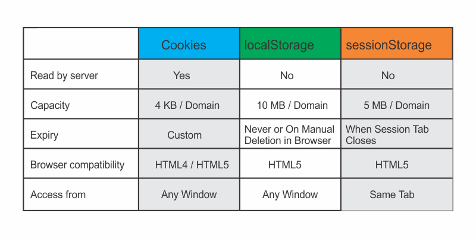

~~localStorage~~ & ~~sessionStorage~~ are meant to be accessed directly by JavaScript &
not directly sent to the server like cookies.

Also, cookie expiration can be configured through code, but ~~localStorage~~ & ~~sessionStorage~~
expiration work differently and more so dependent on browser operations.

Cookies hold 4KB per domain, whereas ~~localStorage~~ & ~~sessionStorage~~ have greater capacity per domain.
