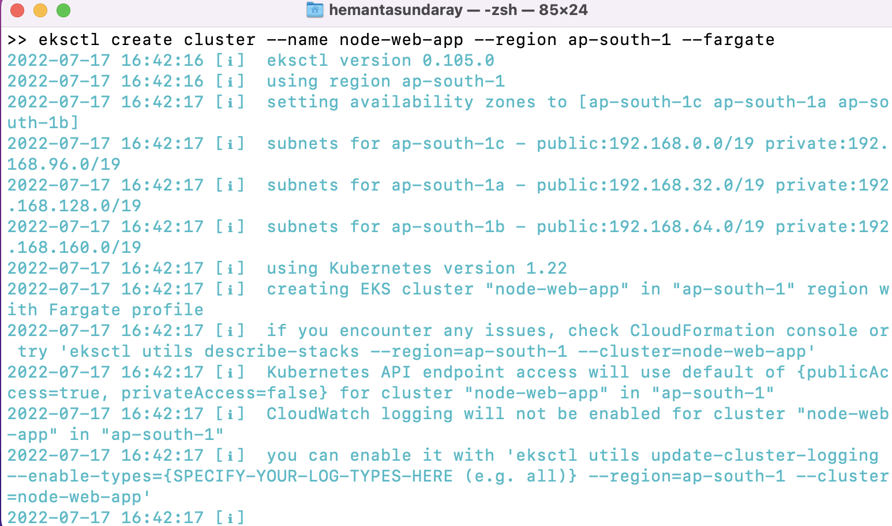
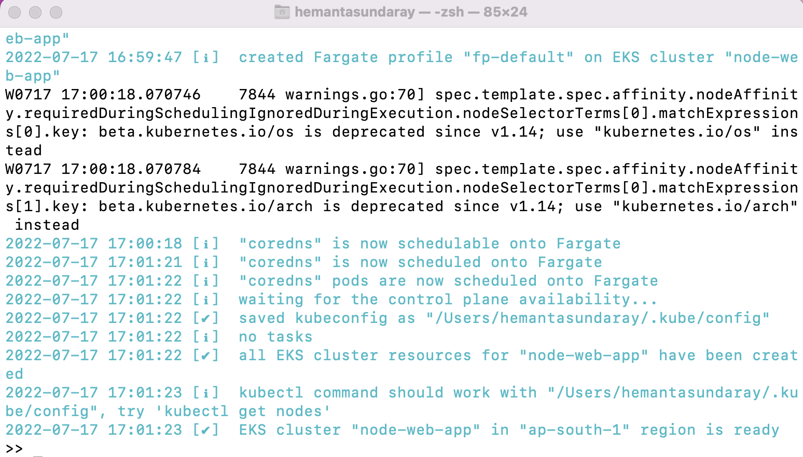
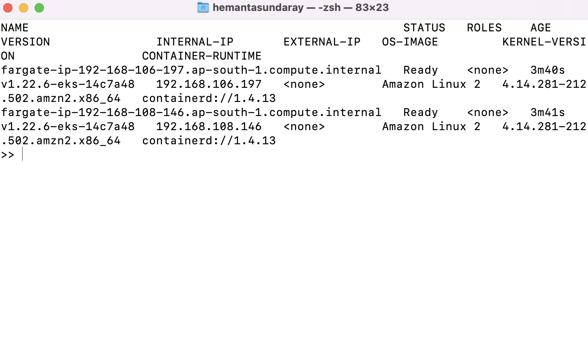
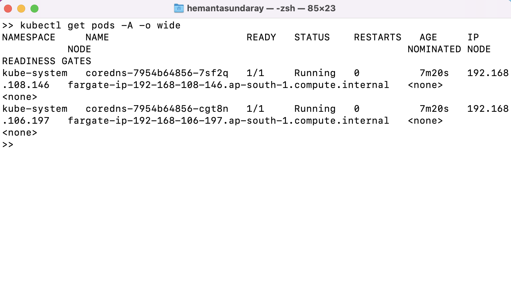
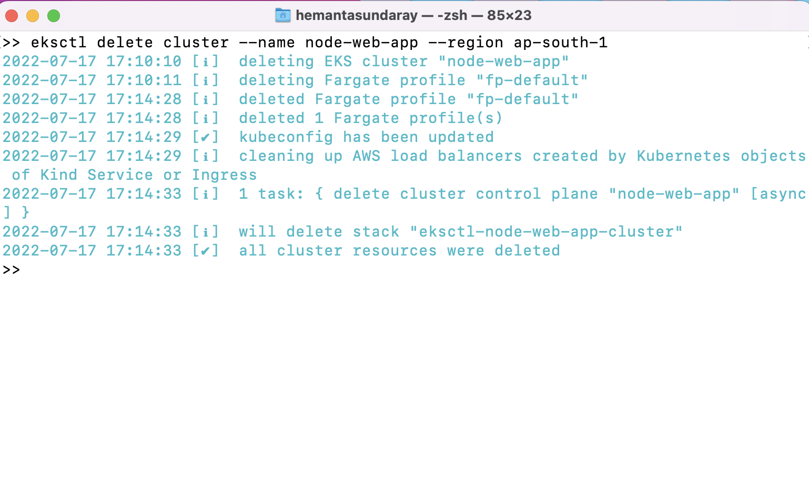

```toc

```

We will create the cluster using ~~Fargate Linux~~ node type. Fargate is a serverless compute engine that will let us deploy Kubernetes pods without managing Amazon EC2 instances.

### Creating the cluster

We will create our Amazon EKS cluster using the ~~eksctl create cluster~~ command.

```sh {numberLines}
eksctl create cluster --name node-web-app --region ap-south-1 --fargate
```



> Note that the cluster name can only contain alphanumeric characters (case-sensitive) and hyphens. It must start with an alphabetic character and can’t be longer than 128 characters. Replace ~~region_code~~ with any AWS region that is supported by Amazon EKS.

Cluster creation takes several minutes. During creation, you will see several lines of output. The last line of output is similar to the following:



### View Kubernetes Resources

View your cluster nodes:

```sh {numberLines}
kubectl get nodes -o wide
```



View the workloads running on your cluster:

```sh {numberLines}
kubectl get pods -A -o wide
```



### Delete Your Cluster & Nodes

We can delete the cluster and the nodes with the following command:

```sh {numberLines}
eksctl delete cluster –name node-web-app –region ap-south-1
```


