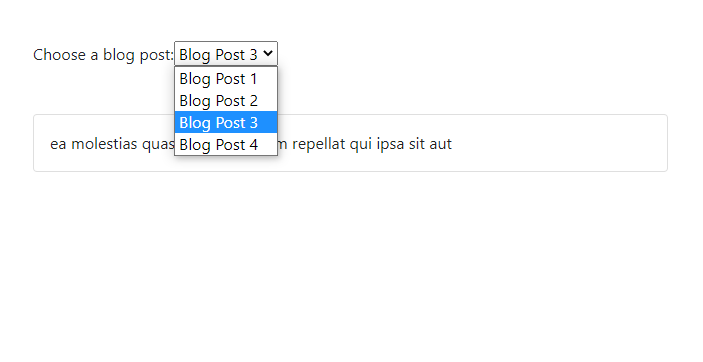

Below, we have a ~~Blog~~ component that renders a dropdown.

```jsx {numberLines}
import React, { useState, useEffect } from "react"
import axios from "axios"

const Blog = () => {
  const [blogId, setBlogId] = useState("")
  const [post, setPost] = useState([])

  useEffect(() => {
    ;(async () => {
      const { data } = await axios.get(
        `https://jsonplaceholder.typicode.com/posts/${blogId}`
      )
      setPost(data)
    })()
  }, [blogId])

  const handleBlogPostChange = event => {
    setBlogId(event.target.value)
  }

  return (
    <div className="m-5">
      <div className="mb-5">
        <label htmlFor="blog">Choose a blog post:</label>
        <select name="blog" id="blog" onChange={handleBlogPostChange}>
          <option value="1">Blog Post 1</option>
          <option value="2">Blog Post 2</option>
          <option value="3">Blog Post 3</option>
          <option value="4">Blog Post 4</option>
        </select>
      </div>

      <div className="card col-md-6">
        {post && <div className="card-body">{post.title}</div>}
      </div>
    </div>
  )
}

export default Blog
```

The resulting UI looks like this:




Every time we select a new option from the dropdown, ~~handleBlogPostChange~~ event listener is fired, which changes the value of the ~~blogId~~ state variable, which in turn runs ~~useEffect~~ (_we have added the ~~blogId~~ variable to the dependency array_), fetching the blog post whose ~~id~~ matches ~~blogId~~.
