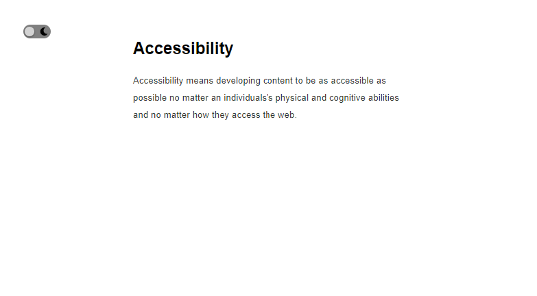
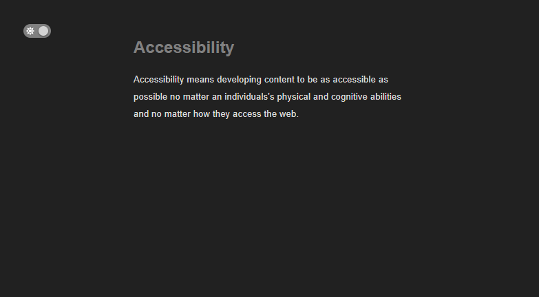
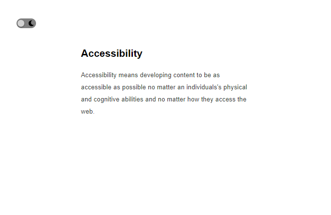

```toc

```

### Prerequisite

- Understanding of GSAP fundamentals.

There are many ways you can implement a light and dark mode toggle in React. I prefer using GSAP (_a JavaScript animation library_), because:

- (a) I can implement the functionality in fewer lines of code - I don’t have to toggle CSS class names based on the value of a variable in component state and
- (b) GSAP allows me to have tight control over the animation.

Now, let’s take a look at what we are going to build.

### Light mode

This is how the page looks in light mode.



### Dark mode

When you click on the toggle button, the dark mode is activated.



The sun and moon icons inside the toggle button are from Font-Awesome.

### Building the project

All right, let’s start building the project.

Create a folder called ~~mode~~, open the folder in VS Code and create a React project using the following command:

```sh
PS C:\Users\Delhivery\Desktop\mode> npx create-react-app .
```

Let’s install ~~gsap~~, which is available as a package from npm.

```sh
PS C:\Users\Delhivery\Desktop\mode> npm i gsap
```

We will use Font Awesome icons using Font Awesome’s official React component.

We need to install the following three packages:

```sh
PS C:\Users\Delhivery\Desktop\mode> npm i --save @fortawesome/fontawesome-svg-core
@fortawesome/free-solid-svg-icons @fortawesome/react-fontawesome
```

You can find more about using Font Awesome icons in React at the following link:

[Using Font Awesome with React](https://fontawesome.com/v5.15/how-to-use/on-the-web/using-with/react)

We have installed our required dependencies. Next, we will create the toggle button.

### Toggle button

```jsx:title=src/App.js {numberLines}
import React from "react"
import { FontAwesomeIcon } from "@fortawesome/react-fontawesome"
import { faSun } from "@fortawesome/free-solid-svg-icons"
import { faMoon } from "@fortawesome/free-solid-svg-icons"

const App = () => {
  return (
    <div className="wrapper">
      <div className="toggle">
        <div>
          <FontAwesomeIcon icon={faSun} className="sun" />
        </div>
        <div>
          <FontAwesomeIcon icon={faMoon} className="moon" />
        </div>
        <div className="circle"></div>
      </div>

      <section className="intro">
        <h1 className="intro-header">Accessibility</h1>
        <p className="intro-text">
          Accessibility means developing content to be as accessible as possible
          no matter an individuals's physical and cognitive abilities and no
          matter how they access the web.
        </p>
      </section>
    </div>
  )
}

export default App
```

```css:title=src/index.css {numberLines}
/*_ || Global styling _*/

- {
  padding: 0;
  margin: 0;
  box-sizing: border-box;
  }

html {
font-size: 62.5%;
font-family: sans-serif;
}

/*_ End of global styling _*/

/*_ || Toggle button styling _*/

.toggle {
width: 4rem;
height: 2rem;
margin: 4rem;
background-color: gray;
border-radius: 3rem;
position: relative;
cursor: pointer;
display: flex;
justify-content: space-around;
align-items: center;
}

.sun,
.moon {
font-size: 1.2rem;
}

.sun {
color: white;
}

.circle {
width: 1.4rem;
height: 1.4rem;
background-color: lightgray;
border-radius: 50%;
position: absolute;
top: 50%;
left: 5%;
transform: translateY(-50%);
box-shadow: 0 0.1rem 0.3rem rgba(0, 0, 0, 0.6);
}

/*_ End of toggle button styling _*/

/*_ || Text styling _*/

.intro {
width: clamp(20rem, 50vw, 80rem);
margin: auto;
}

.intro h1 {
font-size: clamp(2rem, 3vw, 6rem);
margin-bottom: 2rem;
}

.intro p {
font-size: clamp(1.3rem, 1.2vw, 2rem);
letter-spacing: 0.02rem;
line-height: 2.5rem;
color: #353935;
}

/*_ End of text styling _*/
```

Start the application using ~~npm start~~ and we have the following result:



To implement the toggle functionality, we will go through the following steps:

- We will add an ~~onClick~~ handler to the ~~div~~ with the class name of ~~toggle~~. In the ~~onClick~~ handler function, we will use JavaScript ternary operator to play the animation based on a condition: play the animation if it is reversed and reverse the animation if otherwise. Note that the animation will be in a ~~reversed~~ and ~~paused~~ state at the start.

- When we play the animation, we will **simultaneously** animate three things:
  - the circle inside the toggle button moves 2rem in the positive direction of x-axis.
  - the background color of body animates to a darker color.
  - and the color of the heading and paragraph text animate to lighter colors.

Add the highlighted code snippets in the ~~App.js~~ file.

```jsx:title=src/App.js {numberLines, 1-1, 5-5, 7-12, 15-31, 34-35}
import React, { useRef, useEffect } from "react"
import { FontAwesomeIcon } from "@fortawesome/react-fontawesome"
import { faSun } from "@fortawesome/free-solid-svg-icons"
import { faMoon } from "@fortawesome/free-solid-svg-icons"
import { gsap } from "gsap"

const animation = gsap.timeline({
  paused: true,
  reversed: true,
  ease: "expo.inOut",
  duration: 0.01,
})

const App = () => {
  const wrapperRef = useRef()

  useEffect(() => {
    const circle = wrapperRef.current.querySelector(".circle")
    const introHeader = wrapperRef.current.querySelector(".intro-header")
    const introText = wrapperRef.current.querySelector(".intro-text")

    animation
      .to(circle, { x: "2rem" })
      .to(document.body, { backgroundColor: "#212121" }, "<")
      .to(introHeader, { color: "gray" }, "<")
      .to(introText, { color: "gainsboro" }, "<")
  })

  const circleClickHandler = () => {
    animation.reversed() ? animation.play() : animation.reverse()
  }

  return (
    <div className="wrapper" ref={wrapperRef}>
      <div className="toggle" onClick={circleClickHandler}>
        <div>
          <FontAwesomeIcon icon={faSun} className="sun" />
        </div>
        <div>
          <FontAwesomeIcon icon={faMoon} className="moon" />
        </div>
        <div className="circle"></div>
      </div>

      <section className="intro">
        <h1 className="intro-header">Accessibility</h1>
        <p className="intro-text">
          Accessibility means developing content to be as accessible as possible
          no matter an individuals's physical and cognitive abilities and no
          matter how they access the web.
        </p>
      </section>
    </div>
  )
}

export default App
```

That’s all we need to do. Now, if you click on the toggle button, dark mode gets activated. And if you click on the toggle button again, we go back to light mode.
