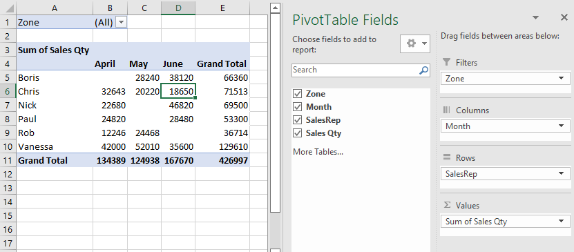

Below, we have a worksheet range that contains four fields: **Zone**, **Month**, **SalesRep** & **Sales Qty**.


### Creating a PivotTable

The following figure shows a PivotTable created from the aforementioned worksheet range along with the PivotTable fields task pane:



The PivotTable summarizes the sales performance by sales representative and month.

The pivot table is set up with the following fields:

- **Zone**: A report filter field in the PivotTable
- **Month**: A column field in the PivotTable
- **SalesRep**: A row field in the PivotTable
- **Sales Qty**: A values field in the PivotTable that uses the SUM function.

We can create the exact PivotTable using the following VBA code:

```vb {numberLines}
Sub CreatePivotTable()
    Dim PTCache As PivotCache
    Dim PT As PivotTable

'   Create the cache
    Set PTCache = ActiveWorkbook.PivotCaches.Create( _
        SourceType:=xlDatabase, _
        SourceData:=Range("A1").CurrentRegion)

'   Add a new sheet for the pivot table
    Worksheets.Add

'   Create the pivot table
    Set PT = ActiveSheet.PivotTables.Add( _
        PivotCache:=PTCache, _
        TableDestination:=Range("A3"))

'   Specify the fields
    With PT
        .PivotFields("Zone").Orientation = xlPageField
        .PivotFields("Month").Orientation = xlColumnField
        .PivotFields("SalesRep").Orientation = xlRowField
        .PivotFields("Sales Qty").Orientation = xlDataField

        'no field captions
        .DisplayFieldCaptions = False
    End With
End Sub
```

To make sense of this VBA code, a basic understanding of the following objects is critical:

- **PivotCaches**: A collection of ~~PivotCache~~ objects in a ~~Workbook object~~ (the data used by a pivot table is stored in a pivot cache)
- **PivotTables**: A collection of ~~PivotTable~~ objects in a ~~Worksheet~~ object.
- **PivotFields**: A collection of fields in a ~~PivotTable~~ object.
- **PivotItems**: A collection of individual data items within a field category.
- **CreatePivotTable**: A method that creates a PivotTable by using the data in a pivot cache.
