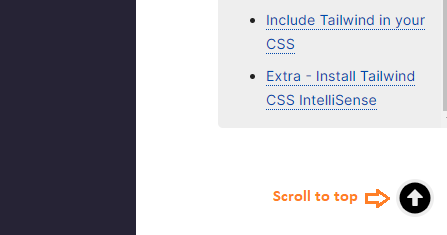
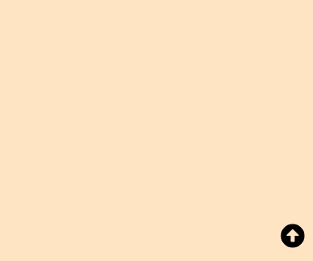

I have a _scroll to top_ feature implemented in my Gatsby blog (_the one you are reading now_).

When you scroll down a page by 800 pixels (from the top of the page), an icon animates into appearance, as shown below:



And when you click on the icon, you are scrolled back to the top of the page.

In this blog post, we are going to recreate this _scroll to top_ feature for a React application.

Let's get started.

Create a folder named ~~scroll~~ on your desktop. Open the folder in Visual Studio Code and create a React project using the following command:

```sh {numberLines}
PS C:\Users\Delhivery\Desktop\scroll> npx create-react-app .
```

We will also use the ~~framer-motion~~ library to add a subtle animation to the _scroll to top_ icon. This is not required for the core feature though.

We will install ~~framer-motion~~ from npm:

```sh {numberLines}
PS C:\Users\Delhivery\Desktop\scroll> npm i framer-motion
```

We will use a Font Awesome arrow icon using Font Awesome’s official React component.

We need to install the following three packages:

```sh {numberLines}
PS C:\Users\Delhivery\Desktop\scroll> npm i @fortawesome/fontawesome-svg-core @fortawesome/free-solid-svg-icons @fortawesome/react-fontawesome
```

###### Learn more about using Font Awesome in React at the link [here](https://fontawesome.com/v5.15/how-to-use/on-the-web/using-with/react).

We have installed all the packages that we need.

Next, inside the ~~src~~ folder, create a folder named ~~components~~, and inside the ~~components~~ folder, create a file named ~~ScrollToTop.js~~.

```jsx:title=src/components/ScrollToTop.js {numberLines}
import React, { useEffect, useState } from "react";
import { FontAwesomeIcon } from "@fortawesome/react-fontawesome";
import { faArrowAltCircleUp } from "@fortawesome/free-solid-svg-icons";
import { motion, AnimatePresence } from "framer-motion";

const scrollVariants = {
  initial: { y: ".5rem", opacity: 0 },
  animate: {
    y: "0rem",
    opacity: 1,
    transition: {
      duration: 0.5,
    },
  },
};

const ScrollToTop = () => {
  const [isVisible, setIsVisible] = useState(false);

  // Show button when page is scrolled upto given distance
  const toggleVisibility = () => {
    if (window.pageYOffset > 800) {
      setIsVisible(true);
    } else {
      setIsVisible(false);
    }
  };

  // Set the top coordinate to 0
  // make scrolling smooth
  const scrollToTop = () => {
    window.scrollTo({
      top: 0,
      behavior: "smooth",
    });
  };
  // the scroll event fires when the document view has been scrolled
  useEffect(() => {
    window.addEventListener("scroll", toggleVisibility);
  }, []);

  return (
    <AnimatePresence>
      {isVisible && (
        <motion.button
          className="scroll-to-top"
          onClick={scrollToTop}
          variants={scrollVariants}
          initial="initial"
          animate="animate"
          exit="initial"
        >
          <FontAwesomeIcon icon={faArrowAltCircleUp} />
        </motion.button>
      )}
    </AnimatePresence>
  );
};

export default ScrollToTop;
```

> ~~pageYOffset~~ is a ~~Window~~ property that returns the number of pixels the document is currently scrolled along the vertical axis (up or down).

> ~~window.scrollTo()~~ scrolls to a particular set of coordinates in the document.

Next, update the ~~App.js~~ file as shown below:

```jsx:title=src/App.js {numberLines}
import React from "react";
import ScrollToTop from "./components/ScrollToTop";

const App = () => {
  return (
    <>
      <div className="page"></div>
      <ScrollToTop />
    </>
  );
};

export default App;
```

Now, add the following styles rules in ~~index.css~~:

```css:title=src/index.css {numberLines}
* {
  padding: 0;
  margin: 0;
  box-sizing: border-box;
}

html {
  font-size: 10px;
  font-family: sans-serif;
}

.page {
  width: 100%;
  height: 200rem;
  background-color: bisque;
}

.scroll-to-top {
  position: fixed;
  bottom: 1.5rem;
  right: 1.5rem;
  cursor: pointer;
  background-color: transparent;
  border: none;
  font-size: 3rem;
}
```

Start the server using the command ~~npm run start~~ and scroll down the page.

After you scroll down 800 pixels from the top of the page, you will see the _scroll to top_ icon appear at the bottom right corner of the viewport.



###### Learn how to create a light and dark mode toggle in React in my blog post [here](https://hemanta.io/create-a-light-and-dark-mode-toggle-in-react-using-gsap/).
