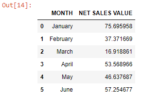
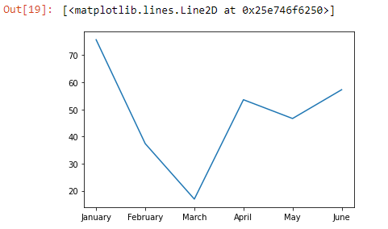
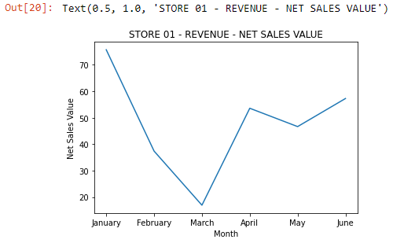
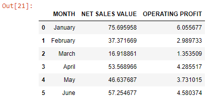
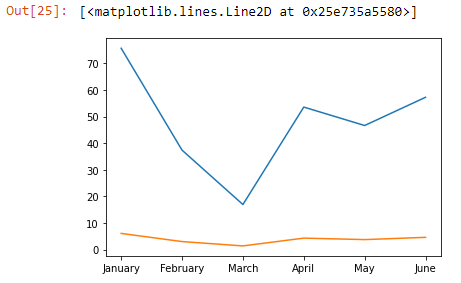
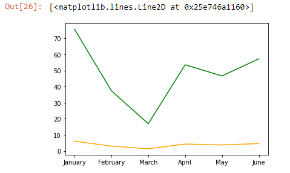
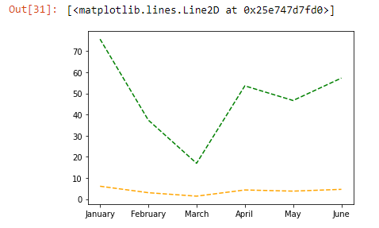
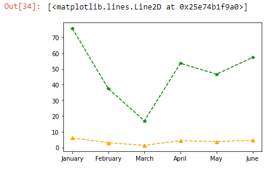

```toc

```

First, we will read an Excel file into a Pandas DataFrame:

```py {numberLines}
import pandas as pd
data = pd.read_excel("LINE PLOT.xlsx")
data
```

**Output:**


We will learn how to make a simple line graph, which is helpful for visualizing how a variable changes over time.

Using Matplotlib methods, the following code will create a simple line graph using ~~.plot()~~ .

```py {numberLines, 4-4}
import matplotlib.pyplot as plt
month = data["MONTH"]
netSalesValue = data["NET SALES VALUE"]
plt.plot(month, netSalesValue )
```

**Output:**


Note that ~~plt~~ is the name of the Matplotlib module we have imported at the top of the code.

### Labelling the axes

We can label the x and y-axis by using ~~plt.xlabel()~~ and ~~plt.ylabel()~~. The plot title can be set using ~~plt.title()~~.

All of these commands require a string which is a set of characters in either single (‘) or double (“ “) quotes.

```py {numberLines, 6-8}
import matplotlib.pyplot as plt
months = data["MONTH"]
netSalesValue = data["NET SALES VALUE"]
plt.plot(month, netSalesValue )

plt.xlabel(“Months”)
plt.ylabel(‘Net Sales Value’)
plt.title("STORE 01 - REVENUE - NET SALES VALUE")
```

This will result in a labeled graph:



### Multiple line plots

We can also have multiple line plots displayed on the same set of axes. This can be very useful if we want to compare two datasets with the same scale and axis categories.

Matplotlib will automatically place the two lines on the same axes and give them different colors if you call ~~plt.plot()~~ twice.

Above, we made a graph to track the revenue of STORE 01, where ~~months~~ is on the x-axis and ~~netSalesValue~~ is on the y-axis.

Let’s add the operating profit for comparison.

First, we will read an Excel sheet into a Pandas DataFrame:

```py {numberLines}
revenue = pd.read_excel('MULTIPLE LINE PLOT.xlsx')

revenue
```

**Output:**



The following code will result in a multiple line plot:

```py {numberLines, 7-8}
months = revenue["MONTH"]

netSalesValue = revenue["NET SALES VALUE"]

operatingProfit = revenue["OPERATING PROFIT"]

plt.plot(months, netSalesValue)
plt.plot(months, operatingProfit)
```

**Output:**



> **Note:** By default, the first line is always blue, and the second line is always orange.

### Linestyles

We can specify a different color for a line by using the keyword ~~color~~ with either an HTML color name or a HEX code:

```py {numberLines}
months = revenue["MONTH"]

netSalesValue = revenue["NET SALES VALUE"]

operatingProfit = revenue["OPERATING PROFIT"]

plt.plot(months, netSalesValue, color="green")
plt.plot(months, operatingProfit, color="orange")
```

**Output:**



We can also make a line dotted or dashed using the keyword ~~linestyle~~.

```py {numberLines}
# Dashed:
plt.plot(x_values, y_values, linestyle='--')
# Dotted:
plt.plot(x_values, y_values, linestyle=':')
# No line:
plt.plot(x_values, y_values, linestyle='')
```

```py {numberLines}
months = revenue["MONTH"]

netSalesValue = revenue["NET SALES VALUE"]

operatingProfit = revenue["OPERATING PROFIT"]

plt.plot(months, netSalesValue, color="green", linestyle="--")
plt.plot(months, operatingProfit, color="orange", linestyle="--")
```

**Output:**


### Adding markers

We can also add a marker using the keyword ~~marker~~:

```py {numberLines}
# A circle:
plt.plot(x_values, y_values, marker='o')
# A square:
plt.plot(x_values, y_values, marker='s')
# A star:
plt.plot(x_values, y_values, marker='*')
```

```py {numberLines}
months = revenue["MONTH"]

netSalesValue = revenue["NET SALES VALUE"]

operatingProfit = revenue["OPERATING PROFIT"]

plt.plot(months, netSalesValue, color="green", linestyle="--", marker="*")
plt.plot(months, operatingProfit, color="orange", linestyle="--", marker="^")
```

**Output:**

