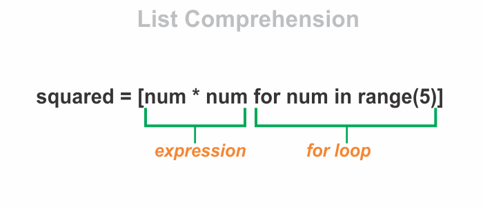

We can create a list in Python simply by writing comma separated values (_items_) in square brackets.

**Example:**

```py {numberLines}
name = ['hemanta', 'kumar', 'sundaray']
```

We can also create a list using a _for_ loop.

**Example:**

```py {numberLines}
squared = []

for num in range(5):
    squared.append(num * num)

print(squared)
# [0, 1, 4, 9, 16]
```

We can create the list we created in the code example above (using _for_ loop) in fewer lines of code using list comprehension.

> We create a list comprehension with square brackets that contain an expression followed by a _for_ clause followed by zero or more _for_ or _if_ clauses.

**Example:**

```py {numberLines}
squared = [num * num for num in range(5)]

print(squared)
# [0, 1, 4, 9, 16]
```



As we can see, list comprehension is concise and more readable.

Let’s create another list - this time however, we will include an _if_ clause after the _for_ loop in order to define a condition.

```py {numberLines}
squared = [num * num for num in range(5) if num % 2 == 0]

print(squared)
# [0, 4, 16]
```
