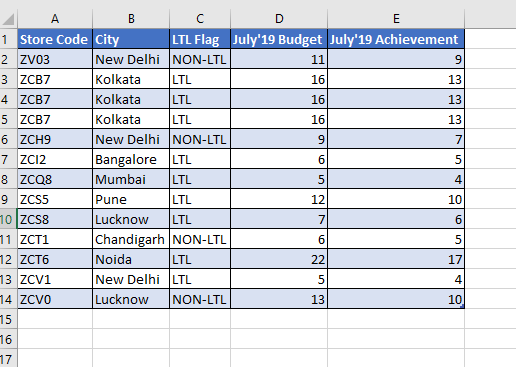
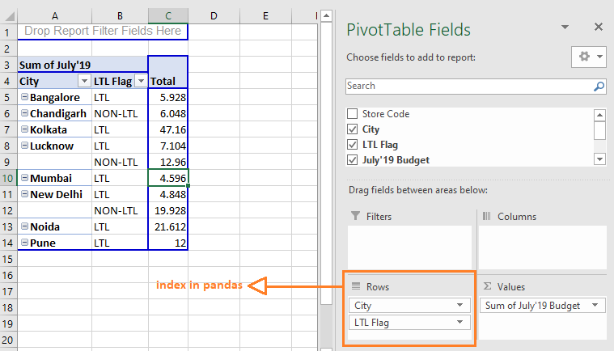
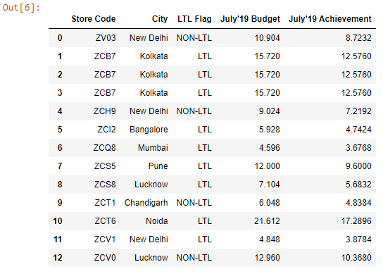
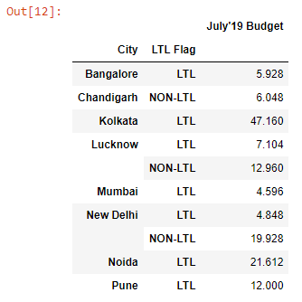
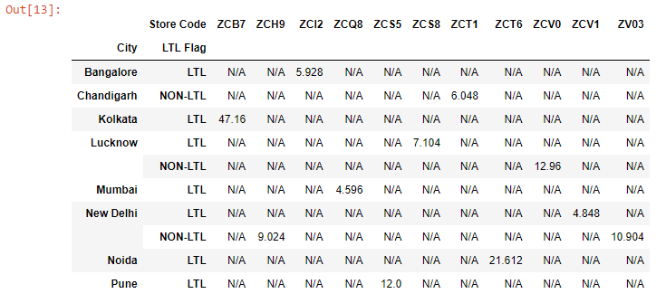

We can create spreadsheet style pivot tables in pandas using the ~~pivot_table()~~ method.

I have an Excel workbook named ~~budget.xlsx~~:



If I need to find out the July’19 Budget numbers both city-wise and LTL Flag-wise, I can create a pivot table as shown below:



We will recreate the exact pivot table in pandas.

First, let’s read the ~~budget.xlsx~~ file into a DataFrame:

```py {numberLines}
import pandas as pd

budget = pd.read_excel("budget.xlsx")

budget
```

**Output:**



Next, let's create the pivot table.

```py {numberLines}
pd.pivot_table(data=budget, index = ["City", "LTL Flag"], values="July'19 Budget", aggfunc="sum").fillna(value="N/A")
```

**Output:**



The only thing you have to remember is that whatever you pass to the ~~rows~~ field in Excel is what you pass to the ~~index~~ parameter in the ~~pivot_table~~ method.

Let’s pass the ~~Store Code~~ column to the ~~columns~~ parameter.

```py {numberLines}
pd.pivot_table(data=budget, index = ["City", "LTL Flag"], columns="Store Code", values="July'19 Budget", aggfunc="sum").fillna(value="N/A")
```

**Output:**


