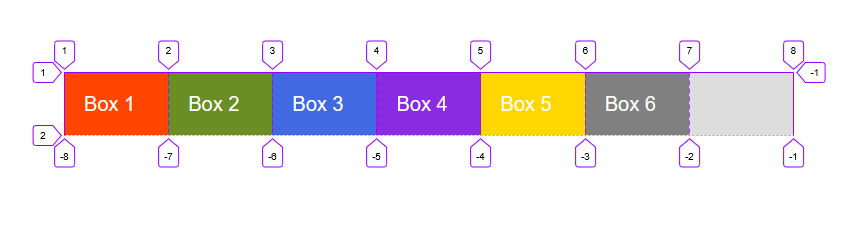
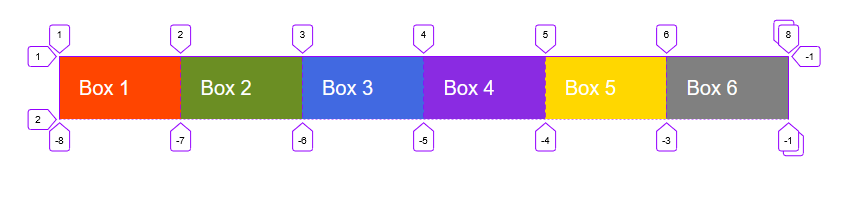

```toc

```

### auto-fill

```html:title=index.html {numberLines}
<div class="container">
    <div class="box box-1">Box 1</div>
    <div class="box box-2">Box 2</div>
    <div class="box box-3">Box 3</div>
    <div class="box box-4">Box 4</div>
    <div class="box box-5">Box 5</div>
    <div class="box box-6">Box 6</div>
</div>
```

```css:title=style.css {numberLines, 6-6}
.container {
  width: 80%;
  background-color: #ddd;
  margin: 40rem auto;
  display: grid;
  grid-template-columns: repeat(auto-fill, minmax(10rem, 1fr));
}

.box {
  padding: 2rem;
  font-size: 2rem;
  color: #fff;
}

.box-1 {
  background-color: orangered;
}

.box-2 {
  background-color: olivedrab;
}

.box-3 {
  background-color: royalblue;
}

.box-4 {
  background-color: blueviolet;
}

.box-5 {
  background-color: gold;
}

.box-6 {
  background-color: gray;
}
```

**Line 6**: The grid will create as many 10rem column tracks as will fit in the container.



### auto-fit

~~auto-fit~~ behaves the same as ~~auto-fill~~, except that after placing the grid items any empty repeated tracks are collapsed.

> A collapsed track is treated as having a single fixed track sizing function of 0px, and the gutters on either side of it collapse.

```css:title=style.css {numberLines, 6-6}
.container {
  width: 80%;
  background-color: #ddd;
  margin: 40rem auto;
  display: grid;
  grid-template-columns: repeat(auto-fit, minmax(10rem, 1fr));
}
```


