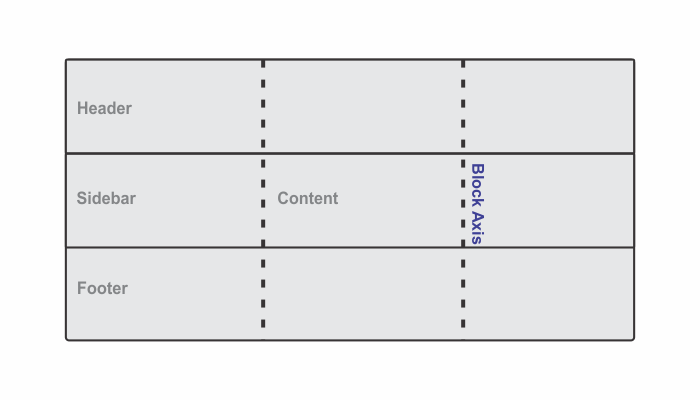
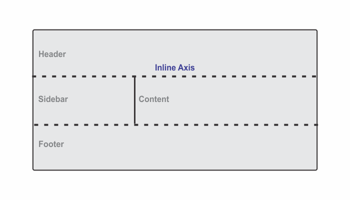
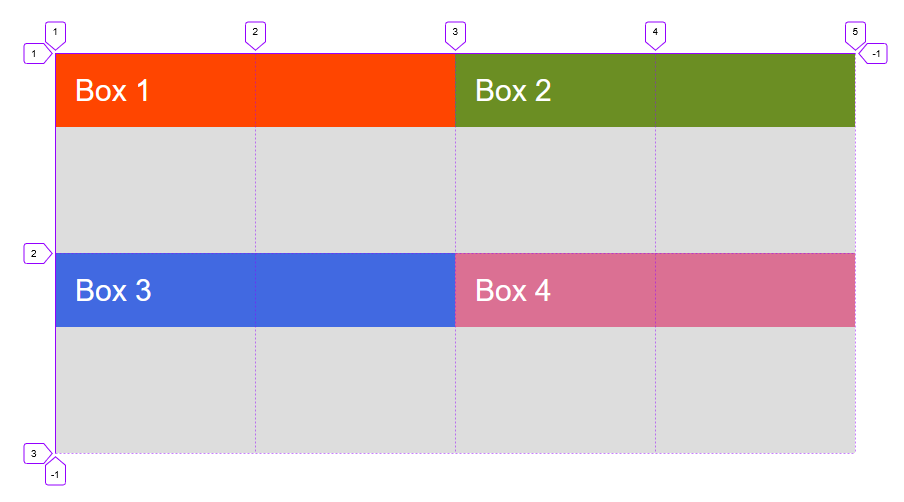
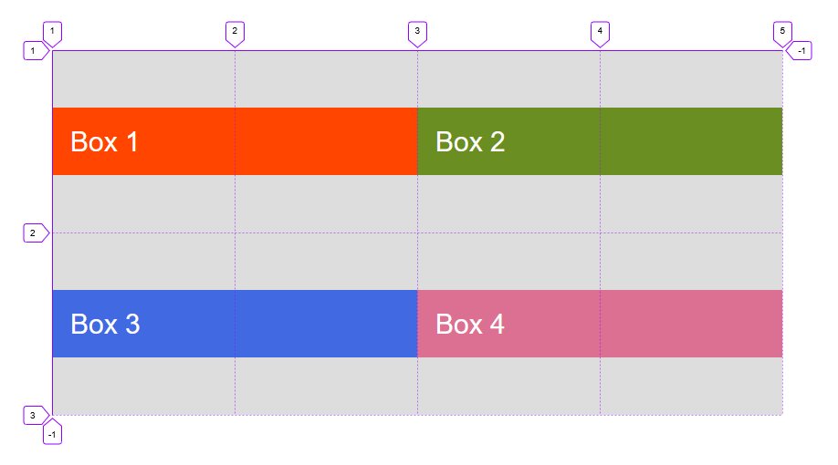
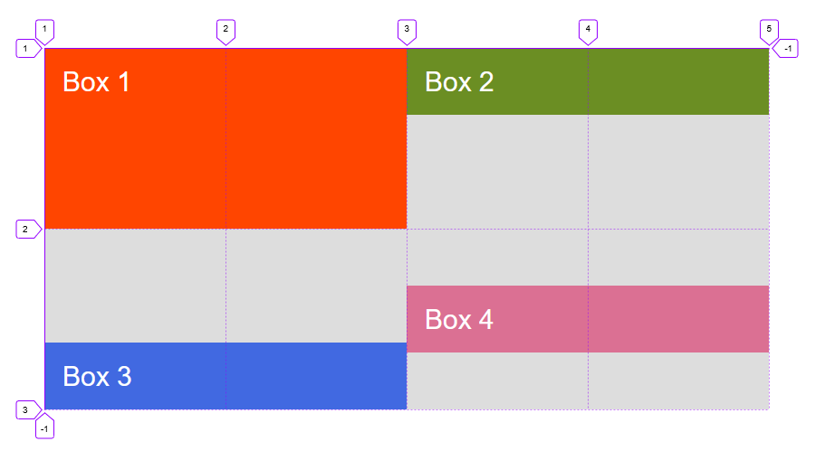
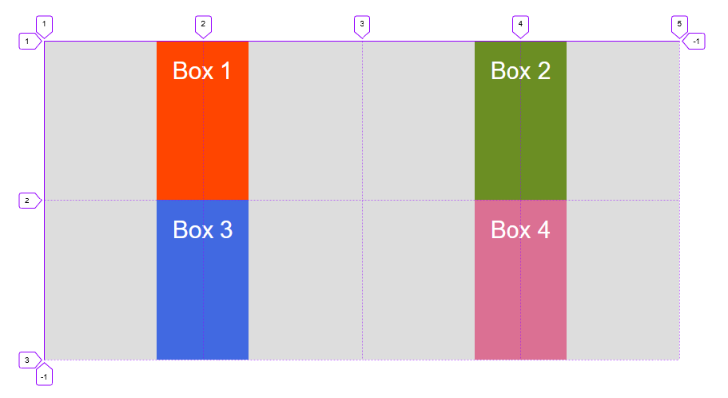
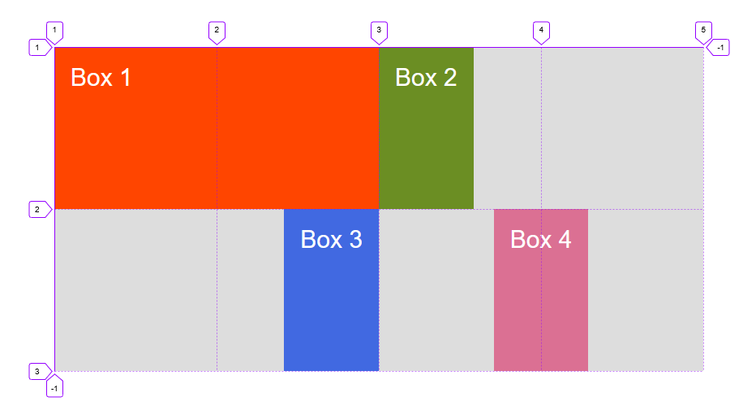
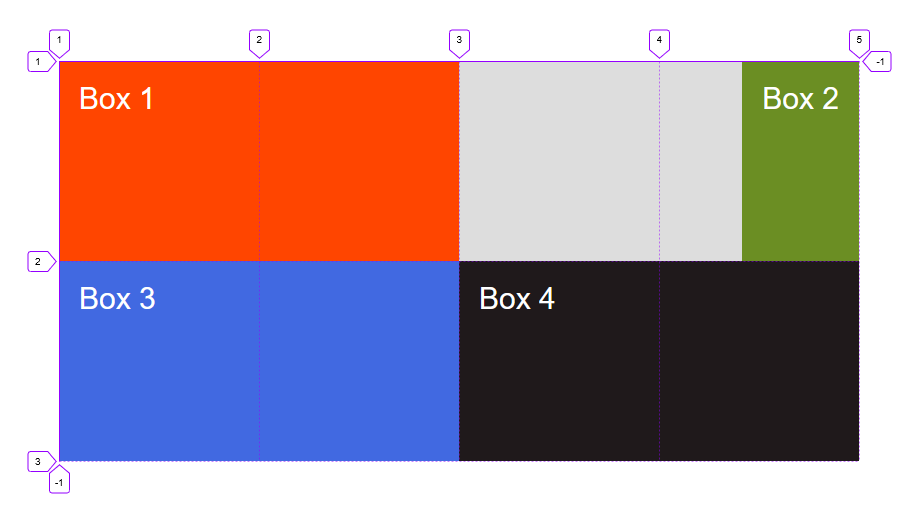

```toc

```

### Two axes of a grid layout

When working with grid layout, we can align things against two axes: **block axis** and **inline axis**.

#### Block axis



#### Inline axis



### Aligning items on the block axis

#### Using align-items

We can use the ~~align-items~~ property on the grid container, to align items using one of the values:

- auto
- normal
- start
- end
- center
- stretch
- baseline
- first baseline
- last baseline

```html:title=index.html {numberLines}
 <div class="container">
      <div class="box box-1">Box 1</div>
      <div class="box box-2">Box 2</div>
      <div class="box box-3">Box 3</div>
      <div class="box box-4">Box 4</div>
 </div>
```

```css:title=style.css {numberLines, 18-18}
* {
  padding: 0;
  margin: 0;
  box-sizing: border-box;
}

html {
  font-size: 10px;
  font-family: sans-serif;
}

.container {
  width: 80rem;
  height: 40rem;
  background-color: #ddd;
  margin: 40rem auto;
  display: grid;
  align-items: start;
}

.box {
  padding: 2rem;
  font-size: 3rem;
  color: #fff;
}

.box-1 {
  background-color: orangered;
  grid-column: 1 / 3;
  grid-row: 1;
}

.box-2 {
  background-color: olivedrab;
  grid-column: 3 / 5;
  grid-row: 1;
}

.box-3 {
  background-color: royalblue;
  grid-column: 1 / 3;
  grid-row: 2;
}

.box-4 {
  background-color: palevioletred;
  grid-column: 3 / 5;
  grid-row: 2;
}
```



```css:title=style.css {numberLines, 7-7}
.container {
  width: 80rem;
  height: 40rem;
  background-color: #ddd;
  margin: 40rem auto;
  display: grid;
  align-items: center;
}
```



#### Using align-self

```css:title=style.css {numberLines, 25-25, 32-32, 39-39}
.container {
  width: 80rem;
  height: 40rem;
  background-color: #ddd;
  margin: 40rem auto;
  display: grid;
}

.box {
  padding: 2rem;
  font-size: 3rem;
  color: #fff;
}

.box-1 {
  background-color: orangered;
  grid-column: 1 / 3;
  grid-row: 1;
}

.box-2 {
  background-color: olivedrab;
  grid-column: 3 / 5;
  grid-row: 1;
  align-self: start;
}

.box-3 {
  background-color: royalblue;
  grid-column: 1 / 3;
  grid-row: 2;
  align-self: end;
}

.box-4 {
  background-color: palevioletred;
  grid-column: 3 / 5;
  grid-row: 2;
  align-self: center;
}
```



> Note that the default behavior of ~~align-self~~ is to stretch.

### Justifying items on the inline axis

#### Using justify-items

We can align items on the inline axis using the ~~justify-items~~ property. The values you can choose from are as follows:

- auto
- normal
- start
- end
- center
- stretch
- baseline
- first baseline
- last baseline

```css:title=style.css {numberLines, 7-7}
.container {
  width: 80rem;
  height: 40rem;
  background-color: #ddd;
  margin: 40rem auto;
  display: grid;
  justify-items: center;
}
```



### Using justify-self

```css:title=style.css {numberLines, 25-25, 32-32, 39-39}
.container {
  width: 80rem;
  height: 40rem;
  background-color: #ddd;
  margin: 40rem auto;
  display: grid;
}

.box {
  padding: 2rem;
  font-size: 3rem;
  color: #fff;
}

.box-1 {
  background-color: orangered;
  grid-column: 1 / 3;
  grid-row: 1;
}

.box-2 {
  background-color: olivedrab;
  grid-column: 3 / 5;
  grid-row: 1;
  justify-self: start;
}

.box-3 {
  background-color: royalblue;
  grid-column: 1 / 3;
  grid-row: 2;
  justify-self: end;
}

.box-4 {
  background-color: palevioletred;
  grid-column: 3 / 5;
  grid-row: 2;
  justify-self: center;
}
```



### Aligning items using auto-margins

Another way to align items inside their area, is to use auto margins.

In the example below, we have given Box 2 a left margin of ~~auto~~. We can see that the content is pushed over to the right side of the area.

```css:title=style.css {numberLines, 25-25}
.container {
  width: 80rem;
  height: 40rem;
  background-color: #ddd;
  margin: 40rem auto;
  display: grid;
}

.box {
  padding: 2rem;
  font-size: 3rem;
  color: #fff;
}

.box-1 {
  background-color: orangered;
  grid-column: 1 / 3;
  grid-row: 1;
}

.box-2 {
  background-color: olivedrab;
  grid-column: 3 / 5;
  grid-row: 1;
  margin-left: auto;
}

.box-3 {
  background-color: royalblue;
  grid-column: 1 / 3;
  grid-row: 2;
}

.box-4 {
  background-color: rgb(31, 25, 27);
  grid-column: 3 / 5;
  grid-row: 2;
}

```


