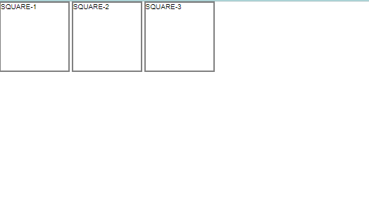

```toc

```

Every HTML element has a default ~~display~~ value that dictates if it can share horizontal space with other elements. Some elements fill the entire browser from left to right regardless of the size of their content. Other elements only take as much space as their content requires and can be directly next to other elements.

In this blog post, we will cover three values for the display property: ~~inline~~, ~~block~~ and ~~inline-block~~.

### display:inline

The default ~~display~~ for some tags, such as \<em>, \<strong> and \<a>, is called ~~inline~~.

Inline elements have a box that wraps tightly around their content, only taking up the amount of space necessary to display their content and not requiring a new line after each element.

The height and width of these elements can’t be specified in the CSS document. For example, the text of an anchor tag (\<a>) will, by default, be displayed on the same line as the surrounding text and it will only be as wide as necessary to contain its content.

> ~~inline~~ elements can’t be altered in size with the ~~height~~ and ~~width~~ CSS properties.

```html {numberLines}
<h1>To learn more about <em>React Query</em>, read <a href=”https://react-query.tanstack.com/overview”>React Query documentation.</a></h1>
```

In the example above, the \<em> element is inline, because it displays its content on the same line as the content surrounding it, including the anchor tag. The code snippet above will display the following line on the browser:


The CSS ~~display~~ property provides the ability to make any element an inline element. This includes elements that are not inline by default such as paragraphs, divs and headings.

```html {numberLines}
<!DOCTYPE html>
<html lang="en">
   <meta charset="UTF-8">
   <meta name="viewport" content="width=device-width, initial-scale=1.0">
   <title>Document</title>
   <link rel="stylesheet" href="style.css">
</head>
<body>
   <h2> Gatsby is a static PWA generator.</h2>
   <h2> Next.js is the React framework for production.</h2>
   </body>
</html>
```


The code example above will display both the headings on different lines, because heading elements are _block-level_ elements by default.

We can display both the headings on the same line by changing the display of all \<h2> elements to ~~inline~~.

```css {numberLines}
* {
  padding: 0;
  margin: 0;
  box-sizing: border-box;
}

html {
  font-size: 62.5%;
  font-family: sans-serif;
}

h2 {
  display: inline;
}
```


The browser will render the \<h2> elements on the same line as other inline elements immediately before or after them (if there are any).

### display:block

Some elements are not displayed in the same line as the content around them. These are called _block-level_ elements. These elements fill the entire width of the page by default, but their ~~width~~ property can also be set. Unless otherwise specified, they are of the height necessary to accommodate their content.

> Elements that are block-level by default include all levels of heading elements (\<h1> through \<h6>), \<p>, \<div> and \<footer>.

```html {numberLines}
<!DOCTYPE html>
<html lang="en">
   <meta charset="UTF-8">
   <meta name="viewport" content="width=device-width, initial-scale=1.0">
   <title>Document</title>
   <link rel="stylesheet" href="style.css">
</head>
<body>
   <p> All heading elements are <em>block-level</em> elements by default.</p>
   </body>
</html>
```

```css {numberLines}
* {
  padding: 0;
  margin: 0;
  box-sizing: border-box;
}

html {
  font-size: 62.5%;
  font-family: sans-serif;
}

p {
  font-size: 2rem;
}

em {
  display: block;
}
```


In the example above, the \<em> element is displayed on its own line.

### display: inline-block

The third value for the ~~display~~ property is ~~inline-block~~. Inline-block display combines features of both inline and block elements. Inline-block elements can appear next to each other and we can specify their dimension using the ~~width~~ and ~~height~~ properties.

> **Images are the next example of default inline-block elements.**

In the CSS below, the \<div>s will be displayed on the same line and with the specified dimensions:

```html {numberLines}
<!DOCTYPE html>
<html lang="en">
   <meta charset="UTF-8">
   <meta name="viewport" content="width=device-width, initial-scale=1.0">
   <title>Document</title>
   <link rel="stylesheet" href="style.css">
</head>
<body>
   <div class="square">SQUARE-1</div>
   <div class="square">SQUARE-2</div>
   <div class="square">SQUARE-3</div>
</body>
</html>
```

```CSS {numberLines}
* {
  padding: 0;
  margin: 0;
  box-sizing: border-box;
}

html {
  font-size: 62.5%;
  font-family: sans-serif;
}

.square {
  display: inline-block;
  width: 10rem;
  height: 10rem;
  border: 0.2rem solid gray;
}
```



In the example above, there are three square \<div>s that each contain text. The ~~.square~~ \<div>s will all appear inline (_provided there is enough space from left to right_) with a width of 10 rem and height of 10 rem, even though the text inside of them may not require 10 rem by 10 rem of space.
